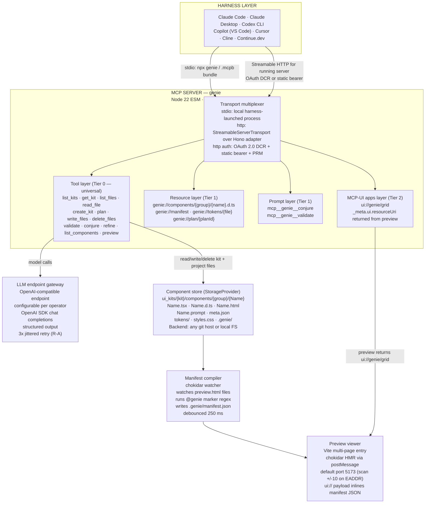
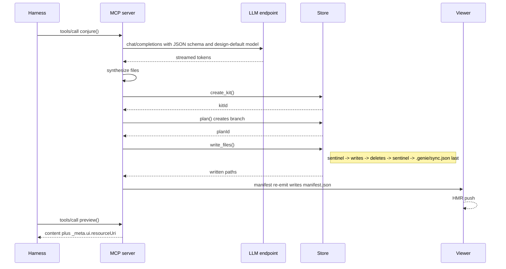
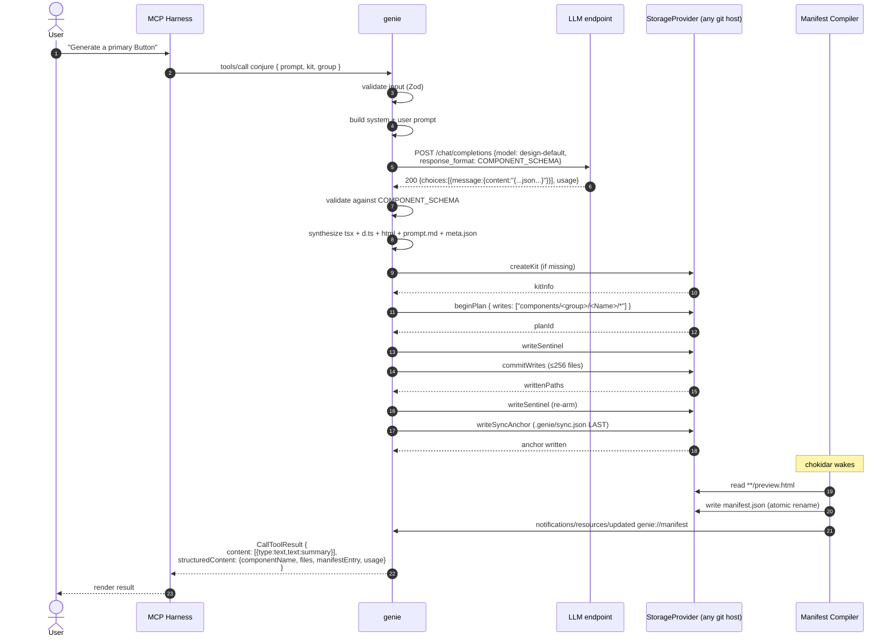
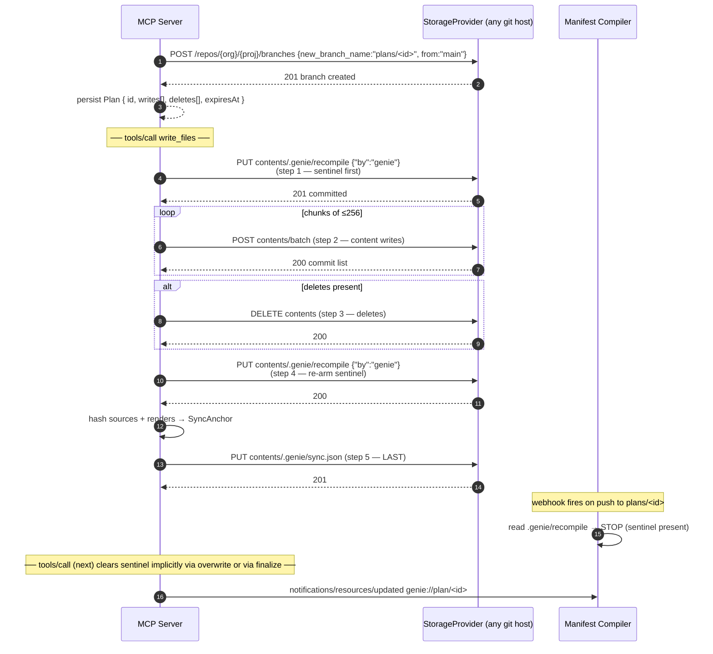
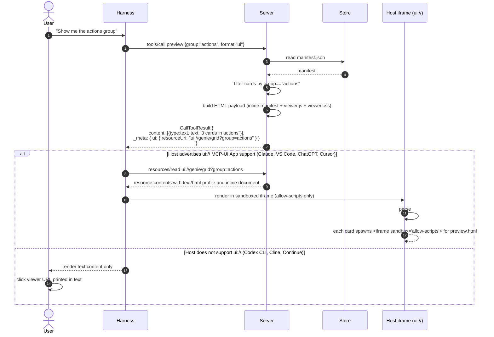
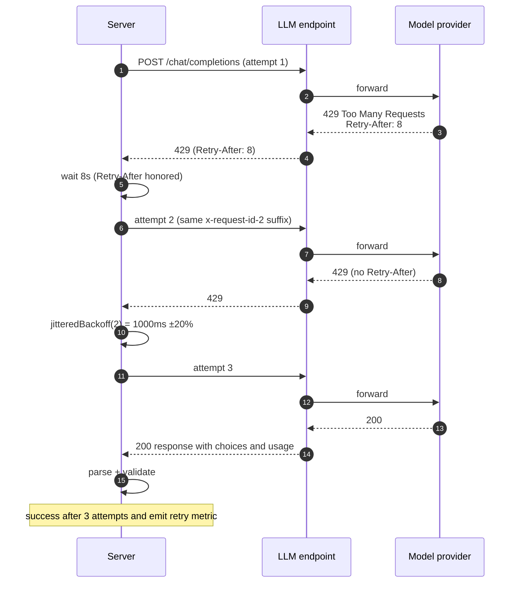
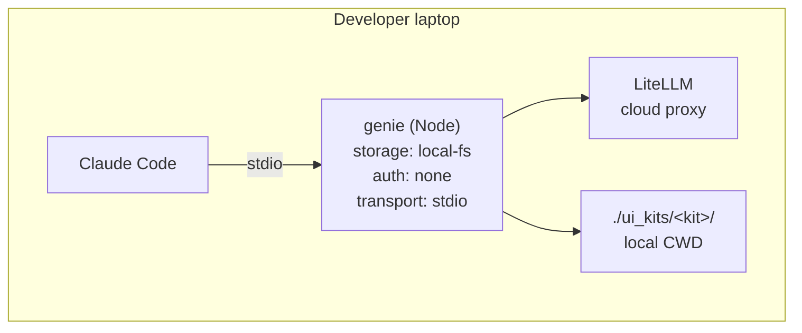
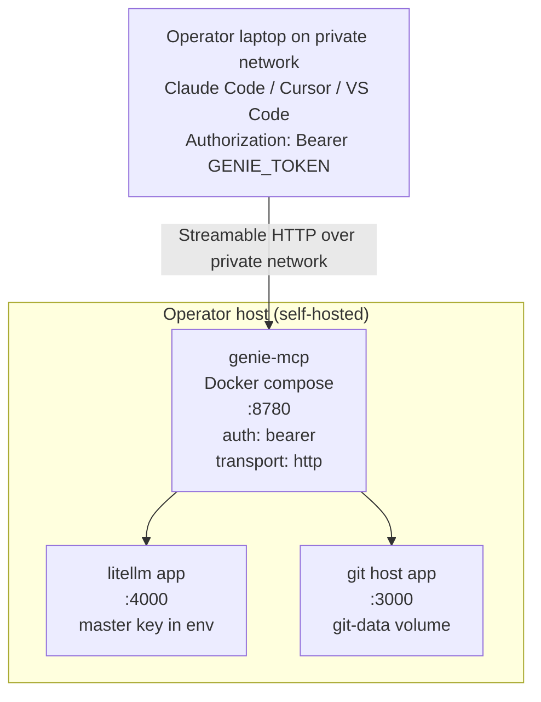
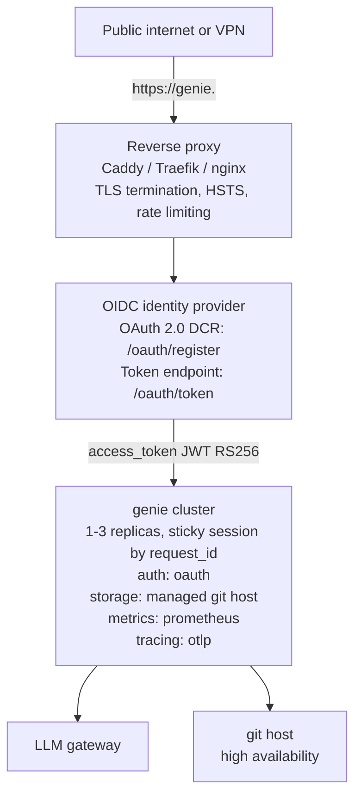

# DS-RFC-0001 — genie Tech Design

## 1. RFC metadata

| Field                        | Value                                                                                                                                                    |
| ---------------------------- | -------------------------------------------------------------------------------------------------------------------------------------------------------- |
| **RFC number**               | DS-RFC-0001                                                                                                                                              |
| **Title**                    | genie — Harness-Agnostic Design-Generation MCP Server Architecture                                                                                       |
| **Status**                   | Draft                                                                                                                                                    |
| **Author**                   | Maintainer                                                                                                                                                |
| **Reviewers**                | TBD — slot proposed: 1× MCP/protocol reviewer, 1× security reviewer, 1× front-end/preview reviewer, 1× ops reviewer                                      |
| **Created**                  | 2026-06-21                                                                                                                                               |
| **Last revised**             | 2026-06-27                                                                                                                                                       |
| **Supersedes**               | — (none)                                                                                                                                                 |
| **Superseded by**            | — (none)                                                                                                                                                 |
| **Related RFCs**             | DS-RFC-0002 _(planned)_ — Adherence rule generator; DS-RFC-0003 _(planned)_ — Storybook adapter                                                          |
| **Related docs**             | `docs/plan/01-product-vision.md`, `docs/plan/02-brd.md`, `docs/plan/03-prd.md`, `docs/plan/05-gtm-and-postprod.md`, `docs/plan/06-operations-runbook.md` |
| **Source-of-truth research** | `docs/research/`                                                                                                                                          |
| **Implementation tracker**   | `github/milestones.md` (M0–M5)                                                                                                                           |
| **License**                  | MIT                                                                                                                                                      |
| **Primary language**         | TypeScript (Node ≥ 22, ESM)                                                                                                                              |
| **Distribution**             | npm · `.mcpb` bundle · Docker image                                                                                                                      |
| **Repository**               | `github.com/roshangautam/genie`                                                                                                                          |

> **Authority note.** This RFC is the engineering source-of-truth. Where it disagrees with the PRD on a technical detail (file paths, schema shapes, transports, retry policy, etc.), this RFC wins; raise a PRD amendment. Where it disagrees with the PRD on a _user-visible_ behaviour (which surfaces exist, what the user can do), the PRD wins; raise an RFC revision.

### 1.1 Revision history

| Date       | Author        | Change                                                                                                                                                                              |
| ---------- | ------------- | ----------------------------------------------------------------------------------------------------------------------------------------------------------------------------------- |
| 2026-06-21 | Maintainer | Initial draft (DS-RFC-0001).                                                                                                                                                        |
| 2026-06-24 | Maintainer | Raised minimum Node.js from 18 to 22 (Node 18 & 20 reached EOL; Node 22 is the current Active LTS). Toolchain (pnpm 10.34, Vitest 4) requires Node ≥ 20+; 22 is the safe LTS floor. |
| 2026-06-27 | Maintainer | BRD-feedback sweep: UI-kit terminology (not "design system"), blueprints not templates, M1 19-tool surface restructure with projects-as-peer verbs. |

---

## 2. TL;DR

`genie` is a single-process TypeScript MCP server with a stdio-first local install and Streamable HTTP for already-running local dev, shared, or remote deployments. It speaks its **own** native conventions (`00-decisions.md` D0), fronts a **configurable OpenAI-compatible chat-completions endpoint** (LiteLLM is the reference; Ollama / OpenAI / vLLM / any compatible gateway also work — no provider URL baked in) for component and screen generation, owns a **git-backed kit/project store** (any git host for shared use, local filesystem for solo) whose preview HTML carries first-line `<!-- @genie group="…" -->` markers validated by genie's own regex, and ships the visual workspace two ways: the MCP App `ui://genie/grid` as the primary inline preview/generate/refine/audit surface for capable hosts, plus a tiny Vite-backed local viewer (`@genie/viewer`) as fallback for URL-only harnesses. The server speaks genie's own **19-tool M1 protocol** — 13 kit/component verbs plus six project verbs — with `read → plan → write/delete` protected by a single permission gate for file mutation; kit artefacts land in a tidy `.genie/` bookkeeping dir anchored by `.genie/sync.json`, while projects use `.genie/project.json`. Round-trip interop with a real Claude Design project (the verbatim `@dsCard` / `_ds_*` shapes) is a post-v1 opt-in bridge, not the native surface. The single irreducible R&D cost is the MCP-App-side _generation_ loop (prompt shape, per-element edit affordances) which Anthropic does not publish; we implement the smallest useful loop over `conjure`, `refine`, and `validate` seeded by structured-output JSON Schema. HTTP auth is OAuth 2.0 with Dynamic Client Registration for supporting harnesses (Claude Code, Codex CLI, Cursor) and static `Authorization: Bearer` as fallback for the rest; local stdio relies on the harness-owned process boundary instead of network auth. Observability is exposed via a Prometheus `/metrics` endpoint and OpenTelemetry traces for the operator's own stack. Target ship: **M5 within ~12 days of focused work**[^m5-effort] for the universal substrate, plus an open-ended canvas-generation workstream.

[^m5-effort]: "M5 within ~12 days of focused work" is single-developer effort, not calendar elapsed; see `github/milestones.md` for week-level allocation through M6.

---

## 3. Goals & non-goals

### 3.1 Goals (numbered, testable)

1. **G-1 — Harness coverage.** Tier-0 (text + tool calls) functions in seven harnesses without per-harness code paths:
   - Claude Code;
   - Claude Desktop;
   - Codex CLI;
   - Copilot Chat (VS Code agent mode);
   - Cursor;
   - Cline;
   - Continue.dev.
2. **G-2 — Native 19-tool kit/project protocol.**
   - Implement genie's own 19-tool M1 surface with the same protocol _shape_ as DesignSync for file mutation (read freely → one `plan` permission gate → writes scoped to the plan) — see D-A/D-F.
     - Kit/component verbs: `list_kits`, `get_kit`, `list_files`, `read_file`, `create_kit`, `plan`, `write_files`, `delete_files`, `validate`, `conjure`, `refine`, `list_components`, `preview`.
     - Project verbs: `list_projects`, `get_project`, `create_project`, `delete_project`, `bind_kit`, `conjure_screen`.
   - The on-disk artefact set round-trips into a real Claude Design project later via the opt-in interop bridge (D0), not the native path.
3. **G-3 — `@genie` regex fidelity.**
   - Honour genie's own marker regex `/^<!--\s*@genie\s+group="[^"]*"[^>]*-->/`; reject violators with `[MARKER_MISSING]`.
   - (The Anthropic `@dsCard` regex lives only in the future interop adapter — D-B.)
4. **G-4 — Atomic write sequence.** Execute the five-step atomic upload (sentinel → chunked writes ≤256/call → deletes → re-arm sentinel → `.genie/sync.json` last) so mid-plan failure never leaves the verification anchor vouching for absent files.
5. **G-5 — One artefact, three vehicles.** A single `.genie/manifest.json` + `preview.html` set is rendered — with byte-for-byte identical card markup — by:
   - (a) `file://` open in a browser;
   - (b) `http://localhost:5173` Vite dev server with HMR;
   - (c) `ui://genie/grid` MCP-UI payload.
6. **G-6 — Endpoint-agnostic generation.**
   - All model traffic flows through a configurable OpenAI-compatible chat-completions endpoint (LiteLLM / Ollama / OpenAI / vLLM — D-H).
   - The server itself never holds an Anthropic / OpenAI key.
7. **G-7 — OAuth-DCR.**
   - Implement OAuth 2.0 Dynamic Client Registration (RFC 7591) per the MCP 2025-06-18 authorization spec for Streamable HTTP deployments on supporting harnesses; static bearer for other HTTP harnesses.
   - Keep local first-run install on stdio, where the harness launches the `genie` process directly.
   - No service ever sees a long-lived password.
8. **G-8 — Distribution matrix.** Ship `npm install -g genie`, a signed `.mcpb` bundle, and a `ghcr.io/roshangautam/genie` Docker image, all from one repo, on every release.
9. **G-9 — Observability by default.** Prometheus metrics endpoint at `/metrics`, structured JSON logs, OpenTelemetry trace export to OTLP/HTTP, and a published Grafana dashboard JSON.

### 3.2 Non-goals (numbered, explicit)

1. **NG-1 — Visual canvas UI.** No Anthropic-style draggable canvas in v1. The preview pane shows a card grid; in-place editing of individual elements is out of scope until v2.
2. **NG-2 — Subscription metering.**
   - No per-user billing, plan tiers, or Anthropic-style 5×/20× quota math.
   - We piggyback on the configured endpoint or gateway's existing per-key/team budgets when available.
3. **NG-3 — Server-side prompt-engineering tuning.**
   - We do not run an eval harness comparable to Anthropic's.
   - We ship a single defensible system prompt per framework and accept that quality is bounded by the underlying model.
4. **NG-4 — Storybook as the primary renderer.** Storybook adapter is a `--renderer=storybook` flag, not a default. The default is the Vite multi-page viewer.
5. **NG-5 — SCIM / Enterprise audit log.** OIDC SSO is in scope; SCIM provisioning, audit log streaming to SIEM, and DLP integrations are not.
6. **NG-6 — Mobile previews.** Previews render in a desktop iframe; responsive testing is the operator's job in browser devtools.
7. **NG-7 — Multi-tenancy on a single server.** v1 is single-tenant: one git-host backend per deployment, one kit namespace. Teams that need isolation run multiple instances.
8. **NG-8 — Authoring of `.tsx` components in the viewer.** The viewer is read-only. Authoring happens through MCP tool calls (or the harness's own code editor).
9. **NG-9 — Round-tripping with the hosted `claude.ai/design` project store.** We mirror the schema but do not implement a live sync against Anthropic's API (we do not have one).
10. **NG-10 — Opus 4.7 specifically.**
    - The announcement names _Claude Opus 4.7_ but it is not in the public model catalog at `platform.claude.com` as of 2026-06-21.
    - We route through operator-defined model aliases and accept whatever the endpoint resolves to.

---

## 4. Background

Anthropic launched **Claude Design** on 2026-04-17 to Pro/Max/Team/Enterprise subscribers, surfaced at `claude.ai/design` with Claude Code companions `/design-sync` and `/design`. The release notes credit _Claude Opus 4.7_; the public model catalog at `platform.claude.com` does not list a "4.7" SKU at the time of writing. Sources: [anthropic.com/news/claude-design-anthropic-labs](https://www.anthropic.com/news/claude-design-anthropic-labs); [claude.com/product/design](https://claude.com/product/design); [support release notes 2026-04-17](https://support.claude.com/en/articles/12138966-release-notes).

The product surface is described at marketing altitude: users start from text/image/DOCX/PPTX/XLSX/web-capture/codebase and Claude builds with the team's existing components, validates against the team's design system, and iterates. Underneath that loop are three observable mechanisms which the bundled `design-sync` skill on disk exposes and the research notes document:

1. **The `@dsCard` first-line marker contract.**
   - Each component's `preview.html` MUST begin with `<!-- @dsCard group="…" -->`.
   - The validator in `package-validate.mjs` uses the regex `/^<!--\s*@dsCard\s+group="[^"]*"[^>]*-->/`; missing marker raises `[DSCARD_MISSING]` and fails the build.
   - This is the _client-side honourable contract_ — server-side compilation of `_ds_manifest.json` is driven entirely by the regex output.
2. **The DesignSync MCP tool with the 12-method protocol.**
   - `read → finalize_plan → write/delete` with a single permission grant.
     - `finalize_plan` returns a `planId`; subsequent `write_files`/`delete_files` cite it and are rejected for any path outside the plan's `writes` globs.
   - The atomic upload sequence (sentinel first, chunked writes, deletes, re-arm sentinel, `_ds_sync.json` last) is _non-obvious and load-bearing_.
     - Mid-plan failure with a different ordering leaves the verification anchor vouching for files that aren't there.
3. **The hosted vs portable split.**
   - Anthropic's hosted side owns:
     - the visual canvas;
     - the generation loop;
     - the project store with `PROJECT_TYPE_DESIGN_SYSTEM`;
     - the private `DesignSync` tool schema;
     - subscription metering.
   - Everything else is recoverable from the on-disk bundled skill at `$TMPDIR/claude-<uid>/bundled-skills/<version>/<hash>/design-sync/` (the session-local Claude Code skill cache; the leaf path varies per session):
     - the file-tree contract;
     - the `@dsCard` mechanism;
     - the `_ds_sync.json` verification anchor;
     - the adherence rule generator.

> **Note (D0):** items 1–3 describe **Anthropic's Claude Design** — the inspiration.
> genie adopts the _techniques_ (capability-gated plan→write, in-file marker,
> verification anchor, atomic order) but speaks its **own** conventions: the
> `@genie` marker, the `.genie/` layout with `.genie/sync.json`, the `plan` verb,
> and the `genie://` scheme. Anthropic's exact `@dsCard` / `_ds_*` shapes appear
> only in the post-v1 interop bridge.

The research report (§2.4) draws this split as a table. The implication for genie is that **we cannot reproduce the visual canvas without inventing it ourselves** (no spec exists), but we _can_ reproduce every observable file-layer protocol — re-expressed in genie's own native conventions (D-A..D-E) — then attach a preview pane of our own design that runs in every MCP harness. genie substitutes:

- **A configurable OpenAI-compatible endpoint** (LiteLLM / Ollama / OpenAI / vLLM — D-H) instead of Anthropic's hosted Opus 4.7 dependency.
  - Gives us model choice, budgets, and rate-limits without re-implementing subscription metering.
- **Any git host** (local FS / GitHub / Gitea / GitLab — D-G) for the cloud project store:
  - a kit is a repo;
  - `planId` is a branch;
  - `write_files` is a commit;
  - merge is atomic publish (full-fidelity when genie owns the repo, Shape A).
- **Vite + MCP-UI** for the visual canvas — universal viewer (every harness with a URL).
  - Progressive enhancement to inline rendering on the four harnesses that support `ui://` today.
- **OIDC + OAuth-DCR** for shared HTTP deployments — SSO against any OIDC provider the operator already runs.

This RFC's job is to convert that high-level substitution into a buildable, deployable, observable, securable system that ships in five milestones (M0–M5).

---

## 5. High-level architecture

### 5.1 System diagram



### 5.2 Component map (numbered)

1. **Harness layer**
   - Any MCP-aware client.
   - Speaks stdio (local process) or Streamable HTTP (remote).
   - Harness support matrix lives in §4 of the research report and [PRD §6].
2. **Transport multiplexer**
   - Selects stdio vs HTTP at startup by priority:
     - `--transport` CLI flag.
     - `MCP_TRANSPORT` env var.
     - Auto-detect: if stdin is a TTY → HTTP; otherwise → stdio.
   - Implements both as `StreamableServerTransport` instances over a shared `McpServer` registration.
3. **Auth subsystem**
   - Local stdio install has no network auth; the harness owns process launch and local file permissions.
   - OAuth 2.0 with Dynamic Client Registration (RFC 7591) for supported Streamable HTTP harnesses.
   - Static `Authorization: Bearer <token>` for HTTP harnesses without OAuth support.
   - Bearer tokens are 32-byte random base64url, stored hashed (SHA-256) server-side.
   - Publishes `/.well-known/oauth-protected-resource` and `/.well-known/oauth-authorization-server`.
4. **Tool layer**
   - 19 M1 tools split into four families:
     - **Kit file-flow:** `list_kits`, `get_kit`, `list_files`, `read_file`, `create_kit`, `plan`, `write_files`, `delete_files`, `validate`, `list_components`.
     - **Projects:** `list_projects`, `get_project`, `create_project`, `delete_project`, `bind_kit`, `conjure_screen`.
     - **Generation:** `conjure`, `refine`.
     - **Preview:** `preview`.
   - Each tool is a single TypeScript handler registered against `McpServer.tool()` with a Zod input/output schema.
   - `list_components` is read-only kit enumeration, not an LLM-driven generation verb.
   - The protocol _shape_ (read freely → one `plan` permission gate → scoped writes) is the proven DesignSync pattern; the verb names are genie's own.
5. **Resource layer**
   - Four URI families under the `genie://` scheme.
   - Resources are read-only; mutations always go through tools.
   - List/read are cursor-paginated per MCP spec: page size 100 default, 500 max.
6. **Prompt layer**
   - Two server-defined prompts are injected into the harness prompt picker.
   - Arguments are typed via JSON Schema.
   - Server-side string interpolation only; no model calls during `prompts/get`.
7. **MCP-UI Apps layer**
   - `ui://genie/grid` serves a self-contained HTML payload inside the harness sandboxed iframe.
   - First-class hosts: Claude, VS Code Stable Jan 2026, ChatGPT via Apps SDK, Cursor's Apps extension.
   - Ecosystem hosts: Goose, Postman, MCPJam.
   - The same HTML is byte-identical to what the Vite viewer serves under `http://localhost:5173`.
8. **LLM client**
   - Uses the `openai` npm SDK with `baseURL` pointed at the operator's configured OpenAI-compatible endpoint.
   - LiteLLM is the reference; Ollama / OpenAI / vLLM all work.
   - Default model alias is `design-default`, operator-mapped to the actual model.
   - Implements exponential-with-jitter retries: max 3, respects `Retry-After`.
   - Propagates `x-request-id` and tracks token usage per request for budget telemetry.
9. **Component store (StorageProvider)**
   - Abstract interface with two implementations:
     - **Local FS** for solo dev: CWD-relative `ui_kits/<kit>` tree.
     - **Git host HTTP** for shared use: any git host (GitHub / Gitea / GitLab).
   - For git host HTTP, `kitId` = repo, `planId` = branch, `write_files` = git commits, merge = atomic publish.
   - Implements the 5-step atomic upload sequence on write.
10. **Manifest compiler**
    - Chokidar watcher running inside the MCP server process and optionally inside the Vite viewer dev server.
    - On any `**/preview.html` change, debounces 250 ms, then re-runs the `@genie` regex across affected files.
    - Writes `.genie/manifest.json` atomically via tmp-file + rename.
    - Emits an `mcp/resources/updated` notification for `genie://manifest` subscribers.
11. **Vite-backed preview viewer** (`@genie/viewer`)
    - Separate npm package, distributed alongside the server.
    - Vite multi-page entry config: one `<Name>/preview.html` per entry.
    - Chokidar-driven HMR via postMessage to the parent iframe.
    - Port scan starts at 5173, with fallback through 5183.
    - CLI exposes `--port`, `--host`, `--open`, `--no-hmr`.

### 5.3 End-to-end sequence (compressed)



The sequence is duplicated in §8 with a per-component zoom (8.1 conjure, 8.2 finalize→write_files atomic, 8.3 preview, 8.4 LLM endpoint 429 retry).

---

## 6. Detailed component design

### 6.1 MCP server process model

#### 6.1.1 Runtime

- **Node.js ≥ 22 LTS**, ESM modules only.
  - `package.json` declares `"type": "module"`, `"engines": { "node": ">=22" }`.
  - CommonJS interop is forbidden — any dep that ships CJS-only is rebuilt or replaced.
- **TypeScript ≥ 5.4** with `strict: true`, `noUncheckedIndexedAccess: true`, `verbatimModuleSyntax: true`.
- **Single process, single event loop.** No worker threads in v1:
  - The LLM endpoint call and the file-system writes are all I/O-bound.
  - A single libuv loop saturates 1 Gbps on a typical operator network long before CPU does.
- **PID-1-safe.** When run as the container entrypoint, the binary calls `process.on('SIGTERM', gracefulShutdown)` to drain in-flight tool calls before exiting:
  - deadline 30 s;
  - `SIGKILL` if exceeded.

#### 6.1.2 Transport selection

The server exposes both transports from a single binary. Selection logic, in priority order:

1. CLI flag: `genie --transport=stdio` or `--transport=http`.
2. Env var: `MCP_TRANSPORT=stdio | http`.
3. Auto-detect: `process.stdin.isTTY` is `false` (i.e. parent piped stdin) → stdio; otherwise → http on `:8780`.

```ts
// server/src/main.ts
import { McpServer } from "@modelcontextprotocol/sdk/server/mcp.js";
import { StdioServerTransport } from "@modelcontextprotocol/sdk/server/stdio.js";
import { StreamableHTTPServerTransport } from "@modelcontextprotocol/sdk/server/streamableHttp.js";
import { register } from "./register.js";
import { httpApp } from "./http.js";

const TRANSPORT =
  process.env.MCP_TRANSPORT ??
  (process.argv.includes("--transport=stdio")
    ? "stdio"
    : process.argv.includes("--transport=http")
      ? "http"
      : process.stdin.isTTY
        ? "http"
        : "stdio");

const server = new McpServer({ name: "genie", version: pkg.version });
register(server);

if (TRANSPORT === "stdio") {
  await server.connect(new StdioServerTransport());
} else {
  const port = Number(process.env.PORT ?? 8780);
  const app = httpApp(server);
  app.listen(port);
}
```

The HTTP transport uses **Hono** as the web framework (small, edge-runtime-compatible, no Node-specific deps) so the same code path can run on Bun for the self-hosted use-case where `npx`-style startup matters less. Streamable HTTP is implemented per MCP spec 2025-06-18: one POST endpoint at `/mcp` accepting JSON-RPC requests and returning either JSON or `text/event-stream`. Server-initiated notifications (e.g. `notifications/resources/updated`) flow over the same SSE stream when the client has opted into one.

#### 6.1.3 Configuration surface

Configuration is loaded with this precedence (highest first):

1. CLI flags (`--port=8780`).
2. Env vars (`PORT=8780`).
3. Config file `./genie.config.json` (only present in shared deployments).
4. Built-in defaults.

```ts
// server/src/config.ts
import { z } from "zod";

export const Config = z.object({
  // Storage
  storageProvider: z.enum(["local", "git"]).default("local"),
  localRoot: z.string().default(process.cwd()),
  // Git host (any: GitHub / Gitea / GitLab — D-G)
  gitHostBaseUrl: z.string().url().optional(),
  gitHostToken: z.string().optional(),
  gitHostOrg: z.string().optional(),

  // LLM endpoint (any OpenAI-compatible — D-H; no hardcoded default)
  llmBaseUrl: z.string().url(), // operator MUST set; no universal default
  llmApiKeyEnv: z.string().default("GENIE_LLM_API_KEY"),
  defaultModel: z.string().default("design-default"),
  modelMaxTokens: z.number().int().positive().default(8192),

  // Transport
  transport: z.enum(["stdio", "http"]).optional(),
  port: z.number().int().positive().default(8780),
  host: z.string().default("0.0.0.0"),

  // Auth
  authMode: z.enum(["bearer", "oauth", "none"]).default("none"),
  bearerHashedTokens: z.array(z.string()).optional(), // SHA-256 hex
  oauthIssuer: z.string().url().optional(),
  oauthClientId: z.string().optional(),

  // Observability
  metricsEnabled: z.boolean().default(true),
  otelExporterOtlpEndpoint: z.string().url().optional(),
  logLevel: z.enum(["debug", "info", "warn", "error"]).default("info"),
});
export type Config = z.infer<typeof Config>;
```

### 6.2 Tool layer

All 19 M1 tools are registered under the MCP `tools` capability with the unified name shape `mcp__genie__<verb>` (Claude Code rewrites non-conforming names, so we comply from day one). Names are stable across versions; new tools get new names; deprecated tools retain their name but return `{ deprecated: true, replacement: "..." }` in `_meta`.

Each handler returns either `CallToolResult` or throws `McpError`. The error taxonomy is:

| Code (string)           | JSON-RPC code | Meaning                                                                                |
| ----------------------- | ------------- | -------------------------------------------------------------------------------------- |
| `genie.unauthorized`    | -32001        | Missing/invalid auth                                                                   |
| `genie.forbidden`       | -32002        | Authed but not allowed for this kit or project                                         |
| `genie.notFound`        | -32003        | Project/file/component does not exist                                                  |
| `genie.invalidTarget`   | -32004        | Tool target is missing or ambiguous                                                    |
| `genie.planRequired`    | -32011        | write/delete without `planId`                                                          |
| `genie.planExpired`     | -32012        | `planId` past TTL                                                                      |
| `genie.pathOutsidePlan` | -32013        | Path not covered by `writes` globs                                                     |
| `genie.markerMissing`   | -32021        | preview.html lacks `@genie` marker                                                     |
| `genie.byteCapExceeded` | -32031        | Single `write_files` payload too large                                                 |
| `genie.llmUpstream`     | -32041        | LLM endpoint 5xx after retries                                                         |
| `genie.rateLimited`     | -32042        | LLM endpoint 429 after retries                                                         |
| `genie.budgetExhausted` | -32043        | LLM endpoint or gateway budget exceeded                                                |
| `genie.gitUpstream`     | -32051        | git-host 5xx after retries                                                             |
| `genie.timeout`         | -32061        | Operation exceeded its budget                                                          |
| `genie.internal`        | -32099        | Anything unanticipated; surface stack trace in `data._stack` only when `GENIE_DEBUG=1` |

**Idempotency.** Every tool is annotated in its description with one of `idempotent | idempotent-with-key | non-idempotent`. The `_meta.idempotencyKey` MAY be supplied; if so, repeated calls within 24 h with identical `(tool, idempotencyKey)` return the cached result.

#### 6.2.1 Kit/component tools (genie's own)

```ts
// server/src/tools/kits.ts
const ListKitsInput = z.object({}); // no args
const ListKitsOutput = z.array(
  z.object({
    id: z.string(),
    name: z.string(),
    owner: z.string(),
    updatedAt: z.string().datetime(),
    canEdit: z.boolean(),
  }),
);

const GetKitInput = z.object({ kitId: z.string().regex(/^[a-z0-9-]{3,64}$/) });
const GetKitOutput = z.object({
  id: z.string(),
  name: z.string(),
  type: z.literal("GENIE_KIT"),
  canEdit: z.boolean(),
  createdAt: z.string().datetime(),
  updatedAt: z.string().datetime(),
});

const ListFilesInput = z.object({
  kitId: z.string(),
  cursor: z.string().optional(),
});
const ListFilesOutput = z.object({
  files: z.array(
    z.object({
      path: z.string(),
      size: z.number().int().nonnegative(),
      hash: z.string().regex(/^sha256-[A-Za-z0-9+/=]{43,44}$/),
      lastModified: z.string().datetime(),
    }),
  ),
  nextCursor: z.string().optional(),
});

const ReadFileInput = z.object({
  kitId: z.string(),
  path: z.string(),
  encoding: z.enum(["utf-8", "base64"]).default("utf-8"),
});
const ReadFileOutput = z.object({
  content: z.string(),
  encoding: z.enum(["utf-8", "base64"]),
  size: z.number().int().max(262_144), // 256 KiB cap
  hash: z.string(),
});
```

**Plan boundary.**

```ts
// server/src/tools/plan.ts
const PlanInput = z.object({
  kitId: z.string(),
  writes: z.array(z.string()).min(1).max(256), // glob patterns
  deletes: z.array(z.string()).max(256).default([]),
  localDir: z.string().optional(), // base for resolving localPath in write_files
});
const PlanOutput = z.object({
  planId: z.string().uuid(),
  expiresAt: z.string().datetime(), // now + (process.env.GENIE_PLAN_TTL_MIN ?? 15) * 60 * 1000
  writes: z.array(z.string()),
  deletes: z.array(z.string()),
});
// Each write glob MUST have ≤3 wildcards. Enforced before issuing the planId.

const WriteFilesInput = z.object({
  planId: z.string().uuid(),
  files: z
    .array(
      z.object({
        path: z.string(),
        localPath: z.string().optional(), // referenced into localDir; preferred — never enters model context
        data: z.string().optional(), // base64 if encoding=base64, else utf-8
        encoding: z.enum(["utf-8", "base64"]).default("utf-8"),
        mimeType: z.string().optional(),
      }),
    )
    .min(1)
    .max(256),
});
const WriteFilesOutput = z.object({
  writtenPaths: z.array(z.string()),
  totalBytes: z.number().int(),
});

const DeleteFilesInput = z.object({
  planId: z.string().uuid(),
  paths: z.array(z.string()).min(1).max(256),
});
const DeleteFilesOutput = z.object({
  deletedPaths: z.array(z.string()),
});
```

**Dropped verbs (D-A).** The inherited `register_assets` / `unregister_assets`
are **removed** — the `@genie` marker IS the registration; to remove a card,
delete the file. (Their schemas live only in the optional interop adapter, for
reading legacy non-`@genie` projects.)

**Validation (single merged verb — D-A).** `validate` merges the inherited
`report_validate` counter-push and `validate_design_system` full-scan into one.
It runs the full validator suite **and** persists its run counters to
`.genie/validation.json`:

```ts
const ValidateInput = z.object({
  kitId: z.string(),
  planId: z.string().uuid().optional(), // present during a write sequence
});
const ValidateOutput = z.object({
  markerMissing: z.array(z.string()),
  thin: z.array(z.string()),
  variantsIdentical: z.array(z.string()),
  total: z.number().int().nonnegative(),
  bad: z.number().int().nonnegative(),
  iterations: z.number().int().nonnegative(),
  runAt: z.string().datetime(),
});
// Output persisted to .genie/validation.json; surfaced on next get_kit.
```

**Read-only component enumeration** (`list_components` — no LLM call, pure store read):

```ts
const ListComponentsInput = z.object({
  kitId: z.string(),
  group: z.string().optional(),
  cursor: z.string().optional(),
});
const ListComponentsOutput = z.object({
  components: z.array(
    z.object({
      name: z.string(),
      group: z.string(),
      path: z.string(),
      // Raw viewport token captured by the M3-01 `@genie` regex from the
      // preview's first-line marker (e.g. "desktop" or "375x812"). Kept as an
      // opaque string — Draft-7 JSON Schema on the wire forbids the `$ref`
      // chain a {width,height} object would require (M1-15 AC3/AC5).
      viewport: z.string(),
      hash: z.string(),
      lastModified: z.string().datetime(),
    }),
  ),
});
// Pagination cap (the shared list_files/list_kits 256-entry ceiling): when a
// page is truncated the continuation token is surfaced OUT-OF-BAND in the MCP
// response `_meta.nextCursor`, NOT inside `ListComponentsOutput`. This keeps
// `components` a clean, schema-validated array on the wire; callers read the
// opaque keyset cursor from `_meta.nextCursor` and pass it back as `cursor`.
// (See §6.2.1 tool impl and packages/server/src/tools/list_components.ts.)
```

#### 6.2.2 Generation surface

```ts
const GenerateComponentInput = z.object({
  kitId: z.string(),
  kit: z.string().regex(/^[a-z0-9-]{1,32}$/),
  prompt: z.string().min(8).max(8192),
  group: z
    .string()
    .regex(/^[a-z0-9-]{1,32}$/)
    .optional(),
  refImageDataUrl: z
    .string()
    .regex(/^data:image\/(png|jpeg|webp);base64,/)
    .optional(),
  refUrl: z.string().url().optional(),
  framework: z.enum(["react", "vue", "html"]).default("react"),
  model: z.string().default("design-default"),
  maxTokens: z.number().int().positive().max(16_384).optional(),
});
const GenerateComponentOutput = z.object({
  componentName: z.string().regex(/^[A-Z][A-Za-z0-9]{0,63}$/),
  group: z.string(),
  files: z.array(
    z.object({
      path: z.string(),
      content: z.string(),
      encoding: z.enum(["utf-8", "base64"]),
    }),
  ),
  manifestEntry: z.object({
    name: z.string(),
    group: z.string(),
    path: z.string(),
    viewport: z.object({ width: z.number().int(), height: z.number().int() }),
    hash: z.string(),
    subtitle: z.string().optional(),
  }),
  usage: z.object({
    promptTokens: z.number().int(),
    completionTokens: z.number().int(),
    totalTokens: z.number().int(),
    costUsd: z.number().nonnegative().optional(),
  }),
});
// idempotency: idempotent-with-key (cache result if same prompt+kit+model in 1h)
```

```ts
const RefineComponentInput = z.object({
  kitId: z.string(),
  componentName: z.string(),
  instruction: z.string().min(4).max(2048),
  region: z
    .object({
      x: z.number().int().nonnegative(),
      y: z.number().int().nonnegative(),
      w: z.number().int().positive(),
      h: z.number().int().positive(),
    })
    .optional(),
  model: z.string().default("design-default"),
});
const RefineComponentOutput = z.object({
  diff: z.string(), // unified diff against the existing files
  files: z.array(
    z.object({
      path: z.string(),
      content: z.string(),
    }),
  ),
  usage: z.object({
    /* same shape as generate */
  }),
});
// non-idempotent (refinement is inherently sequential)
```

#### 6.2.3 Preview & validation

```ts
const RenderPreviewInput = z.object({
  kitId: z.string(),
  componentName: z.string().optional(), // single-card mode
  group: z.string().optional(), // group-filtered grid
  format: z.enum(["text", "ui"]).default("ui"),
});
const RenderPreviewOutput = z.object({
  text: z.string(), // human-readable summary always included for Tier-0 harnesses
});
// _meta.ui.resourceUri set when format=ui AND host advertises ui:// support
```

```ts
const ValidateDesignSystemInput = z.object({
  kitId: z.string(),
  planId: z.string().uuid().optional(),
});
const ValidateDesignSystemOutput = z.object({
  markerMissing: z.array(z.string()),
  thin: z.array(z.string()),
  variantsIdentical: z.array(z.string()),
  total: z.number().int(),
  bad: z.number().int(),
  iterations: z.number().int(),
  runAt: z.string().datetime(),
});
```

### 6.3 Resource layer

URI scheme: `genie://`. Resources are read-only views into the component store. The server implements `resources/list`, `resources/read`, and `resources/subscribe`; updates trigger `notifications/resources/updated`.

| URI pattern                              | MIME                             | Description                                                               |
| ---------------------------------------- | -------------------------------- | ------------------------------------------------------------------------- |
| `genie://components/{group}/{name}.d.ts` | `text/plain`                     | Per-component API surface (the contract Claude Design's self-check reads) |
| `genie://components/{group}/{name}.html` | `text/html`                      | The `preview.html` with `@genie` first line                               |
| `genie://manifest`                       | `application/json`               | Current `manifest.json`                                                   |
| `genie://tokens/{file}`                  | `text/css` \| `application/json` | Design tokens (`tokens.css`, `tokens.json`)                               |
| `genie://plan/{planId}`                  | `application/json`               | Plan state including `expiresAt`, `writes`, `deletes`                     |

**Pagination.** `resources/list` returns up to 100 entries per page; `nextCursor` is an opaque base64 string `b64(JSON({path, kitId, ts}))`. Cursors expire after 5 min.

**Cache headers.** For HTTP transport, resources are served with `Cache-Control: private, max-age=10, must-revalidate` and an `ETag: W/"sha256-<hash-prefix-16>"`. The client may send `If-None-Match` on subsequent reads; we respond `304 Not Modified` when the hash matches. (stdio transport ignores HTTP headers; cache decisions are deferred to the harness.)

### 6.4 Prompt layer

Two prompts:

```ts
// mcp__genie__conjure
const NewComponentPromptArgs = z.object({
  kit: z.string().describe("Name of the UI kit (e.g. 'acme')"),
  group: z.string().describe("Card group (e.g. 'actions', 'surfaces')"),
  framework: z.enum(["react", "vue", "html"]).default("react"),
  vibe: z.string().optional().describe("Free-text design direction (e.g. 'brutalist minimal')"),
});
```

When the harness calls `prompts/get` with these args, the server returns a `PromptMessage` array:

```ts
[
  {
    role: "user",
    content: {
      type: "text",
      text: `Generate a new ${args.framework} component for the "${args.kit}" UI kit in group "${args.group}". ${args.vibe ? `Design direction: ${args.vibe}.` : ""} Use ${tokensInlined(args.kit)} as design tokens. Output via the conjure tool.`,
    },
  },
];
```

The substitution rules: `{tokensInlined(kit)}` reads the kit's `tokens/tokens.json` and embeds it; `{args.*}` are HTML-escaped (defence against prompt injection from harness inputs).

```ts
// mcp__genie__validate
const AuditPromptArgs = z.object({
  kitId: z.string(),
  scope: z.enum(["all", "untested", "thin", "missing-marker"]).default("all"),
});
```

### 6.5 MCP-UI Apps layer

> **⚠ Framework decision pending (Skybridge spike).** This layer is a candidate to
> be built on [Skybridge](https://www.skybridge.tech/) rather than hand-rolled — see
> §15.8 (status: spike-then-decide) and `docs/research/skybridge.md` §8. Keep the
> `ui://genie/grid` payload framework-agnostic so it stays ejectable to raw
> `@modelcontextprotocol/sdk` / `mcp-ui`. The spike must prove embedded-tier CSP +
> display-mode parity before any adoption.

The MCP-UI Apps integration ships the primary visual workspace as a `ui://`
resource that capable harnesses render inside their own sandboxed iframe.
Preview is read-only until the user clicks Generate, Refine, or Audit; those
actions leave the iframe through `ui/message` and map back to normal MCP tool
calls.

**Resource URI:** `ui://genie/grid`
**MIME:** `text/html;profile=mcp-app`
**Payload shape:** a self-contained HTML document with the manifest inlined as JSON; no external fetches.

```html
<!doctype html>
<html lang="en">
  <head>
    <meta charset="utf-8" />
    <meta name="viewport" content="width=device-width, initial-scale=1" />
    <title>genie</title>
    <script type="application/json" id="manifest">
      /* server inlines the parsed manifest.json here */
      {"version":1,"generatedAt":"...","cards":[...]}
    </script>
    <script type="application/json" id="config">
      { "hostOrigin": "<host origin>", "capabilities": { "hmr": false } }
    </script>
    <style>
      /* viewer.css inlined */
    </style>
  </head>
  <body>
    <main id="grid" role="region" aria-label="Component preview grid"></main>
    <script type="module">
      /* viewer.js inlined */
    </script>
  </body>
</html>
```

**postMessage protocol** between the iframe and the host:

| Direction     | `type`                 | Payload                         | Purpose                               |
| ------------- | ---------------------- | ------------------------------- | ------------------------------------- |
| iframe → host | `genie:ready`          | `{ version, manifestCount }`    | Signals viewer mounted                |
| iframe → host | `genie:select`         | `{ name, group }`               | User clicked a card                   |
| iframe → host | `genie:request-conjure` | `{ kitId, group, prompt, model? }` | Generate a new card                |
| iframe → host | `genie:request-refine` | `{ name, instruction, region? }` | Refine an existing card              |
| iframe → host | `genie:request-validate` | `{ kitId }`                   | Audit the current kit                 |
| host → iframe | `genie:manifest`       | `{ manifest }`                  | Push new manifest after a write_files |
| host → iframe | `genie:focus`          | `{ name }`                      | Scroll/highlight specific card        |
| host → iframe | `genie:theme`          | `{ scheme: "light" \| "dark" }` | Match harness theme                   |

Message origin is validated against `config.hostOrigin`; unknown origins are silently dropped.

**CSP.** The HTML payload sets `Content-Security-Policy: default-src 'none'; script-src 'unsafe-inline'; style-src 'unsafe-inline'; img-src data: https:; frame-src 'self'; connect-src 'none'`. `connect-src 'none'` deliberately blocks all `fetch()` — the manifest is inlined, there is nothing to fetch.

**Iframe sandbox.** The harness embeds `ui://genie/grid` with `<iframe sandbox="allow-scripts">` (no `allow-same-origin`); per-card preview iframes inside the grid use `<iframe sandbox="allow-scripts">` too, so card scripts cannot read the parent's storage even if they escape their own iframe.

### 6.6 LLM endpoint client

```ts
// server/src/llm.ts
import OpenAI from "openai";
import { setTimeout as delay } from "node:timers/promises";
import { randomInt } from "node:crypto";

export function makeClient(cfg: Config) {
  return new OpenAI({
    baseURL: cfg.llmBaseUrl,
    apiKey: process.env[cfg.llmApiKeyEnv] ?? throws("GENIE_LLM_API_KEY unset"),
    defaultHeaders: { "user-agent": `genie/${pkg.version}` },
    timeout: 120_000,
    maxRetries: 0, // we implement retry ourselves; openai SDK's behavior is opaque
  });
}

export async function generateComponentSpec(
  client: OpenAI,
  input: GenInput,
  requestId: string,
): Promise<{ response: ComponentJson; usage: UsageInfo }> {
  const messages = buildMessages(input);
  let attempt = 0;
  while (true) {
    try {
      const resp = await client.chat.completions.create(
        {
          model: resolveAlias(input.model),
          messages,
          response_format: { type: "json_schema", json_schema: COMPONENT_SCHEMA },
          max_tokens: input.maxTokens ?? 8192,
          stream: false,
        },
        { headers: { "x-request-id": requestId } },
      );
      return {
        response: COMPONENT_SCHEMA.shape.parse(JSON.parse(resp.choices[0]!.message.content!)),
        usage: {
          promptTokens: resp.usage!.prompt_tokens,
          completionTokens: resp.usage!.completion_tokens,
          totalTokens: resp.usage!.total_tokens,
        },
      };
    } catch (e: any) {
      attempt++;
      if (attempt > 3) throw mapError(e);
      if (e.status === 429 || e.status === 503) {
        const retryAfter = parseRetryAfter(e.headers?.["retry-after"]);
        const backoff = retryAfter ?? jitteredBackoff(attempt);
        await delay(backoff);
        continue;
      }
      if (e.status >= 500) {
        await delay(jitteredBackoff(attempt));
        continue;
      }
      throw mapError(e);
    }
  }
}

function jitteredBackoff(attempt: number): number {
  // base 500ms, exponential, ±20% jitter
  const base = 500 * 2 ** (attempt - 1);
  const jitter = randomInt(-Math.floor(base * 0.2), Math.floor(base * 0.2));
  return Math.min(base + jitter, 30_000);
}
```

**Model alias resolution.** The server keeps a small in-process map:

| Server alias     | Endpoint model name           | Notes                                      |
| ---------------- | ----------------------------- | ------------------------------------------ |
| `design-default` | `anthropic/claude-sonnet-4-6` | Default for `conjure`                      |
| `design-best`    | `anthropic/claude-opus-4-8`   | Slower, more expensive, picks better names |
| `design-local`   | `ollama/qwen3-coder:32b`      | Offline-capable, lower quality             |

`resolveAlias` returns the raw endpoint model name; if the input is already a raw name (contains `/`), it passes through unchanged.

**Structured output JSON Schema.** See §7.5.

**Request ID propagation.** Every outbound LLM request carries `x-request-id: <tool-call-uuid>-<attempt>`. The harness's tool-call ID propagates from MCP into the configured endpoint, and then to the provider when the endpoint supports forwarding, so traces line up end-to-end.

**Streaming pass-through.** v1 does **not** stream model output to the harness for `conjure` (we need the full structured response to validate against `COMPONENT_SCHEMA`). For `refine`, where the output is a textual diff, we offer streaming via SSE on the Streamable HTTP transport when the harness opts in (`Accept: text/event-stream`).

**Token budget tracking.** Each successful response increments a Prometheus counter `llm_tokens_total{model,direction}` and `llm_cost_usd_total{model}` (computed from endpoint usage data or a static price table refreshed monthly).

### 6.7 Component store (StorageProvider)

Abstract interface:

```ts
// server/src/storage/types.ts
export interface StorageProvider {
  // Read
  listKits(): Promise<KitInfo[]>;
  getKit(kitId: string): Promise<KitInfo | null>;
  listFiles(kitId: string, cursor?: string): Promise<{ files: FileEntry[]; nextCursor?: string }>;
  getFile(kitId: string, path: string, encoding: "utf-8" | "base64"): Promise<FileContent>;

  // Write — all gated by an active Plan
  createKit(name: string): Promise<KitInfo>;
  beginPlan(kitId: string, plan: PlanSpec): Promise<Plan>;
  commitWrites(plan: Plan, batch: WriteBatch): Promise<WriteResult>;
  commitDeletes(plan: Plan, paths: string[]): Promise<DeleteResult>;
  finalizePlan(plan: Plan): Promise<PublishResult>;

  // Atomic upload sequence (called by tools, not by harnesses directly)
  writeSentinel(plan: Plan): Promise<void>;
  writeSyncAnchor(plan: Plan, anchor: SyncAnchor): Promise<void>;
}
```

Two implementations:

#### 6.7.1 LocalFsStorage

```
localRoot/
└── <kitId>/
    └── ui_kits/<kit>/
        ├── components/<group>/<Name>/...
        ├── manifest.json
        ├── .genie/recompile
        └── .genie/sync.json
```

- `beginPlan` stores the plan spec in `.genie/plans.sqlite`.
- `commitWrites` writes to a temp directory `.genie/plans/<planId>/staging/` and renames into place during `finalizePlan`.
- Atomicity: per-file `writeFile` to `path.tmp` then `rename` (POSIX atomic on same filesystem).
- No cross-host coordination — single-writer assumption.

#### 6.7.2 GitHostStorage

```
git-host/<owner>/<kitId>/
├── (main branch — published state)
└── (plan branches — pending state, one per planId)
```

- `createKit` → create a private repo named `kitId` through the configured git host.
- `beginPlan` → create `plans/<planId>` from `main`.
- `commitWrites` → commit staged content to the plan branch through the host SDK/API.
- `finalizePlan` → open a PR/MR where the host supports it; merge happens out-of-band (manual review for shared deployments) or via a webhook-triggered auto-merge (solo).

The **5-step atomic upload sequence**, common to both implementations:

```ts
// server/src/tools/writeFiles.ts
async function writeFilesTool(input: WriteFilesInput) {
  const plan = await store.getPlan(input.planId);
  const { writes, deletes } = splitWritesDeletes(input.files, plan);

  // 1. Sentinel first — fences the manifest-compiler from running mid-upload
  await store.writeSentinel(plan);

  // 2. Chunked content writes ≤256/call (already bounded by the input schema)
  for (const chunk of chunk(writes, 256)) {
    await store.commitWrites(plan, chunk);
  }

  // 3. Deletes
  if (deletes.length > 0) {
    await store.commitDeletes(plan, deletes);
  }

  // 4. Re-arm sentinel — makes the next plan's first writeSentinel still fence
  await store.writeSentinel(plan);

  // 5. .genie/sync.json LAST — verification anchor
  const anchor: SyncAnchor = {
    version: 1,
    writtenAt: new Date().toISOString(),
    by: "genie",
    sourceHashes: hashSources(writes),
    renderHashes: hashRenders(writes),
    verified: derivedVerified(writes),
  };
  await store.writeSyncAnchor(plan, anchor);

  return { writtenPaths: writes.map((w) => w.path), totalBytes: sumBytes(writes) };
}
```

If step 5 fails, the manifest-compiler sees `.genie/recompile` still present and refuses to publish a manifest update — the next successful `write_files` will re-anchor.

### 6.8 Manifest compiler

```ts
// server/src/manifest.ts
import chokidar from "chokidar";
import { writeFile, rename } from "node:fs/promises";

const MARKER_RE = /^<!--\s*@genie\s+group="([^"]*)"([^>]*)-->/;
const VIEWPORT_RE = /viewport="(\d+)x(\d+)"/;

export function startWatcher(kitRoot: string) {
  const w = chokidar.watch(`${kitRoot}/components/**/*.html`, {
    ignored: /(^|[/\\])\../, // dotfiles
    persistent: true,
    awaitWriteFinish: { stabilityThreshold: 100, pollInterval: 50 },
  });

  let pending: NodeJS.Timeout | null = null;
  const recompile = () => {
    if (pending) clearTimeout(pending);
    pending = setTimeout(() => compileManifest(kitRoot), 250); // debounce 250ms
  };

  w.on("add", recompile);
  w.on("change", recompile);
  w.on("unlink", recompile);

  // Refuse to compile if sentinel exists (mid-upload)
  return { stop: () => w.close() };
}

async function compileManifest(kitRoot: string) {
  if (await exists(`${kitRoot}/.genie/recompile`)) {
    return; // wait for the upload to complete
  }
  const htmls = await glob(`${kitRoot}/components/**/*.html`);
  const cards: ManifestCard[] = [];
  for (const html of htmls) {
    const firstLine = (await readFirstLine(html)).trim();
    const m = MARKER_RE.exec(firstLine);
    if (!m) continue; // invalid card; validate surfaces it
    const group = m[1]!;
    const vp = VIEWPORT_RE.exec(m[2] ?? "");
    cards.push({
      name: pathToName(html),
      group,
      path: path.relative(kitRoot, html),
      viewport: vp ? { width: +vp[1]!, height: +vp[2]! } : { width: 800, height: 600 },
      hash: await sha256File(html),
    });
  }
  const manifest = { version: 1, generatedAt: new Date().toISOString(), cards };
  const tmp = `${kitRoot}/manifest.json.tmp`;
  await writeFile(tmp, JSON.stringify(manifest, null, 2));
  await rename(tmp, `${kitRoot}/manifest.json`);
  // emit notification
  server.notification("notifications/resources/updated", { uri: "genie://manifest" });
}
```

**Debounce strategy.** 250 ms after the last write event. A burst of 250 file writes (typical `write_files` call) registers as one debounced compile, not 250.

**Failure mode.** If a `preview.html` has no `@genie` marker, the watcher silently skips it; `validate` surfaces the omission with `markerMissing: [...]`. This separation keeps the compiler simple and gives the harness an explicit "go fix these" affordance.

### 6.9 Vite-backed viewer

> **⚠ Framework decision pending (Skybridge spike).** The hand-rolled viewer described
> here is the _fallback_ if the §15.8 Skybridge spike fails genie's hard constraints
> (G-5 byte-identical cards + embedded CSP). See `docs/research/skybridge.md` §8.

The viewer ships as a separate npm package `@genie/viewer` so it can be upgraded independently and run without the MCP server (e.g. for designers reviewing a kit directly).

**Vite multi-page entry config:**

```ts
// viewer/vite.config.ts
import { defineConfig } from "vite";
import { resolve, dirname } from "node:path";
import { fileURLToPath } from "node:url";
import fg from "fast-glob";

export default defineConfig(({ command }) => {
  const root = process.env.GENIE_KIT_ROOT!;
  const entries = fg.sync("components/**/preview.html", { cwd: root });
  const input: Record<string, string> = { main: resolve(root, "index.html") };
  for (const e of entries) input[e.replace(/[/\\]/g, "_")] = resolve(root, e);
  return {
    root,
    server: { port: 5173, strictPort: false },
    build: { rollupOptions: { input } },
    plugins: [chokidarHmrPlugin()],
  };
});
```

**HMR via postMessage.** The viewer plugin intercepts the default Vite HMR boundary handling for `**/preview.html`: instead of full-page reload, it posts `genie:reload-card { name }` to the per-card iframe, which receives the message and calls `location.reload()` on itself.

**Iframe sandbox flags.** Each per-card iframe is `<iframe src="components/<group>/<Name>/preview.html" sandbox="allow-scripts" loading="lazy">`. No `allow-same-origin` — the iframe runs in an opaque origin, so even if the card script tries `parent.localStorage` it gets `SecurityError`.

**Port selection.** Default 5173. If `EADDRINUSE`, increment to 5174, …, up to 5183 (range of 11). If all in use, exit 1 with a clear error pointing at `--port`.

**CLI:**

```
npx @genie/viewer <kitRoot> [options]
  --port <number>         Initial port (default 5173)
  --host <host>           Bind address (default 127.0.0.1)
  --open                  Open default browser on start
  --no-hmr                Disable HMR (serve static files only)
  --base <path>           Public base URL when behind a proxy
```

### 6.10 Auth

#### 6.10.1 OAuth 2.0 with Dynamic Client Registration

OAuth is only on the Streamable HTTP surface. Local stdio clients do not call these endpoints because the harness starts the `genie` process directly.

The HTTP server implements MCP authorization spec 2025-06-18 §2 (OAuth 2.1 + DCR). Endpoints:

| Path                                      | Purpose                                                            |
| ----------------------------------------- | ------------------------------------------------------------------ |
| `/.well-known/oauth-protected-resource`   | Resource metadata (RFC 8707) — points harnesses at the auth server |
| `/.well-known/oauth-authorization-server` | Auth server metadata (RFC 8414) when bundled                       |
| `POST /oauth/register`                    | Dynamic Client Registration (RFC 7591)                             |
| `GET /oauth/authorize`                    | Authorization endpoint with PKCE (S256 required)                   |
| `POST /oauth/token`                       | Token endpoint — exchanges code for access+refresh tokens          |
| `POST /oauth/revoke`                      | Token revocation (RFC 7009)                                        |

Tokens are signed JWTs (RS256, keys rotated every 90 d). Access tokens TTL = 1 h, refresh tokens TTL = 30 d, sliding window.

**Scope model.**

| Scope            | Grants                                                                        |
| ---------------- | ----------------------------------------------------------------------------- |
| `genie:read`     | `list_*`, `get_*`, `preview`, `validate`, all resource reads                              |
| `genie:write`    | `create_kit`, `create_project`, `delete_project`, `bind_kit`, `plan`, `write_files`, `delete_files`, `validate` |
| `genie:generate` | `conjure`, `refine`, `conjure_screen` (separated so a viewer-only token cannot burn LLM budget) |

A token without `genie:write` calling `write_files` returns `genie.forbidden`. The server publishes its supported scopes in the resource metadata; harnesses request the union of what they need.

#### 6.10.2 Static bearer fallback

For HTTP harnesses without OAuth DCR support (Cline, Continue.dev, VS Code's `headers` block):

```jsonc
// genie.config.json
{
  "authMode": "bearer",
  "bearerHashedTokens": ["sha256:9f86d081884c7d659a2feaa0c55ad015a3bf4f1b2b0b822cd15d6c15b0f00a08"],
}
```

The operator generates a token with `genie issue-token`, copies the hashed digest into config, and gives the raw token to the harness via env var. Tokens are 32 bytes of `crypto.randomBytes` base64url-encoded. The server only ever stores the SHA-256 digest.

#### 6.10.3 Secret storage

| Secret                | Where it lives                                       | How read                                                                               |
| --------------------- | ---------------------------------------------------- | -------------------------------------------------------------------------------------- |
| LLM API key           | Operator secret store → exported `GENIE_LLM_API_KEY` | `process.env.GENIE_LLM_API_KEY` at startup; never logged, redacted from error messages |
| OAuth RSA signing key | `~/.config/genie/oauth.pem` (mode 0600)              | Loaded at startup; rotated via `genie rotate-keys`                                     |
| Git-host token        | Operator secret store → `GENIE_GIT_TOKEN`            | Read at startup                                                                        |
| Bearer tokens         | Config file (hashed) + raw in harness env            | Compared with `crypto.timingSafeEqual`                                                 |

#### 6.10.4 Token refresh

The MCP client (harness) holds the access token and refresh token. On 401 with `WWW-Authenticate: Bearer error="invalid_token"`, the harness calls `POST /oauth/token grant_type=refresh_token`. The server rotates the refresh token (returns a new one, invalidates the old) per OAuth 2.1 best practice.

### 6.11 Concurrency model

The MCP server is single-process, single-event-loop. Concurrency is achieved by leveraging libuv's I/O multiplexing — every tool handler is `async`, and the bottlenecks (LLM endpoint calls, git-host HTTP, FS writes) are network/disk-bound. We expect a single process to comfortably handle 50 concurrent tool calls on a modest single-vCPU host (1 vCPU).

Two specific concerns require explicit handling:

1. **Plan write serialization.**
   - Two concurrent `write_files` calls against the same `planId` could interleave their commits and break the atomic sequence.
   - We serialize per-plan with a small in-process `Map<planId, Promise<void>>` lock; the second caller waits for the first to release.
   - Cross-plan calls run in parallel.
   - Lock acquire timeout: 60 s; expiry returns `genie.timeout`.

2. **Manifest compile debounce.**
   - The chokidar watcher fires once per `preview.html` change; bursts of 250 writes collapse to a single compile via the 250 ms debounce window.
   - The compile itself is sequential (one watcher per kit root); concurrent kits compile in parallel.

For multi-host shared deployments (Scenario C), the plan lock moves into Redis (`SET plan:<id>:lock <node-id> NX EX 60`); see §17.19 for tracking the v2 work.

### 6.12 Streaming, cancellation, and backpressure

- **Streaming.**
  - `conjure` does not stream (we need the full response to validate `COMPONENT_SCHEMA`);
  - `refine` streams when the harness sends `Accept: text/event-stream` on the Streamable HTTP transport.
  - SSE chunks carry the partial diff as `data: { partial: "<unified-diff-chunk>" }` lines.
- **Cancellation.**
  - MCP supports `notifications/cancelled` carrying a `requestId`.
  - On receipt, the server aborts any in-flight `AbortSignal`-aware operation (the openai SDK supports `signal`; Gitea HTTP via Hono supports `AbortController`).
  - FS writes are best-effort — partially-written files are cleaned up in `finally`.
- **Backpressure.**
  - The HTTP transport uses Hono's built-in stream handling.
  - SSE writes are sent through a `WritableStream` whose `desiredSize` we monitor; when negative, we yield before resuming.
  - For stdio, we rely on Node's libuv flow control; the server emits a warning at `process.stdout.writableLength > 4 MiB`.

### 6.13 Internationalization and locale

- All server-emitted messages are English (en-US) in v1.
- Date formatting in logs uses ISO 8601 UTC.
- The viewer respects the harness's `prefers-color-scheme` via the `genie:theme` postMessage and the CSS `@media (prefers-color-scheme: dark)` query.
- Future: a per-card `lang` attribute in `meta.json` for component-level locale targeting (e.g. RTL preview for an Arabic locale).

### 6.14 Build, package, and release

- **Build.**
  - `tsc --noEmit` for type-checking,
  - `tsup` for bundling (single ESM output),
  - `vitest` for tests.
  - Output: `dist/main.js` + `dist/main.js.map` + ambient types in `dist/index.d.ts`.
- **Package.**
  - `npm pack --provenance` for the npm artifact;
  - `npx @modelcontextprotocol/mcpb pack` for the `.mcpb` bundle;
  - `docker buildx bake` for multi-arch images (linux/amd64, linux/arm64).
- **Release.** GitHub Actions `release.yml`: on `push` of tag `v*.*.*`, runs:
  - build;
  - tests;
  - sigstore-sign;
  - publish to npm;
  - push to GHCR;
  - create GitHub Release with `.mcpb` artifact attached.
- **Reproducible builds.**
  - Pin Node version in `.nvmrc` (`22.20`);
  - pin npm version in `package.json` `"packageManager"`;
  - vendor `pnpm-lock.yaml`.
  - CI verifies the produced tarball's hash matches the release notes.

---

## 7. Data model

### 7.1 `manifest.json` schema (JSON Schema Draft 7)

The kit manifest is a flat array of cards. It is regenerated atomically on every `preview.html` change.

```json
{
  "$schema": "http://json-schema.org/draft-07/schema#",
  "$id": "https://genie.dev/schema/manifest.json",
  "title": "GenieManifest",
  "type": "object",
  "required": ["version", "generatedAt", "cards"],
  "additionalProperties": false,
  "properties": {
    "version": { "type": "integer", "const": 1 },
    "generatedAt": { "type": "string", "format": "date-time" },
    "kit": { "type": "string", "pattern": "^[a-z0-9-]{1,32}$" },
    "cards": {
      "type": "array",
      "items": {
        "type": "object",
        "required": ["name", "group", "path", "viewport", "hash"],
        "additionalProperties": false,
        "properties": {
          "name": { "type": "string", "pattern": "^[A-Z][A-Za-z0-9]{0,63}$" },
          "group": { "type": "string", "pattern": "^[a-z0-9-]{1,32}$" },
          "subtitle": { "type": "string", "maxLength": 256 },
          "path": {
            "type": "string",
            "pattern": "^components/[a-z0-9-]+/[A-Z][A-Za-z0-9]*/[A-Z][A-Za-z0-9]*\\.html$"
          },
          "viewport": {
            "type": "object",
            "required": ["width", "height"],
            "additionalProperties": false,
            "properties": {
              "width": { "type": "integer", "minimum": 1, "maximum": 4096 },
              "height": { "type": "integer", "minimum": 1, "maximum": 4096 }
            }
          },
          "hash": { "type": "string", "pattern": "^sha256-[A-Za-z0-9+/=]{43,44}$" },
          "tags": { "type": "array", "items": { "type": "string" }, "maxItems": 16 }
        }
      },
      "maxItems": 4096
    }
  }
}
```

### 7.2 `.genie/sync.json` schema

Reconstructed from `lib/sync-hashes.mjs` + `lib/remote-diff.mjs` in the bundled skill on disk. The exact field set is one of the open questions in §17, but our schema is forward-compatible (additive fields are non-breaking).

```json
{
  "$schema": "http://json-schema.org/draft-07/schema#",
  "$id": "https://genie.dev/schema/ds-sync.json",
  "title": "DsSyncAnchor",
  "type": "object",
  "required": ["version", "writtenAt", "by", "sourceHashes", "renderHashes", "verified"],
  "additionalProperties": false,
  "properties": {
    "version": { "type": "integer", "minimum": 1 },
    "writtenAt": { "type": "string", "format": "date-time" },
    "by": { "type": "string", "pattern": "^genie(/.+)?$" },
    "sourceHashes": {
      "type": "object",
      "additionalProperties": {
        "type": "string",
        "pattern": "^sha256-[A-Za-z0-9+/=]{43,44}$"
      },
      "description": "Map of repo-relative source path → sha256 of source file content"
    },
    "renderHashes": {
      "type": "object",
      "additionalProperties": {
        "type": "string",
        "pattern": "^sha256-[A-Za-z0-9+/=]{43,44}$"
      },
      "description": "Map of repo-relative preview.html path → sha256"
    },
    "verified": {
      "type": "array",
      "items": { "type": "string", "pattern": "^[a-z0-9-]+/[A-Z][A-Za-z0-9]*$" },
      "description": "List of <group>/<Name> tuples whose source + render hash were both seen during this write"
    },
    "planId": { "type": "string", "format": "uuid" },
    "model": { "type": "string" }
  }
}
```

### 7.3 `meta.json` per component

Each `components/<group>/<Name>/meta.json` carries non-renderable metadata.

```json
{
  "$schema": "http://json-schema.org/draft-07/schema#",
  "$id": "https://genie.dev/schema/component-meta.json",
  "type": "object",
  "required": ["group", "viewport", "renderCheck"],
  "additionalProperties": false,
  "properties": {
    "group": { "type": "string", "pattern": "^[a-z0-9-]{1,32}$" },
    "viewport": {
      "type": "object",
      "required": ["width", "height"],
      "properties": {
        "width": { "type": "integer", "minimum": 1, "maximum": 4096 },
        "height": { "type": "integer", "minimum": 1, "maximum": 4096 }
      }
    },
    "deps": {
      "type": "array",
      "items": { "type": "string", "pattern": "^[a-z0-9-]+/[A-Z][A-Za-z0-9]*$" },
      "description": "Other components this one references"
    },
    "renderCheck": {
      "type": "object",
      "properties": {
        "minNodes": { "type": "integer", "minimum": 0 },
        "minTextLength": { "type": "integer", "minimum": 0 },
        "expectsImage": { "type": "boolean" }
      },
      "description": "Heuristic gate used by validate to flag 'thin' renders"
    },
    "framework": { "enum": ["react", "vue", "html"] }
  }
}
```

### 7.4 `.d.ts` extraction rules

The `<Name>.d.ts` file is the **API contract surface** for adherence rule generation. We extract it from `<Name>.tsx` using `ts-morph` with these rules:

1. **Include** the default export's type if it is a `React.ComponentType<P>` or a forwardRef. `P` becomes the props type.
2. **Include** any named exports that are types or interfaces beginning with the component's name (e.g. `ButtonVariant`).
3. **Strip** function bodies, JSX, hook calls — keep only signatures.
4. **Inline** types from the kit's `tokens/types.ts` if referenced — the contract must be self-contained.
5. **Emit** a `// @dsContract <Name>` first-line marker so the adherence generator can detect generated vs hand-written `.d.ts`.

Example output:

```ts
// @dsContract Button
import type { ReactNode } from "react";
export type ButtonVariant = "primary" | "secondary" | "ghost" | "danger";
export type ButtonSize = "sm" | "md" | "lg";
export interface ButtonProps {
  variant?: ButtonVariant;
  size?: ButtonSize;
  disabled?: boolean;
  loading?: boolean;
  iconStart?: ReactNode;
  iconEnd?: ReactNode;
  children: ReactNode;
  onClick?(): void;
}
declare const Button: React.ComponentType<ButtonProps>;
export default Button;
```

**Element-index summary** — the first line of `<Name>.prompt.md` is a JSON-encoded summary of the prop space, used by `conjure` when iterating on a refinement. Example:

```
{"props":["variant","size","disabled","loading","iconStart","iconEnd","children","onClick"],"slots":["children","iconStart","iconEnd"],"events":["onClick"]}
This Button renders a clickable action with optional leading/trailing icons and a loading state.
The component supports four visual variants and three sizes...
```

### 7.5 LLM `COMPONENT_SCHEMA`

The JSON Schema sent to the configured LLM endpoint as `response_format.json_schema` for `conjure`:

```json
{
  "name": "GeneratedComponent",
  "schema": {
    "$schema": "http://json-schema.org/draft-07/schema#",
    "type": "object",
    "required": ["name", "group", "framework", "files", "subtitle"],
    "additionalProperties": false,
    "properties": {
      "name": { "type": "string", "pattern": "^[A-Z][A-Za-z0-9]{0,63}$" },
      "group": { "type": "string", "pattern": "^[a-z0-9-]{1,32}$" },
      "framework": { "enum": ["react", "vue", "html"] },
      "subtitle": { "type": "string", "maxLength": 256 },
      "viewport": {
        "type": "object",
        "required": ["width", "height"],
        "properties": {
          "width": { "type": "integer", "minimum": 200, "maximum": 1600 },
          "height": { "type": "integer", "minimum": 100, "maximum": 1200 }
        }
      },
      "files": {
        "type": "array",
        "minItems": 3,
        "maxItems": 8,
        "items": {
          "type": "object",
          "required": ["path", "content"],
          "additionalProperties": false,
          "properties": {
            "path": {
              "type": "string",
              "pattern": "^[A-Z][A-Za-z0-9]+\\.(tsx|d\\.ts|html|prompt\\.md|jsx)$"
            },
            "content": { "type": "string", "minLength": 1, "maxLength": 65536 }
          }
        }
      },
      "depsUsed": {
        "type": "array",
        "items": { "type": "string", "pattern": "^[a-z0-9-]+/[A-Z][A-Za-z0-9]*$" }
      }
    }
  },
  "strict": true
}
```

The server validates the LLM endpoint response against this schema after parsing; a failure raises `genie.llmUpstream` with the validator error in `data._validatorErrors`.

### 7.6 Plan / planId lifecycle

- `planId` is a v4 UUID generated server-side at `plan` time (`node:crypto` `randomUUID()`).
- TTL is **1 hour** by default; configurable via the `GENIE_PLAN_TTL` env var (milliseconds).
  Supersedes this section's earlier `GENIE_PLAN_TTL_MIN` (minutes) name — shipped as
  implemented in M1-07.
- Plans are persisted to `${GENIE_HOME}/plans/<planId>.json` (`GENIE_HOME` defaults to
  `<cwd>/.genie`) on every create and every access (refreshes `lastAccessedAt`), and are
  re-hydrated from disk on lookup if not already in the in-process `Map`. This means a plan
  **survives a server restart** — supersedes this section's earlier "v1: in-process Map, lost
  on restart" — the on-disk snapshot *is* the v1 durability story; a v2 shared store (Redis or
  otherwise) remains future scope for multi-host deployments, keyed by `plan:<planId>`.
- Each plan stores `{ planId, kitId, writes[], deletes[], localDir, createdAt, lastAccessedAt }`
  (ISO-8601 timestamps). `expiresAt` is not stored; expiry is computed at read time from
  `lastAccessedAt + TTL`, so the TTL window slides on every access rather than being fixed at
  creation.
- When a lookup finds a plan expired, or housekeeping (`pruneExpiredPlans`) sweeps one, its
  on-disk snapshot is deleted along with the in-process `Map` entry — expired plans do not
  accumulate under `${GENIE_HOME}/plans/`.
- There are no asset-registration verbs to track — the `@genie` marker is the
  registration (D-A); `register_assets` / `unregister_assets` are dropped.

### 7.7 Git host conventions

Reference values for the **git-host** StorageProvider (any git host — local FS /
GitHub / Gitea / GitLab; D-G). Full branch/PR fidelity applies when genie owns the
repo (Shape A); in a monorepo subtree (Shape B) the commit is the user's and these
conventions degrade to plain validated writes.

| Convention                  | Value                                                             |
| --------------------------- | ----------------------------------------------------------------- |
| Org namespace               | configurable via `gitOrg`; default `genie`                        |
| Kit repo name               | `<kitId>`                                                         |
| Default branch              | `main`                                                            |
| Plan branch                 | `plans/<planId>`                                                  |
| PR title on finalize        | `Plan <planId-short>: <writeCount> writes, <deleteCount> deletes` |
| PR description              | Markdown-rendered plan spec, including `localDir` for trail       |
| Auto-merge label            | `genie:auto-merge` (set in solo deployments, not shared)          |
| Commit author               | `genie <bot@genie.local>`                                         |
| Commit message shape        | `[genie-<verb>] <pathCount> files in plan <planId-short>`         |
| Branch protection on `main` | Required: PR + 1 review (in shared deployments)                   |
| Webhook on push to `main`   | Triggers manifest re-compile + viewer HMR push                    |

---

## 8. Sequence diagrams

### 8.1 `conjure` end-to-end



### 8.2 `plan` → `write_files` atomic sequence



### 8.3 `preview` with `ui://` payload



### 8.4 LLM endpoint 429 retry with backoff



If attempt 3 also fails, the server emits `genie.rateLimited` (for 429) or `genie.llmUpstream` (for 5xx); the harness can present "try again" affordance and the metric `llm_retries_total{result="exhausted"}` increments.

---

## 9. API contracts

Every tool input/output schema below is **authoritative**. Drift between this section and the implementation MUST trigger an RFC revision before merge.

### 9.1 `mcp__genie__list_kits`

Returns the caller's writable genie-native UI kits, backed by
`KitStore.listKits()`. Store records whose persisted `type` is not
`"GENIE_KIT"` are filtered out before the public response is built; Anthropic
project-type mapping stays in the interop adapter.

The `output` schema below describes `structuredContent`, matching the
`{ <noun>: [...] }` wrapper convention used by every other list-shaped M1 tool
(§9.3 `list_files` → `{ files }`, §9.14 `list_projects` → `{ projects }`) so
clients that read `structuredContent` get a consistent, extensible shape
instead of a bare top-level array. `content[0].text` still serializes the
plain `kits` array on its own for callers that only parse `content`.

```json
{
  "input": { "type": "object", "additionalProperties": false, "properties": {}, "required": [] },
  "output": {
    "type": "object",
    "additionalProperties": false,
    "required": ["kits"],
    "properties": {
      "kits": {
        "type": "array",
        "items": {
          "type": "object",
          "additionalProperties": false,
          "required": ["id", "name", "owner", "updatedAt", "canEdit"],
          "properties": {
            "id": { "type": "string", "pattern": "^[a-z0-9-]{3,64}$" },
            "name": { "type": "string", "minLength": 1, "maxLength": 128 },
            "owner": { "type": "string" },
            "updatedAt": { "type": "string", "format": "date-time" },
            "canEdit": { "type": "boolean" }
          }
        }
      }
    }
  }
}
```

### 9.2 `mcp__genie__get_kit`

```json
{
  "input": {
    "type": "object",
    "additionalProperties": false,
    "required": ["kitId"],
    "properties": { "kitId": { "type": "string", "pattern": "^[a-z0-9-]{3,64}$" } }
  },
  "output": {
    "type": "object",
    "additionalProperties": false,
    "required": ["id", "name", "type", "canEdit", "createdAt", "updatedAt"],
    "properties": {
      "id": { "type": "string" },
      "name": { "type": "string" },
      "type": { "const": "GENIE_KIT" },
      "canEdit": { "type": "boolean" },
      "createdAt": { "type": "string", "format": "date-time" },
      "updatedAt": { "type": "string", "format": "date-time" }
    }
  }
}
```

### 9.3 `mcp__genie__list_files`

```json
{
  "input": {
    "type": "object",
    "additionalProperties": false,
    "required": ["kitId"],
    "properties": {
      "kitId": { "type": "string" },
      "cursor": { "type": "string", "maxLength": 1024 }
    }
  },
  "output": {
    "type": "object",
    "additionalProperties": false,
    "required": ["files"],
    "properties": {
      "files": {
        "type": "array",
        "items": {
          "type": "object",
          "additionalProperties": false,
          "required": ["path", "size", "hash", "lastModified"],
          "properties": {
            "path": { "type": "string" },
            "size": { "type": "integer", "minimum": 0 },
            "hash": { "type": "string", "pattern": "^sha256-[A-Za-z0-9+/=]{43,44}$" },
            "lastModified": { "type": "string", "format": "date-time" }
          }
        },
        "maxItems": 500
      },
      "nextCursor": { "type": "string" }
    }
  }
}
```

### 9.4 `mcp__genie__read_file`

```json
{
  "input": {
    "type": "object",
    "additionalProperties": false,
    "required": ["kitId", "path"],
    "properties": {
      "kitId": { "type": "string" },
      "path": { "type": "string", "maxLength": 1024 },
      "encoding": { "enum": ["utf-8", "base64"], "default": "utf-8" }
    }
  },
  "output": {
    "type": "object",
    "additionalProperties": false,
    "required": ["content", "encoding", "size", "hash"],
    "properties": {
      "content": { "type": "string" },
      "encoding": { "enum": ["utf-8", "base64"] },
      "size": { "type": "integer", "minimum": 0, "maximum": 262144 },
      "hash": { "type": "string", "pattern": "^sha256-[A-Za-z0-9+/=]{43,44}$" }
    }
  }
}
```

### 9.5 `mcp__genie__create_kit`

```json
{
  "input": {
    "type": "object",
    "additionalProperties": false,
    "required": ["name"],
    "properties": {
      "name": { "type": "string", "pattern": "^[a-z0-9-]{3,64}$" },
      "displayName": { "type": "string", "maxLength": 128 },
      "kit": { "type": "string", "pattern": "^[a-z0-9-]{1,32}$", "default": "default" }
    }
  },
  "output": {
    "type": "object",
    "additionalProperties": false,
    "required": ["kitId"],
    "properties": {
      "kitId": { "type": "string" },
      "url": {
        "type": "string",
        "format": "uri",
        "description": "Git-host repo URL when storageProvider=git"
      }
    }
  }
}
```

### 9.6 `mcp__genie__plan`

The single user-visible permission grant (§7.6). Locks `writes`, `deletes`, and
`localDir` for a kit and returns a `planId` that `write_files` / `delete_files`
(M1-08/09) must present. (There are no asset-registration verbs — `register_assets` /
`unregister_assets` are dropped per §7.6 / D-A; the `@genie` marker _is_ the registration.)

Schema-level enforcement deliberately stops at `type`/`required` for `writes` —
it does **not** declare a `maxItems` cap. The MCP SDK rejects schema violations
at the protocol layer with a generic, non-JSON error string, which would bypass
the structured `TooManyWritesError` payload (`{error, message, count, max}`) and
its `plan.created`-shaped audit trail. The 256-write and ≤3-wildcard-per-glob
limits are enforced by the handler itself (`createPlan()` / `validateGlobPatterns()`
in `packages/server/src/plans/index.ts`), which is what produces the structured,
audited error responses below.

```json
{
  "input": {
    "type": "object",
    "additionalProperties": false,
    "required": ["kitId", "writes"],
    "properties": {
      "kitId": { "type": "string", "minLength": 1 },
      "writes": {
        "type": "array",
        "items": { "type": "string", "description": "Glob pattern, ≤3 wildcards (enforced at runtime, not by this schema — see above)" }
      },
      "deletes": {
        "type": "array",
        "items": { "type": "string" },
        "default": []
      },
      "localDir": { "type": "string", "description": "Defaults to process.cwd() when omitted" }
    }
  },
  "output": {
    "type": "object",
    "additionalProperties": false,
    "required": ["planId"],
    "properties": {
      "planId": { "type": "string", "format": "uuid" }
    }
  }
}
```

Error responses (`isError: true`, `content[0].text` is JSON):

| `error` | Cause |
| --- | --- |
| `InvalidLocalDir` | `localDir` (explicit or defaulted to `cwd()`) does not exist, or exists but is not a directory (e.g. a regular file). |
| `TooManyWritesError` | `writes.length > 256`. Payload includes `count`, `max`. |
| `TooComplexGlobError` | A `writes`/`deletes` pattern has >3 `*`/`**` wildcards. Payload includes `pattern`, `wildcardCount`, `max`. |

On success, a `plan.created` line (`{event, kitId, planId, writeCount, deleteCount, timestamp}`,
no path contents — AC10) is written to **stderr**, never stdout: on the stdio transport (the
default when a harness pipes JSON-RPC), stdout carries the JSON-RPC protocol stream itself, and
a stray stdout log line would corrupt every client's message framing.

### 9.7 `mcp__genie__write_files`

```json
{
  "input": {
    "type": "object",
    "additionalProperties": false,
    "required": ["planId", "files"],
    "properties": {
      "planId": { "type": "string", "format": "uuid" },
      "files": {
        "type": "array",
        "minItems": 1,
        "maxItems": 256,
        "items": {
          "type": "object",
          "additionalProperties": false,
          "required": ["path"],
          "properties": {
            "path": { "type": "string", "maxLength": 1024 },
            "localPath": {
              "type": "string",
              "maxLength": 1024,
              "description": "Preferred — contents never enter model context"
            },
            "data": {
              "type": "string",
              "maxLength": 1048576,
              "description": "Inline payload; required iff localPath omitted"
            },
            "encoding": { "enum": ["utf-8", "base64"], "default": "utf-8" },
            "mimeType": { "type": "string", "maxLength": 128 }
          }
        }
      }
    }
  },
  "output": {
    "type": "object",
    "additionalProperties": false,
    "required": ["writtenPaths", "totalBytes"],
    "properties": {
      "writtenPaths": { "type": "array", "items": { "type": "string" } },
      "totalBytes": { "type": "integer", "minimum": 0 }
    }
  }
}
```

### 9.8 `mcp__genie__delete_files`

```json
{
  "input": {
    "type": "object",
    "additionalProperties": false,
    "required": ["planId", "paths"],
    "properties": {
      "planId": { "type": "string", "format": "uuid" },
      "paths": {
        "type": "array",
        "minItems": 1,
        "maxItems": 256,
        "items": { "type": "string", "maxLength": 1024 }
      }
    }
  },
  "output": {
    "type": "object",
    "additionalProperties": false,
    "required": ["deletedPaths"],
    "properties": {
      "deletedPaths": { "type": "array", "items": { "type": "string" } },
      "notFoundPaths": {
        "type": "array",
        "items": { "type": "string" },
        "description": "Authorized paths that did not exist on disk — a non-error (the known-good silent-retry case, e.g. a floor-card component with no _preview/*.html). Always present; empty when every path existed."
      }
    }
  }
}
```

Each requested `path` must match a glob in the plan's `deletes` (locked at
`plan` time); an out-of-plan path — a traversal path included — rejects the
**whole** call with `PathOutsidePlanError` after an atomic pre-flight, so an
in-plan sibling is never taken down with it. Authorized paths are deleted
longest-first (a file before any shorter path naming its containing directory,
avoiding `ENOTEMPTY`). A path that no longer exists (`ENOENT`/`ENOTDIR`) is a
non-error recorded in `notFoundPaths`; any other failure (permission denied, a
directory target — recursive directory delete is out of scope) fails the call
with `DeleteFailed`.

Error responses (`isError: true`, `content[0].text` is JSON):

| `error` | Cause |
| --- | --- |
| `InvalidArguments` | `planId` empty, `paths` empty, an empty path string, or an unknown key. |
| `PlanNotFoundError` | `planId` is unknown, expired, or not a UUID. |
| `PathOutsidePlanError` | A `path` matches no `deletes` glob, or resolves outside the kit root. Payload includes the offending `path`. |
| `DeleteFailed` | A non-`ENOENT`/`ENOTDIR` filesystem error (e.g. `EISDIR`, `EACCES`). Payload includes the offending `path`. |

### 9.9 `mcp__genie__validate`

The single validator verb (D-A merges the old `report_validate` counter-push and
`validate_design_system` full-scan into one). Runs the full validator suite and
returns the violation arrays; an optional `counts` echo lets a client that already
ran validation locally persist the summary without a re-scan.

```json
{
  "input": {
    "type": "object",
    "additionalProperties": false,
    "required": ["kitId"],
    "properties": {
      "kitId": { "type": "string" },
      "planId": { "type": "string", "format": "uuid" },
      "counts": {
        "type": "object",
        "additionalProperties": false,
        "description": "optional client-supplied summary to persist without re-scan",
        "properties": {
          "total": { "type": "integer", "minimum": 0 },
          "bad": { "type": "integer", "minimum": 0 },
          "thin": { "type": "integer", "minimum": 0 },
          "variantsIdentical": { "type": "integer", "minimum": 0 },
          "iterations": { "type": "integer", "minimum": 0 }
        }
      }
    }
  },
  "output": {
    "type": "object",
    "additionalProperties": false,
    "required": [
      "markerMissing",
      "thin",
      "variantsIdentical",
      "total",
      "bad",
      "iterations",
      "runAt"
    ],
    "properties": {
      "markerMissing": { "type": "array", "items": { "type": "string" } },
      "thin": { "type": "array", "items": { "type": "string" } },
      "variantsIdentical": { "type": "array", "items": { "type": "string" } },
      "total": { "type": "integer", "minimum": 0 },
      "bad": { "type": "integer", "minimum": 0 },
      "iterations": { "type": "integer", "minimum": 0 },
      "runAt": { "type": "string", "format": "date-time" }
    }
  }
}
```

> **Dropped verbs (D-A).** `register_assets` / `unregister_assets` are **removed** —
> the first-line `@genie` marker _is_ the registration; to unregister, delete the
> file. Any legacy hand-authored kit without markers is handled by the interop
> bridge (D0), not the native surface.

### 9.10 `mcp__genie__conjure`

```json
{
  "input": {
    "type": "object",
    "additionalProperties": false,
    "required": ["kitId", "kit", "prompt"],
    "properties": {
      "kitId": { "type": "string" },
      "kit": { "type": "string", "pattern": "^[a-z0-9-]{1,32}$" },
      "prompt": { "type": "string", "minLength": 8, "maxLength": 8192 },
      "group": { "type": "string", "pattern": "^[a-z0-9-]{1,32}$" },
      "refImageDataUrl": { "type": "string", "pattern": "^data:image/(png|jpeg|webp);base64," },
      "refUrl": { "type": "string", "format": "uri" },
      "framework": { "enum": ["react", "vue", "html"], "default": "react" },
      "model": { "type": "string", "default": "design-default", "maxLength": 128 },
      "maxTokens": { "type": "integer", "minimum": 256, "maximum": 16384 }
    }
  },
  "output": {
    "type": "object",
    "additionalProperties": false,
    "required": ["componentName", "group", "files", "manifestEntry", "usage"],
    "properties": {
      "componentName": { "type": "string", "pattern": "^[A-Z][A-Za-z0-9]{0,63}$" },
      "group": { "type": "string" },
      "files": {
        "type": "array",
        "items": {
          "type": "object",
          "required": ["path", "content", "encoding"],
          "properties": {
            "path": { "type": "string" },
            "content": { "type": "string" },
            "encoding": { "enum": ["utf-8", "base64"] }
          }
        }
      },
      "manifestEntry": { "$ref": "#/definitions/ManifestCard" },
      "usage": {
        "type": "object",
        "required": ["promptTokens", "completionTokens", "totalTokens"],
        "properties": {
          "promptTokens": { "type": "integer", "minimum": 0 },
          "completionTokens": { "type": "integer", "minimum": 0 },
          "totalTokens": { "type": "integer", "minimum": 0 },
          "costUsd": { "type": "number", "minimum": 0 }
        }
      }
    }
  }
}
```

### 9.11 `mcp__genie__refine`

```json
{
  "input": {
    "type": "object",
    "additionalProperties": false,
    "required": ["kitId", "componentName", "instruction"],
    "properties": {
      "kitId": { "type": "string" },
      "componentName": { "type": "string", "pattern": "^[A-Z][A-Za-z0-9]{0,63}$" },
      "instruction": { "type": "string", "minLength": 4, "maxLength": 2048 },
      "region": {
        "type": "object",
        "required": ["x", "y", "w", "h"],
        "properties": {
          "x": { "type": "integer", "minimum": 0 },
          "y": { "type": "integer", "minimum": 0 },
          "w": { "type": "integer", "minimum": 1 },
          "h": { "type": "integer", "minimum": 1 }
        }
      },
      "model": { "type": "string", "default": "design-default" }
    }
  },
  "output": {
    "type": "object",
    "additionalProperties": false,
    "required": ["diff", "files", "usage"],
    "properties": {
      "diff": { "type": "string", "description": "Unified diff vs current files" },
      "files": {
        "type": "array",
        "items": {
          "type": "object",
          "required": ["path", "content"],
          "properties": { "path": { "type": "string" }, "content": { "type": "string" } }
        }
      },
      "usage": { "$ref": "#/definitions/UsageInfo" }
    }
  }
}
```

### 9.12 `mcp__genie__list_components`

```json
{
  "input": {
    "type": "object",
    "additionalProperties": false,
    "required": ["kitId"],
    "properties": {
      "kitId": { "type": "string" },
      "group": { "type": "string", "pattern": "^[a-z0-9-]{1,32}$" },
      "cursor": { "type": "string" }
    }
  },
  "output": {
    "type": "object",
    "additionalProperties": false,
    "required": ["components"],
    "properties": {
      "components": {
        "type": "array",
        "maxItems": 256,
        "items": {
          "type": "object",
          "required": ["name", "group", "path", "viewport", "hash", "lastModified"],
          "properties": {
            "name": { "type": "string" },
            "group": { "type": "string" },
            "path": { "type": "string" },
            "viewport": { "type": "string" },
            "hash": { "type": "string" },
            "lastModified": { "type": "string", "format": "date-time" }
          }
        }
      }
    }
  }
}
```

**Ordering (AC6).** Entries are sorted `group` ASC, then `name` ASC, ties broken by `path` ASC, compared by UTF-16 code unit (locale-independent) so the manifest compiler (M3-03) and grid renderer (M4-03) share a stable seed order.

**Pagination (AC7).** A single call returns at most 256 components — the shared `list_files` / `list_kits` cap. When more remain, an opaque keyset cursor is returned out-of-band in `_meta.nextCursor`; pass it back as the `cursor` input to fetch the next page. `viewport` is the raw first-line-marker token (string), not a `{width,height}` object, keeping the schema Draft-7 `$ref`-free (AC3/AC5).

### 9.13 `mcp__genie__preview`

```json
{
  "input": {
    "type": "object",
    "additionalProperties": false,
    "required": ["kitId"],
    "properties": {
      "kitId": { "type": "string" },
      "componentName": { "type": "string", "pattern": "^[A-Z][A-Za-z0-9]{0,63}$" },
      "group": { "type": "string", "pattern": "^[a-z0-9-]{1,32}$" },
      "format": { "enum": ["text", "ui"], "default": "ui" }
    }
  },
  "output": {
    "type": "object",
    "additionalProperties": false,
    "required": ["text"],
    "properties": {
      "text": { "type": "string" },
      "viewerUrl": { "type": "string", "format": "uri" },
      "cards": { "type": "integer", "minimum": 0 }
    }
  },
  "_meta": {
    "ui": {
      "resourceUri": "ui://genie/grid?...",
      "description": "Returned only when format=ui AND host advertises ui:// support"
    }
  }
}
```

### 9.14 `mcp__genie__list_projects`

```json
{
  "input": { "type": "object", "additionalProperties": false, "properties": {}, "required": [] },
  "output": {
    "type": "object",
    "additionalProperties": false,
    "required": ["projects"],
    "properties": {
      "projects": {
        "type": "array",
        "items": { "$ref": "#/definitions/ProjectSummary" }
      }
    }
  }
}
```

### 9.15 `mcp__genie__get_project`

```json
{
  "input": {
    "type": "object",
    "additionalProperties": false,
    "required": ["projectId"],
    "properties": { "projectId": { "type": "string", "pattern": "^[a-z0-9-]{3,64}$" } }
  },
  "output": { "$ref": "#/definitions/ProjectDetail" }
}
```

### 9.16 `mcp__genie__create_project`

```json
{
  "input": {
    "type": "object",
    "additionalProperties": false,
    "required": ["name", "kind"],
    "properties": {
      "name": { "type": "string", "pattern": "^[a-z0-9-]{3,64}$" },
      "displayName": { "type": "string", "maxLength": 128 },
      "kind": { "enum": ["workspace", "blueprint"] },
      "fromBlueprintId": { "type": "string", "pattern": "^[a-z0-9-]{3,64}$" },
      "kitBindings": {
        "type": "array",
        "items": { "$ref": "#/definitions/KitBinding" },
        "maxItems": 32
      }
    }
  },
  "output": {
    "type": "object",
    "additionalProperties": false,
    "required": ["projectId"],
    "properties": { "projectId": { "type": "string" } }
  }
}
```

### 9.17 `mcp__genie__delete_project`

```json
{
  "input": {
    "type": "object",
    "additionalProperties": false,
    "required": ["projectId"],
    "properties": { "projectId": { "type": "string", "pattern": "^[a-z0-9-]{3,64}$" } }
  },
  "output": {
    "type": "object",
    "additionalProperties": false,
    "required": ["deletedProjectId"],
    "properties": {
      "deletedProjectId": { "type": "string" },
      "warnings": { "type": "array", "items": { "type": "string" } }
    }
  }
}
```

### 9.18 `mcp__genie__bind_kit`

```json
{
  "input": {
    "type": "object",
    "additionalProperties": false,
    "required": ["projectId", "kitId"],
    "properties": {
      "projectId": { "type": "string", "pattern": "^[a-z0-9-]{3,64}$" },
      "kitId": { "type": "string", "pattern": "^[a-z0-9-]{3,64}$" },
      "default": { "type": "boolean", "default": false }
    }
  },
  "output": { "$ref": "#/definitions/ProjectSummary" }
}
```

### 9.19 `mcp__genie__conjure_screen`

```json
{
  "input": {
    "type": "object",
    "additionalProperties": false,
    "required": ["projectId", "prompt"],
    "properties": {
      "projectId": { "type": "string", "pattern": "^[a-z0-9-]{3,64}$" },
      "prompt": { "type": "string", "minLength": 8, "maxLength": 8192 },
      "kitId": { "type": "string", "pattern": "^[a-z0-9-]{3,64}$" },
      "blueprintId": { "type": "string", "pattern": "^[a-z0-9-]{3,64}$" },
      "framework": { "enum": ["react", "vue", "html"], "default": "react" },
      "model": { "type": "string", "default": "design-default", "maxLength": 128 }
    }
  },
  "output": {
    "type": "object",
    "additionalProperties": false,
    "required": ["screenId", "files", "usage"],
    "properties": {
      "screenId": { "type": "string", "pattern": "^[a-z0-9-]{3,64}$" },
      "files": {
        "type": "array",
        "items": {
          "type": "object",
          "required": ["path", "content", "encoding"],
          "properties": {
            "path": { "type": "string" },
            "content": { "type": "string" },
            "encoding": { "enum": ["utf-8", "base64"] }
          }
        }
      },
      "usage": { "$ref": "#/definitions/UsageInfo" }
    }
  }
}
```

### 9.20 Shared `$defs`

```json
{
  "definitions": {
    "Viewport": {
      "type": "object",
      "required": ["width", "height"],
      "properties": {
        "width": { "type": "integer", "minimum": 1, "maximum": 4096 },
        "height": { "type": "integer", "minimum": 1, "maximum": 4096 }
      }
    },
    "ManifestCard": {
      "type": "object",
      "required": ["name", "group", "path", "viewport", "hash"],
      "properties": {
        "name": { "type": "string" },
        "group": { "type": "string" },
        "subtitle": { "type": "string" },
        "path": { "type": "string" },
        "viewport": { "$ref": "#/definitions/Viewport" },
        "hash": { "type": "string" }
      }
    },
    "UsageInfo": {
      "type": "object",
      "required": ["promptTokens", "completionTokens", "totalTokens"],
      "properties": {
        "promptTokens": { "type": "integer", "minimum": 0 },
        "completionTokens": { "type": "integer", "minimum": 0 },
        "totalTokens": { "type": "integer", "minimum": 0 },
        "costUsd": { "type": "number", "minimum": 0 }
      }
    },
    "KitBinding": {
      "type": "object",
      "required": ["kitId"],
      "properties": {
        "kitId": { "type": "string" },
        "default": { "type": "boolean" }
      }
    },
    "ProjectSummary": {
      "type": "object",
      "required": ["id", "name", "kind", "kitBindings", "updatedAt", "canEdit"],
      "properties": {
        "id": { "type": "string" },
        "name": { "type": "string" },
        "kind": { "enum": ["workspace", "blueprint"] },
        "defaultKitId": { "type": "string" },
        "kitBindings": { "type": "array", "items": { "$ref": "#/definitions/KitBinding" } },
        "updatedAt": { "type": "string", "format": "date-time" },
        "canEdit": { "type": "boolean" }
      }
    },
    "ProjectDetail": {
      "allOf": [
        { "$ref": "#/definitions/ProjectSummary" },
        {
          "type": "object",
          "required": ["screens"],
          "properties": {
            "sourceBlueprintId": { "type": "string" },
            "screens": {
              "type": "array",
              "items": {
                "type": "object",
                "required": ["id", "path", "title", "updatedAt"],
                "properties": {
                  "id": { "type": "string" },
                  "path": { "type": "string" },
                  "title": { "type": "string" },
                  "updatedAt": { "type": "string", "format": "date-time" }
                }
              }
            }
          }
        }
      ]
    }
  }
}
```

### 9.21 Resource contracts

| URI                                      | MIME                        | Body schema                                                  |
| ---------------------------------------- | --------------------------- | ------------------------------------------------------------ |
| `genie://manifest`                       | `application/json`          | §7.1                                                         |
| `genie://components/{group}/{name}.d.ts` | `text/plain`                | Per-component `.d.ts` raw                                    |
| `genie://components/{group}/{name}.html` | `text/html`                 | Per-component `preview.html` raw                             |
| `genie://tokens/tokens.json`             | `application/json`          | Free-form; consumer-defined                                  |
| `genie://tokens/tokens.css`              | `text/css`                  | Raw CSS                                                      |
| `genie://plan/{planId}`                  | `application/json`          | `{planId, kitId, writes[], deletes[], createdAt, expiresAt}` |
| `genie://projects/{projectId}`           | `application/json`          | `.genie/project.json` raw                                    |
| `ui://genie/grid`                        | `text/html;profile=mcp-app` | §6.5                                                         |

---

## 10. Security design

### 10.1 STRIDE threat model

Threats listed below cover the MCP server, the LLM endpoint call path, the git-host storage path, the Vite viewer, and the `ui://` MCP-UI Apps payload. Residual risk uses a 1-5 scale (1 = negligible, 5 = unacceptable).

| #    | Category                   | Threat                                                                    | Mitigation                                                                                                                                                                                                                                                                                            | Residual |
| ---- | -------------------------- | ------------------------------------------------------------------------- | ----------------------------------------------------------------------------------------------------------------------------------------------------------------------------------------------------------------------------------------------------------------------------------------------------- | -------- | --- |
| T-01 | **Spoofing**               | Malicious local process pretends to be the harness on stdio               | stdio is intrinsically scoped to parent process; OS-level process isolation is sufficient. We pin spawned subprocess UID/GID matching parent in `.mcpb` installer; no extra protocol-level handshake.                                                                                                 | 1        |
| T-02 | **Spoofing**               | Attacker intercepts HTTP transport without TLS                            | Refuse to listen on a non-loopback interface without TLS (`config.host` ≠ `127.0.0.1` requires `tls.cert` + `tls.key` or fronting reverse-proxy detected via `X-Forwarded-Proto: https`). Exit 1 on misconfig.                                                                                        | 1        |
| T-03 | **Tampering**              | Attacker modifies `.mcpb` bundle in transit                               | Sigstore-sign every release with `cosign sign-blob` against the GitHub Actions OIDC identity; publish `.sig` and `.cert` alongside the bundle; `.mcpb` installer validates before unpack.                                                                                                             | 2        |
| T-04 | **Tampering**              | Compromised npm package serves backdoored server                          | Provenance attestations (`npm publish --provenance`); subscribe to `npm audit signatures` in CI; pin top-level deps with exact versions; weekly `npm audit` SARIF upload.                                                                                                                             | 2        |
| T-05 | **Tampering**              | Attacker substitutes `.genie/sync.json` to vouch for malicious files      | Server signs `.genie/sync.json` with the OAuth signing key; viewer ignores unsigned anchors when `GENIE_REQUIRE_SIGNED_ANCHOR=true`. Future: anchor commits to a transparency log (Rekor).                                                                                                            | 3        |
| T-06 | **Repudiation**            | User denies running a destructive `delete_files`                          | Every tool call logs to immutable journal (append-only file + git-host commit author trail). Logs include `request_id`, OAuth subject, `planId`, paths. Retention 365 d.                                                                                                                              | 2        |
| T-07 | **Information disclosure** | LLM API key leaks via error message                                       | Logger redacts known secrets via a Pino transport; error responses scrub `Authorization` headers; the key is only in `process.env`, never written to disk or stdout. `GENIE_DEBUG=1` does not unlock the redaction.                                                                                   | 2        |
| T-08 | **Information disclosure** | `read_file` returns a file outside the kit                                | Path normalization (`path.normalize`) + assertion that the resolved absolute path is a descendant of `localRoot/<kitId>/`. Symlink resolution disabled (`{nofollow: true}`); symlinked files return `genie.notFound`.                                                                                 | 1        |
| T-09 | **Information disclosure** | Per-card preview iframe reads parent's localStorage                       | Per-card iframes use `sandbox="allow-scripts"` (no `allow-same-origin`); even with `<script>parent.localStorage</script>` the browser returns `SecurityError`. Recommend a separate origin for previews (e.g. `previews.genie.local` vs `app.genie.local`) for defence-in-depth.                      | 1        |
| T-10 | **Denial of Service**      | Attacker submits `write_files` with 256 × 1 MiB files                     | Default cap: 16 MiB per tool call; hard ceiling 64 MiB configurable via `GENIE_WRITE_BYTE_CAP` env var. Payloads exceeding the active cap return `genie.byteCapExceeded`.                                                                                                                             | 3        |
| T-11 | **Denial of Service**      | Attacker burns LLM budget via `conjure` loop                              | Per-OAuth-subject rate limit (config: 10 req/min, 100 req/hour); endpoint/gateway key has its own budget cap where supported; soft alert at 80%, hard cap (return `genie.budgetExhausted`) at 100%.                                                                                                   | 2        |
| T-12 | **Denial of Service**      | Chokidar watcher exhausts inotify handles on the host                     | Watcher only watches `**/components/**/*.html`, not the whole tree; uses `useFsEvents` on macOS where possible; ulimit recommendation in deployment doc.                                                                                                                                              | 2        |
| T-13 | **Elevation of privilege** | Path traversal in `write_files` overwrites `/etc/passwd`                  | Same normalization as T-08 applied at write time; additional check that resolved path is inside the active plan's `localDir`; reject paths matching `/^\.{1,2}([\/\\]                                                                                                                                 | $)/`.    | 1   |
| T-14 | **Elevation of privilege** | OAuth refresh token reuse                                                 | Per OAuth 2.1 BCP, refresh tokens rotate on every refresh; presenting an old refresh token after rotation triggers global revocation of the lineage.                                                                                                                                                  | 2        |
| T-15 | **Elevation of privilege** | `ui://` payload escapes iframe sandbox via opener / postMessage           | `sandbox="allow-scripts"` without `allow-same-origin` prevents DOM access; `window.opener` is null; outgoing `postMessage` is validated against `config.hostOrigin` whitelist. CSP `frame-ancestors 'self'` blocks reframing.                                                                         | 2        |
| T-16 | **Information disclosure** | LLM gateway logs the model prompt server-side, leaking proprietary tokens | Operators keep gateways on private networks when self-hosted; when the gateway is LiteLLM we add `X-Litellm-Log-Body: false` header per [docs.litellm.ai] to suppress body logging; sensitive tokens (e.g. `tokens.json` private values) are redacted from the prompt with `[REDACTED]` placeholders. | 3        |
| T-17 | **DoS / Tampering**        | Disk fills on the operator storage volume, all writes hang                | Reject writes when `df` reports <5% free on the storage volume; emit `genie.storage.disk_full_block` metric; alert at 90%.                                                                                                                                                                            | 3        |

**Cross-cutting controls:**

- **Iframe sandboxing**
  - `<iframe sandbox="allow-scripts">` everywhere; no `allow-same-origin`, no `allow-top-navigation`, no `allow-forms`.
  - The viewer's outer shell may use `allow-same-origin` only on the host origin and never inside a preview.
- **Separate origin for previews** — Reverse-proxy config example (Caddy):
  ```
  app.genie.local       { reverse_proxy 127.0.0.1:5173 }
  previews.genie.local  { root * /var/lib/genie/previews; file_server }
  ```
  This puts each preview's `file://`-equivalent on a cookieless, storageless origin.
- **CSP** — On every HTML response from the viewer or the `ui://` resource: `Content-Security-Policy: default-src 'none'; script-src 'unsafe-inline'; style-src 'unsafe-inline'; img-src data: https:; frame-src 'self'; connect-src 'none'; frame-ancestors 'self'`.
- **LLM API-key handling** — Loaded from `process.env[config.llmApiKeyEnv]` exactly once at startup. Held in a `Symbol`-keyed module-private slot:
  - not enumerable;
  - not assignable;
  - not visible to error serializers (custom `util.inspect.custom` returns `"[REDACTED]"`).
- **Secret scanning in CI**
  - `gitleaks` runs on every PR;
  - `trufflehog` runs nightly on `main`;
  - both push SARIF to GitHub code-scanning.
- **Sigstore signing**
  - Every release is tagged.
  - The GitHub Actions workflow signs `.mcpb` + the npm tarball with `cosign sign-blob --identity-token` using the workflow's OIDC identity.
  - Verification doc lives in `SECURITY.md`.
- **`.mcpb` integrity** — Bundle includes `manifest.json` with SHA-256 of every internal file; installer verifies before unpack. Mismatch → installer aborts with error.

### 10.2 Threats explicitly out of scope

- **Side-channel attacks** on the host machine (memory dumps, /proc/<pid>/environ).
- **Network attacks on the operator's private network** — assumed encrypted by WireGuard.
- **Insider attacks** on Gitea — single-tenant, the operator trusts their own server.
- **Quantum-resistant cryptography** — RSA-2048 / SHA-256 are not future-proof; rotation policy is the only defence pre-2030.

---

## 11. Deployment topology

### 11.1 Scenario A — Solo developer (single-host, single-user)



**Configuration (`~/.claude.json`):**

```jsonc
{
  "mcpServers": {
    "genie": {
      "command": "npx",
      "args": ["-y", "genie", "--transport=stdio"],
      "env": {
        "GENIE_LLM_BASE_URL": "https://your-llm-gateway.example.com",
        "GENIE_STORAGE_PROVIDER": "local",
        "GENIE_LOCAL_ROOT": "/Users/me/dev/ui-kits",
      },
    },
  },
}
```

| Setting       | Value                                                     |
| ------------- | --------------------------------------------------------- |
| Storage       | local FS at `$GENIE_LOCAL_ROOT`                           |
| Auth          | none (process-local)                                      |
| Transport     | stdio                                                     |
| Observability | optional — logs to `~/Library/Logs/genie/*.log` (rotated) |
| Backup        | rely on `$GENIE_LOCAL_ROOT` being in user's normal backup |

### 11.2 Scenario B — Self-hosted (single-user, multi-host on a private network)



**Docker compose snippet:**

```yaml
services:
  genie:
    image: ghcr.io/roshangautam/genie:0.4.2
    restart: unless-stopped
    ports: ["8780:8780"]
    environment:
      GENIE_STORAGE_PROVIDER: git
      GENIE_GIT_BASE_URL: http://gitea:3000
      GENIE_GIT_TOKEN_FILE: /run/secrets/git_host_token
      GENIE_GIT_ORG: genie
      GENIE_LLM_BASE_URL: http://litellm:4000
      GENIE_LLM_API_KEY_FILE: /run/secrets/llm_api_key
      GENIE_AUTH_MODE: bearer
      GENIE_BEARER_TOKENS_FILE: /run/secrets/genie_bearer_tokens
      GENIE_METRICS_ENABLED: "true"
      OTEL_EXPORTER_OTLP_ENDPOINT: http://grafana-alloy:4318
    secrets: [git_host_token, llm_api_key, genie_bearer_tokens]
secrets:
  git_host_token: { file: ./secrets/git_host_token }
  llm_api_key: { file: ./secrets/llm_api_key }
  genie_bearer_tokens: { file: ./secrets/genie_bearer_tokens.json }
```

| Setting       | Value                                                                |
| ------------- | -------------------------------------------------------------------- |
| Storage       | Configured git host (Gitea in the reference compose file)            |
| Auth          | static bearer per harness, hashed in config                          |
| Transport     | http over private network                                            |
| Observability | Prometheus scrape plus optional dashboard and OTLP trace export       |
| Backup        | Filesystem snapshot of the git-data volume (existing schedule)       |

### 11.3 Scenario C — Shared team (multi-user, fronted by SSO)

> **Status: aspirational v2 — requires §17.19 Redis-backed plan persistence (deferred).** The 3-replica cluster sketched below cannot ship until shared plan-state is backed by Redis; until then, Scenario C must be run as a single-node deployment behind the same SSO/reverse-proxy stack. Track upgrade in §17.19.



| Setting        | Value                                                                                                               |
| -------------- | ------------------------------------------------------------------------------------------------------------------- |
| Storage        | Managed git host (HA where available), backed by shared durable storage                                             |
| Auth           | OAuth 2.0 + DCR via the operator's OIDC provider; scopes `genie:read` / `genie:write` / `genie:generate` mapped to IdP groups |
| Transport      | `https://genie.<operator-domain>/mcp` (Streamable HTTP)                                                             |
| Observability  | Prometheus metrics, structured logs, OTLP traces; alerts route through the operator's incident channel               |
| Backup         | Git-host repo backup nightly to off-site; secret rotation 90 d; OAuth key rotation 90 d                             |
| Capacity       | 3 replicas × 1 vCPU / 1 GiB RAM (the LLM endpoint is the bottleneck, not the MCP server)                            |
| Failure budget | 99.5% monthly availability                                                                                          |

---

## 12. Observability

### 12.1 Prometheus metrics (named, typed, labeled)

| #   | Name                               | Type      | Labels                 | Description                                                                                                |
| --- | ---------------------------------- | --------- | ---------------------- | ---------------------------------------------------------------------------------------------------------- |
| 1   | `genie_tool_calls_total`           | counter   | `tool, result, model?` | Total tool invocations; `result` ∈ `ok, error`                                                             |
| 2   | `genie_tool_latency_seconds`       | histogram | `tool, result`         | Buckets 0.01, 0.05, 0.1, 0.5, 1, 2, 5, 10, 30, 60                                                          |
| 3   | `genie_tool_input_bytes`           | histogram | `tool`                 | Request payload size                                                                                       |
| 4   | `genie_tool_output_bytes`          | histogram | `tool`                 | Response payload size                                                                                      |
| 5   | `llm_requests_total`               | counter   | `model, result`        | Outbound LLM endpoint calls                                                                                |
| 6   | `llm_latency_seconds`              | histogram | `model, result`        | Same buckets as #2                                                                                         |
| 7   | `llm_retries_total`                | counter   | `model, result`        | `result` ∈ `ok, exhausted`                                                                                 |
| 8   | `llm_tokens_total`                 | counter   | `model, direction`     | `direction` ∈ `prompt, completion`                                                                         |
| 9   | `llm_cost_usd_total`               | counter   | `model`                | USD spend; computed from endpoint usage data or a static price table                                       |
| 10  | `llm_budget_remaining_usd`         | gauge     | `model`                | Set from the endpoint or gateway admin API when available                                                  |
| 11  | `genie_plan_active`                | gauge     | —                      | Number of plans not yet expired                                                                            |
| 12  | `genie_plan_age_seconds`           | histogram | —                      | Lifetime of plans at finalize time                                                                         |
| 13  | `genie_storage_writes_total`       | counter   | `provider, result`     | `provider` ∈ `local, git` (`git` = any configured git host; `gitea` used in the reference compose) |
| 14  | `genie_storage_latency_seconds`    | histogram | `provider, op`         | `op` ∈ `read, write, delete, commit, branch`                                                               |
| 15  | `genie_storage_disk_free_ratio`    | gauge     | `provider`             | 0-1, scraped every 60 s                                                                                    |
| 16  | `genie_manifest_compile_total`     | counter   | `result`               | Compiler runs; `result` ∈ `ok, sentinel_present, error`                                                    |
| 17  | `genie_manifest_compile_seconds`   | histogram | —                      | Latency                                                                                                    |
| 18  | `genie_marker_missing_total`       | counter   | `kitId`                | Cumulative count of missing markers                                                                        |
| 19  | `genie_oauth_tokens_issued_total`  | counter   | `grant_type`           | `grant_type` ∈ `authorization_code, refresh_token`                                                         |
| 20  | `genie_oauth_tokens_revoked_total` | counter   | `reason`               | `reason` ∈ `logout, rotation, abuse`                                                                       |
| 21  | `genie_viewer_connections_active`  | gauge     | —                      | WebSocket count to Vite HMR                                                                                |
| 22  | `process_*`                        | (default) | —                      | Standard Node.js process metrics from `prom-client`                                                        |

Endpoint: `GET /metrics` on the HTTP transport. stdio transport does not expose `/metrics`; metrics are written to disk at `~/.cache/genie/metrics.prom` and a sidecar `prometheus-pushgateway` is recommended for solo deployments.

### 12.2 Structured log schema

Logger: **Pino** ≥ 9 with custom serializers. Every log line is a JSON object:

```json
{
  "ts": "2026-06-21T12:34:56.789Z",
  "level": "info",
  "service": "genie",
  "version": "0.4.2",
  "request_id": "7b3e1c40-...",
  "tool": "conjure",
  "planId": "c1...-...",
  "kitId": "acme-design",
  "model": "anthropic/claude-sonnet-4-6",
  "latency_ms": 4231,
  "error_code": null,
  "message": "tool ok",
  "_extra": { "promptTokens": 1234, "completionTokens": 4567 }
}
```

| Field        | Always present           | Notes                             |
| ------------ | ------------------------ | --------------------------------- |
| `ts`         | yes                      | ISO 8601 UTC                      |
| `level`      | yes                      | `debug, info, warn, error, fatal` |
| `service`    | yes                      | constant                          |
| `version`    | yes                      | from `package.json`               |
| `request_id` | yes (for tool calls)     | UUID v4                           |
| `tool`       | tool calls only          | tool name                         |
| `planId`     | when plan-scoped         | UUID                              |
| `kitId`      | when kit-scoped          | string                            |
| `model`      | LLM calls only           | resolved model id                 |
| `latency_ms` | yes for completion lines | integer                           |
| `error_code` | yes (null on success)    | from §6.2 error taxonomy          |
| `message`    | yes                      | short human string                |
| `_extra`     | optional                 | bag of tool-specific fields       |

Redaction is applied via a Pino transport before serialization: `Authorization`, `GENIE_LLM_API_KEY`, `GENIE_GIT_TOKEN`, raw bearer tokens, and any JWT payload's `sub` claim where `GENIE_LOG_PII=false` (default).

### 12.3 OpenTelemetry tracing spans

| Span name              | Kind     | Attributes                                                      |
| ---------------------- | -------- | --------------------------------------------------------------- |
| `mcp.tool`             | server   | `tool.name, request_id, kit_id, plan_id?, result, error.code?`  |
| `llm.chat_completion`  | client   | `model, attempt, retry_count, prompt_tokens, completion_tokens` |
| `storage.write`        | client   | `provider, kit_id, plan_id, file_count, byte_count`             |
| `storage.commit`       | client   | `provider, kit_id, branch, sha`                                 |
| `storage.list_files`   | client   | `provider, kit_id, cursor?, page_size`                          |
| `manifest.compile`     | internal | `kit_path, card_count, debounced_ms`                            |
| `oauth.token`          | server   | `grant_type, sub?, scopes`                                      |
| `auth.bearer.validate` | internal | `result` (no token in attributes)                               |

Trace context (`traceparent`) is propagated from harness → server (when supplied) → LLM endpoint (added as header) → git host (added as header). Sampling defaults to head-based 100% in dev, tail-based 10% in shared.

### 12.4 Grafana dashboard panels

The repo ships `dashboards/genie.json` with:

1. **Request rate** — `sum by (tool) (rate(genie_tool_calls_total[5m]))` — stacked area.
2. **Latency p50/p95/p99 per tool** — `histogram_quantile(0.99, sum by (le, tool) (rate(genie_tool_latency_seconds_bucket[5m])))` — multi-line.
3. **Error rate** — `sum by (tool) (rate(genie_tool_calls_total{result="error"}[5m])) / sum by (tool) (rate(genie_tool_calls_total[5m]))` — gauge, red >5%.
4. **LLM spend last 24h** — `increase(llm_cost_usd_total[24h])` per model — bar chart.
5. **LLM budget remaining** — `llm_budget_remaining_usd` — single-stat with thresholds.
6. **Retry-rate vs success-rate** — `rate(llm_retries_total{result="ok"}[5m]) / rate(llm_requests_total[5m])` — line.
7. **Active plans** — `genie_plan_active` — single-stat.
8. **Storage disk free** — `genie_storage_disk_free_ratio` — gauge, red <0.05.
9. **`@genie` missing trend** — `sum by (kitId) (increase(genie_marker_missing_total[1h]))` — bar.
10. **OAuth tokens issued vs revoked** — `rate(genie_oauth_tokens_issued_total[5m])` vs `rate(genie_oauth_tokens_revoked_total[5m])` — line.
11. **Manifest compile time p99** — `histogram_quantile(0.99, sum(rate(genie_manifest_compile_seconds_bucket[5m])) by (le))` — single-stat.
12. **Viewer HMR connections** — `genie_viewer_connections_active` — single-stat.

### 12.5 Alert rules (Alertmanager)

```yaml
groups:
  - name: genie
    rules:
      - alert: DsHighErrorRate
        expr: sum(rate(genie_tool_calls_total{result="error"}[10m])) / sum(rate(genie_tool_calls_total[10m])) > 0.10
        for: 10m
        labels: { severity: warning }
        annotations: { summary: "Tool error rate >10% over 10m" }

      - alert: DsToolLatencyHigh
        expr: histogram_quantile(0.95, sum by (le, tool) (rate(genie_tool_latency_seconds_bucket[5m]))) > 30
        for: 10m
        labels: { severity: warning }

      - alert: LlmBudgetLow
        expr: llm_budget_remaining_usd < 5
        for: 5m
        labels: { severity: page }
        annotations: { summary: "LLM budget < $5 for {{ $labels.model }}" }

      - alert: LlmRetriesExhausted
        expr: rate(llm_retries_total{result="exhausted"}[5m]) > 0
        for: 5m
        labels: { severity: warning }

      - alert: DsStorageDiskLow
        expr: genie_storage_disk_free_ratio < 0.10
        for: 5m
        labels: { severity: page }

      - alert: GenieMarkerMissingSpike
        expr: rate(genie_marker_missing_total[15m]) > 0.5
        for: 15m
        labels: { severity: warning }
        annotations: { summary: "Many components missing @genie marker — check upstream prompt" }

      - alert: DsOauthAbuse
        expr: rate(genie_oauth_tokens_revoked_total{reason="abuse"}[5m]) > 0
        for: 1m
        labels: { severity: page }

      - alert: DsProcessRestartLoop
        expr: changes(process_start_time_seconds[10m]) > 3
        for: 10m
        labels: { severity: page }
```

---

## 13. Performance budgets

All numbers are _targets at GA_, measured on a single Docker container with 1 vCPU / 1 GiB RAM, self-hosted LLM endpoint and git host. Re-baseline once per release.

> **Units note.** All byte/throughput figures use IEC binary prefixes (KiB = 1024 B, MiB = 1024 KiB, GiB = 1024 MiB). Decimal-prefix "MB"/"GB" usage is intentionally avoided to keep budgets comparable across the RFC and ops-runbook.

### 13.1 Cold-start

| Stage                                         | Budget                            |
| --------------------------------------------- | --------------------------------- |
| Node startup + module load                    | ≤ 400 ms                          |
| `McpServer` instantiation + tool registration | ≤ 50 ms                           |
| HTTP listener bind                            | ≤ 50 ms                           |
| First `tools/list` response                   | ≤ 500 ms total from process start |

### 13.2 Per-tool latency (p50 / p95 / p99)

| Tool                                    | p50    | p95    | p99    | Notes                                               |
| --------------------------------------- | ------ | ------ | ------ | --------------------------------------------------- |
| `list_kits`                             | 80 ms  | 250 ms | 500 ms | git-host API listing                                |
| `get_kit`                               | 40 ms  | 120 ms | 300 ms | Single GET                                          |
| `list_files`                            | 120 ms | 400 ms | 800 ms | Up to 500 entries                                   |
| `read_file`                             | 50 ms  | 200 ms | 400 ms | 256 KiB cap; local FS faster                        |
| `create_kit`                            | 600 ms | 1.5 s  | 3 s    | git-host repo create                                |
| `plan`                                  | 200 ms | 800 ms | 2 s    | Branch create                                       |
| `write_files` (16 files, 200 KiB total) | 1.2 s  | 3 s    | 6 s    | Five-step atomic sequence                           |
| `delete_files` (8 files)                | 400 ms | 1 s    | 2 s    |                                                     |
| `validate`                              | 200 ms | 500 ms | 1 s    | Full validator suite; persists summary to `.genie/` |
| `conjure`                               | 8 s    | 25 s   | 60 s   | Model-bound; LLM endpoint is the budget             |
| `refine`                                | 5 s    | 15 s   | 40 s   | Smaller prompts than generate                       |
| `list_components`                       | 100 ms | 300 ms | 600 ms |                                                     |
| `preview`                               | 50 ms  | 150 ms | 400 ms | Builds `ui://` HTML in-memory                       |
| `validate`                              | 200 ms | 600 ms | 1.5 s  | Reads + regex                                       |

### 13.3 Viewer first-paint

| Cards in grid | First contentful paint | Time to interactive |
| ------------- | ---------------------- | ------------------- |
| 1             | < 200 ms               | < 500 ms            |
| 10            | < 300 ms               | < 800 ms            |
| 100           | < 600 ms               | < 2 s               |
| 1000          | < 1.5 s                | < 5 s               |

The 1000-card target requires `loading="lazy"` on iframes and virtual scrolling beyond row 50; the viewer keeps DOM ≤ 200 article elements regardless of `cards.length`.

### 13.4 `write_files` throughput

| Provider                      | Files/s | MiB/s |
| ----------------------------- | ------- | ----- |
| local FS                      | 800     | 80    |
| Gitea (single-branch commits) | 60      | 10    |
| Gitea (batch contents API)    | 250     | 40    |

### 13.5 Generation TTFT and end-to-end refine

| Metric                          | Budget                                                |
| ------------------------------- | ----------------------------------------------------- |
| Generation: time to first token | < 800 ms (Sonnet-class model via configured endpoint) |
| Generation: end-to-end p50      | 8 s                                                   |
| Refine: end-to-end p50          | 5 s                                                   |
| Refine: HMR push to viewer      | < 400 ms after write_files completes                  |

### 13.6 Rate-limit budgets per OAuth subject

| Tool family                                                             | Per-minute | Per-hour | Per-day |
| ----------------------------------------------------------------------- | ---------- | -------- | ------- |
| Read-only (`list_*`, `get_*`, `list_components`, `preview`, `validate`) | 600        | 20,000   | 200,000 |
| Write (`create_kit`, `plan`, `write_files`, `delete_files`)             | 60         | 600      | 4,000   |
| Generation (`conjure`, `refine`)                                        | 10         | 100      | 500     |

Rate-limit response: `429 Too Many Requests` with `Retry-After: <seconds>` and JSON-RPC error `genie.rateLimited`. Internal counters live in Redis when present, in-process Map otherwise (per-process limits in solo).

### 13.7 Memory and CPU envelope

| Workload                                        | RSS          | CPU                               |
| ----------------------------------------------- | ------------ | --------------------------------- |
| Idle (no traffic)                               | 90 MiB       | < 1%                              |
| 10 concurrent `preview`                         | 130 MiB      | 15-25%                            |
| 1 in-flight `conjure`                           | 110 MiB      | 5-10% (mostly waiting on network) |
| `write_files` 256 × 8 KiB files                 | 180 MiB peak | 30-50% during commit              |
| Pathological: 50 concurrent generate + 10 write | 280 MiB      | 70-90%                            |

Container limits in shared deployments: `--memory=512m --cpus=1`. OOM-kill protection: process registers `process.on("memoryUsage")` (a custom interval check) and rejects new tool calls with `genie.timeout` when RSS > 400 MiB.

---

## 14. Testing strategy

### 14.1 Unit tests (vitest)

- Every Zod schema has a test asserting valid + invalid sample inputs.
- Every error code in §6.2 has a test that triggers it.
- The `@genie` regex has tests with each documented capturing group and each known failure mode.
- The five-step atomic sequence has a test using an in-memory `StorageProvider` that crashes at each step and asserts no inconsistent state.
- Retry/backoff jitter is property-tested with `fast-check`: 1000 invocations always within `[base*0.8, base*1.2]`.

Coverage gate: 85% branch coverage on `server/src/**`, 95% on `server/src/tools/**`.

### 14.2 Integration tests

- **Real LLM endpoint + real git host in test containers** via Testcontainers:
  - LiteLLM image `ghcr.io/berriai/litellm` is the reference gateway.
  - Gitea image `gitea/gitea:1.22` is the reference git host.
- Tests generate a real component against a low-cost model (`design-local` Ollama if present, else stub), write it to the git host, read it back, assert hash equality.
- Run on every PR via GitHub Actions; full suite ~ 3 min.

### 14.3 Contract tests

- **MCP Inspector** — `npx @modelcontextprotocol/inspector --server ./dist/main.js` runs the entire tool surface against the spec. CI asserts zero `schema` errors.
- **Custom harness simulators** — One JS test per harness that mimics that harness's quirks. Catches drift before users hit it.
  - Codex CLI implicit transport.
  - Cline `headers` block.
  - Continue `${{ secrets.* }}` interpolation.

### 14.4 End-to-end tests

- **One Playwright suite per harness** for the smoke test from research §7 step 11:
  - Install MCP server, run `conjure → preview → write_files → validate`, capture screenshots.
  - Asserts: tool calls succeed, `manifest.json` contains the new card, the viewer at `:5173` renders it.
- Runs nightly on schedule; manual trigger on release branch.
- Captures `_meta.ui.resourceUri` presence for the Tier-2 harnesses; absence in Tier-0 harnesses is asserted explicitly (regression guard).

### 14.5 Load tests

- **k6** script in `tests/load/k6-mcp.js`. Scenarios:
  - (a) 50 concurrent users running `list_components + preview` for 5 min
  - (b) 5 concurrent `conjure`
  - (c) burst of 256-file `write_files` to a single git-host repo
- Acceptance: p95 latency stays within §13 budgets at the scenario's concurrency. Failure rate ≤ 0.1%.
- Run pre-release on staging.

### 14.6 Chaos tests

| Scenario                                            | Expected behaviour                                                                                                                   |
| --------------------------------------------------- | ------------------------------------------------------------------------------------------------------------------------------------ |
| Kill LLM gateway mid-`conjure`                      | Tool returns `genie.llmUpstream` after 3 retries; subsequent calls succeed when the gateway recovers                                 |
| Kill Gitea mid-`write_files` step 3                 | Tool returns `genie.gitUpstream`; replay of same `planId` is rejected (`genie.planExpired` after TTL) but operator can re-issue plan |
| Fill disk on storage volume                         | `write_files` returns `genie.byteCapExceeded` with hint about disk                                                                   |
| Port conflict on 8780                               | Server exits 1 with helpful message pointing at `PORT` env var                                                                       |
| Network partition between harness and server (HTTP) | Harness times out per its config; server cleans up after `tool_timeout_sec`                                                          |
| Concurrent `plan` for same project from two clients | Both succeed (independent `planId`s); only one PR merges; manifest converges                                                         |

### 14.7 Security tests

- **zap** baseline scan against staging HTTP transport on every release.
- **`npm audit --omit=dev` + `npm audit signatures`** in CI on every PR.
- **sigstore-verify** the `.mcpb` bundle in `release.yml` and surface failure.
- **`gitleaks`** secret scan on every PR (hooks + CI).
- **OWASP ASVS** Level 2 controls reviewed once per quarter.

### 14.8 Accessibility tests

- **axe-core** runs against the Vite viewer in the Playwright suite for every card layout. WCAG 2.1 AA must pass.
- Keyboard-only navigation: `Tab` cycles through cards in DOM order; `Enter` opens the card detail; `Esc` closes. Tested in CI.
- Color contrast: design tokens enforce 4.5:1 minimum body, 3:1 minimum large text.

---

## 15. Alternatives considered

### 15.1 Alt-1 — Pure agentskills.io substrate

- **Description:** Skip MCP; build the same surface as an agentskills.io "skill" so it runs on any agent that loads skills.
- **Pros:** Potentially wider reach if agentskills.io takes off. Lower protocol overhead.
- **Cons:**
  - **agentskills.io is unverified as a portable substrate in mid-2026** (research §8.14, open question 17.14).
  - No authoritative spec.
  - We'd be betting on a non-existent ecosystem.
- **Why rejected:** Premature. Revisit in 12 months if the spec stabilizes.

### 15.2 Alt-2 — VS Code extension as the primary surface

- **Description:** Ship as a VS Code extension that talks directly to the LLM endpoint, with the MCP server as a secondary path.
- **Pros:** Tighter UX in VS Code (sidebar tree, inline previews). Largest user base of any single tool.
- **Cons:** Locks us to one harness. Anything that's not VS Code degrades to "go install the extension." Cursor, Claude Desktop, Codex CLI all become second-class.
- **Why rejected:** Violates G-1 (harness coverage). MCP is the _protocol_ answer to "I want it to work everywhere."

### 15.3 Alt-3 — Storybook as the renderer

- **Description:** Replace the bespoke Vite viewer with Storybook; emit `*.stories.tsx` instead of `preview.html`.
- **Pros:** Free addons (a11y, viewport, controls). Massive existing user base.
- **Cons:**
  - Storybook startup is 5-10 s (vs our viewer's 200 ms).
  - Manifest schema would diverge from Anthropic's `@dsCard` line; round-trip into a real Claude Design project breaks.
  - Heavy for the "designer reviews a kit" use case.
- **Why rejected:**
  - Keep Storybook as a `--renderer=storybook` adapter flag (research §7 step 12) for teams already on Storybook.
  - But default to the Vite viewer for simplicity and parity with the bundled skill's contract.

### 15.4 Alt-4 — ChatGPT Apps SDK as the primary harness

- **Description:** Build the visual canvas as a ChatGPT App per `developers.openai.com/apps-sdk/build/custom-ux`. Use MCP only as a backend.
- **Pros:** ChatGPT has ~5× the WAU of any single agent. Apps SDK supports rich UI natively.
- **Cons:**
  - Single-harness lock-in (worse than Alt-2 because ChatGPT's user-base doesn't overlap with the Claude / Cursor / VS Code engineers we're targeting).
  - Apps SDK is provider-specific.
- **Why rejected:** Same as Alt-2 — MCP-first lets ChatGPT _also_ render `ui://` via the Apps SDK, without anchoring to it.

### 15.5 Alt-5 — gRPC instead of MCP

- **Description:** Custom gRPC service with a Buf-published schema; write our own client in each harness.
- **Pros:** Strongly typed, fast, bidirectional streaming, well-understood ops.
- **Cons:** Zero existing harness support. We'd be writing seven adapters by hand. No MCP-UI Apps integration.
- **Why rejected:** MCP solves the "what does the harness already speak" problem; gRPC is a regression here.

### 15.6 Alt-6 — Tauri-based standalone app

- **Description:** Ship a desktop app that bundles the viewer + a local MCP server + an embedded SQLite project store, eliminating the harness layer entirely.
- **Pros:** Polished single-binary install. No tail-end harness compatibility worries. Native menus.
- **Cons:** Two artefacts to maintain (desktop + server). Doesn't help users who _want_ to live inside Claude Code / Cursor. Distribution per-OS (codesigning, notarization).
- **Why rejected:** Out of scope for v1; revisit as v2 "designer-friendly" companion app.

### 15.7 Alt-7 — Fork the `design-sync` bundled skill directly

- **Description:**
  - Lift the bundled skill from disk (`$TMPDIR/claude-<uid>/bundled-skills/<version>/<hash>/design-sync/` — the session-local Claude Code skill cache).
  - Republish it under a new name, swapping the `DesignSync` MCP tool calls with local-stub equivalents.
- **Pros:** Faster start; the file-layer protocol is already encoded.
- **Cons:**
  - **License unknown** — the bundled skill is Anthropic property and we have no grant.
  - Even with attribution, redistribution risk is high.
  - The skill's `claude.ai/design` integration is also unrunnable without Anthropic's hosted side.
- **Why rejected:**
  - Legal risk dominates.
  - We re-implement the _contract_ (the `@dsCard` regex, the 12-method protocol, the file tree) which is observable behaviour and not protected; we do _not_ copy code.

### 15.8 Alt-8 — Skybridge framework for the MCP-UI Apps tier

- **Description:**
  - Replace the hand-rolled §6.5 MCP-UI Apps layer + §6.9 Vite viewer with [Skybridge](https://www.skybridge.tech/) (`alpic-ai/skybridge`), an MIT-licensed full-stack React framework for MCP Apps by MCP Apps-spec contributors.
  - Provides tRPC-style type-safe binding from MCP tool defs → React views, plus DevTools/HMR/`--tunnel`.
- **Pros:**
  - Real velocity on genie's _least-built_ tier — type-safe tool→view binding maps cleanly onto generate/refine round-trips; DevTools + tunnel test the preview surfaces against real MCP clients pre-ship.
  - **Low lock-in:** it is syntactic sugar over the standard `ui://`+iframe primitive, ejectable to raw `@modelcontextprotocol/sdk` or `mcp-ui` (same SEP-1865 lineage).
  - MIT + optional self-host.
- **Cons:**
  - Its headline selling point — cross-harness "write once, run everywhere" — is an ecosystem _aspiration the MCP Apps spec explicitly refuses to guarantee_, and Skybridge's docs only demonstrate ChatGPT/Claude/VSCode (**not Cursor or Goose**, two genie targets).
  - The genie-critical blockers — embedded-tier CSP (`default-src 'none'`, no web fonts), inline/fullscreen/pip parity, G-5 byte-identical cards — are **unproven, not solved**, in the evidence.
  - Vendor metrics ("~10% of MCP apps", "1K+ stars") did not verify.
- **Status: 🟡 SPIKE-THEN-DECIDE (not rejected, not adopted).**
  - Deep-research verdict (2026-06-23, `docs/research/skybridge.md` §8, raw `docs/research/skybridge.json`): run a **time-boxed spike before M4 hand-build starts** that proves or disproves embedded CSP + display-mode parity + real Cursor/VS Code rendering.
  - Adopt only if the spike clears genie's hard constraints (G-5 + embedded CSP); otherwise fall back to the hand-rolled §6.9 viewer.
  - **Alpic must never be on genie's critical path** (self-host only — protects G-8).
  - Architect §6.5/§6.9 so the card payload stays framework-agnostic and ejectable either way.

---

## 16. Migration & rollback

### 16.1 Versioning policy

- **SemVer 2.0** at the package level. Major = breaking change to any public API (tool schema, resource URI, on-disk file shape).
- **MCP capability version** is held constant at the spec version we implement (`2025-06-18` at this RFC's draft date). Bumping to a newer spec version is a major release.
- **Manifest schema version** (the `version: 1` integer in `manifest.json`) increments separately.
  - Clients see-saw versions: a viewer compiled for `version: 2` MUST read `version: 1` manifests by falling back to default values for new fields.
- **`.genie/sync.json` schema version** follows the same rule.

### 16.2 Backward-compat rules

| Change                                          | Allowed in minor?                                 | Allowed in patch? |
| ----------------------------------------------- | ------------------------------------------------- | ----------------- |
| Add a new tool                                  | ✅                                                | ✅                |
| Add a new optional input field to existing tool | ✅                                                | ✅                |
| Add a new output field to existing tool         | ✅                                                | ✅                |
| Tighten a string pattern (e.g. stricter regex)  | ❌ (major)                                        | ❌                |
| Loosen a string pattern                         | ✅                                                | ✅                |
| Change a default value                          | ✅ (minor only; documented)                       | ❌                |
| Rename a tool                                   | ❌ (major) — instead add new name + deprecate old | ❌                |
| Remove a tool                                   | ❌ (major)                                        | ❌                |
| Add a new error code                            | ✅                                                | ✅                |
| Reuse an existing error code for new meaning    | ❌                                                | ❌                |
| Add a new resource URI                          | ✅                                                | ✅                |
| Change MIME of existing resource                | ❌ (major)                                        | ❌                |

### 16.3 Deprecation cadence

- Mark a tool deprecated in version `X.Y` → it returns `{ _meta: { deprecated: true, replacement: "<new>" } }` and emits `genie_deprecated_calls_total{tool}` metric.
- Tool is removed no earlier than version `X.(Y+2)` (two minor versions notice).
- Major version bumps may remove already-deprecated tools without further notice.

### 16.4 Rollback procedure for a bad release

1. **Within 1 hour of release:** `npm dist-tag rm genie latest` + `npm dist-tag add genie@<prev> latest`. Docker rollback: re-tag `:latest → :<prev>` on GHCR.
2. **`.mcpb` rollback:** Re-publish the previous bundle to the registry; existing `.mcpb` installs need user action.
3. **Harness config rollback snippet** to give users in the incident channel:

   ```jsonc
   // Claude Desktop / Claude Code
   {
     "mcpServers": {
       "genie": {
         "command": "npx",
         "args": ["-y", "genie@<safe-version>"],
       },
     },
   }
   ```

4. **`npm yank` is not enough** — yanked versions remain installable; pinned `latest` tag movement is the operative control.
5. **Communicate** via GitHub Releases (mark bad version "do not use"), GitHub Discussions announcement, and the `#genie` community channel.
6. **Hotfix release** within 24 hours if possible; otherwise revert.

### 16.5 Storage migration

- Renaming `<kitId>` repos on git hosts that support it is safe:
  - Manifest paths use relative paths, so no manifest mutation is needed.
  - The reference Gitea deployment uses `POST /api/v1/repos/{owner}/{repo}` with a new name.
- Migrating from `local` to a git host:
  - Ship a `genie migrate --from=local --to=git --root=<path>` command that creates one repo per `ui_kits/<kit>` and commits the existing tree as the initial commit.
  - In the reference deployment, `git` resolves to the configured Gitea instance.
- Migrating to a different git host (for example, from Gitea to GitLab or Forgejo):
  - Replace the `StorageProvider` implementation.
  - URIs change shape but on-disk artefacts are unchanged.

---

## 17. Open technical questions

Each entry is tagged with one of `spike-needed` / `decision-needed` / `external-dependency` / `acceptable-as-is`. Aligned with research §8.

| #     | Question                                                                                                                                                            | Tag                 | Settle by                                                                                                                          |
| ----- | ------------------------------------------------------------------------------------------------------------------------------------------------------------------- | ------------------- | ---------------------------------------------------------------------------------------------------------------------------------- |
| 17.1  | **`_ds_manifest.json` exact filename** — bundled `SKILL.md` writes `ds_manifest`, tool-schema description says `_ds_manifest.json`. Unknown which is on-disk truth. | spike-needed        | Inspect a real `claude.ai/design` upload via `list_files`. Owner: M3 milestone.                                                    |
| 17.2  | **Canvas-side generation loop prompt shape** — undocumented; we invent.                                                                                             | acceptable-as-is    | Treat as the open R&D workstream. Iterate via prompt evals on a fixed test set.                                                    |
| 17.3  | **`.genie/sync.json` exact schema** — recovered from `lib/sync-hashes.mjs` but not formally specified.                                                              | spike-needed        | Read the bundled skill source on disk; commit our schema to docs/.                                                                 |
| 17.4  | **Adherence config exact schema** (`_adherence.oxlintrc.json`) — only mentioned, never specified.                                                                   | external-dependency | Inspect after a real upload; otherwise defer to DS-RFC-0002.                                                                       |
| 17.5  | **`write_files` byte cap** — Anthropic's server caps bytes, not just file count. Our cap (64 MiB) is a guess.                                                       | spike-needed        | Empirical: trip Anthropic's 500, halve, repeat. Or accept our 64 MiB as authoritative since we don't ship to Anthropic's endpoint. |
| 17.6  | **"Claude Opus 4.7"** — named in the announcement, not in the public catalog.                                                                                       | external-dependency | Wait for Anthropic. Our endpoint alias routing is unaffected.                                                                      |
| 17.7  | **`design-sync` skill loadable as public plugin** — unknown.                                                                                                        | external-dependency | Watch `anthropics/claude-plugins-official`.                                                                                        |
| 17.8  | **Claude Code `ui://` inline rendering** — unverified at draft time.                                                                                                | spike-needed        | Empirical: ship a test resource, observe in Claude Code 1.x. Pre-launch checklist.                                                 |
| 17.9  | **VS Code MCP Apps in Stable** (Jan 2026 milestone).                                                                                                                | external-dependency | Watch `microsoft/vscode#260218`; verify in the v1.125+ release notes.                                                              |
| 17.10 | **Codex CLI `ui://` rendering** — silent in docs.                                                                                                                   | spike-needed        | Empirical pre-launch; if absent, our `format=text` fallback already covers.                                                        |
| 17.11 | **Cursor 40-tool cap** — historical, not in current docs.                                                                                                           | spike-needed        | Ship 50+ tools and observe.                                                                                                        |
| 17.12 | **Cline IDE-extension JSON config path** per-OS.                                                                                                                    | spike-needed        | Inspect a live Cline install.                                                                                                      |
| 17.13 | **`cursor://add-mcp` deeplink scheme** — not in current docs.                                                                                                       | spike-needed        | Inspect the marketplace "Add to Cursor" HTML.                                                                                      |
| 17.14 | **agentskills.io status** as portable substrate.                                                                                                                    | external-dependency | Track upstream; absent → ignore.                                                                                                   |
| 17.15 | **`claude.ai/design` separate sandboxed preview origin** (`*.artifacts.anthropic.com`).                                                                             | spike-needed        | DevTools-inspect; not blocking.                                                                                                    |
| 17.16 | **Specialised design-system system prompt** injected by Anthropic.                                                                                                  | spike-needed        | Empirical probe (often blocked); our system prompt is independently authored.                                                      |
| 17.17 | **Per-project storage quotas** on hosted Claude Design.                                                                                                             | acceptable-as-is    | Not applicable to our deployment.                                                                                                  |
| 17.18 | **DesignSync server-side vs client-side execution model** — pattern suggests server-side but ambiguous.                                                             | acceptable-as-is    | We implement server-side; round-trip is the only test that matters.                                                                |
| 17.19 | **`v2` Redis-backed plan persistence** — single-node sufficient for now.                                                                                            | decision-needed     | Defer until evidence of multi-host need; track via issue.                                                                          |
| 17.20 | **Per-card iframe origin separation in shared deployments** — adds nice-to-have defence-in-depth.                                                                   | decision-needed     | M5 if reverse-proxy config easy; otherwise defer.                                                                                  |

---

## 18. References

### 18.1 Primary spec & SDK

- Model Context Protocol — spec 2025-06-18: <https://modelcontextprotocol.io/specification>
- `@modelcontextprotocol/sdk` — TypeScript SDK: <https://github.com/modelcontextprotocol/typescript-sdk>
- MCP-UI Apps spec — `ui://`, profile=mcp-app: <https://github.com/idosal/mcp-ui>
- `modelcontextprotocol/mcpb` (formerly `anthropics/dxt`): <https://github.com/anthropics/dxt>

### 18.2 Anthropic / Claude Design sources

- Claude Design announcement: <https://www.anthropic.com/news/claude-design-anthropic-labs>
- Product page: <https://claude.com/product/design>
- Release notes 2026-04-17: <https://support.claude.com/en/articles/12138966-release-notes>
- Claude Code MCP docs: <https://code.claude.com/docs/en/mcp>
- Claude Plugins Official: <https://github.com/anthropics/claude-plugins-official>

### 18.3 Harness docs (per research §4)

- Codex CLI MCP: <https://developers.openai.com/codex/mcp>
- VS Code Copilot MCP API: <https://code.visualstudio.com/api/extension-guides/ai/mcp>
- VS Code MCP Apps milestone: <https://github.com/microsoft/vscode/issues/260218>
- Cursor agent tools: <https://cursor.com/docs/agent/tools>
- Continue.dev: <https://docs.continue.dev/>

### 18.4 LiteLLM & gateway

- LiteLLM proxy: <https://docs.litellm.ai/docs/simple_proxy>
- LiteLLM user/team budgets: <https://docs.litellm.ai/docs/proxy/users>

### 18.5 Storage & infra

- Gitea API: <https://docs.gitea.com/api>
- Vite multi-page entry: <https://vite.dev/guide/>
- chokidar: <https://github.com/paulmillr/chokidar>
- `ts-morph`: <https://github.com/dsherret/ts-morph>

### 18.6 Open-source prior art (from research §5)

- `GLips/Figma-Context-MCP`: <https://github.com/GLips/Figma-Context-MCP>
- `Jpisnice/shadcn-ui-mcp-server`: <https://github.com/Jpisnice/shadcn-ui-mcp-server>
- `Kinglions/ui-design-to-code-mcp`: <https://github.com/Kinglions/ui-design-to-code-mcp>
- `21st-dev/magic-mcp`: <https://github.com/21st-dev/magic-mcp>
- Storybook indexer source: <https://github.com/storybookjs/storybook/blob/next/code/core/src/types/modules/indexer.ts>

### 18.7 ChatGPT Apps SDK (mcp-ui interop)

- Apps SDK custom UX: <https://developers.openai.com/apps-sdk/build/custom-ux>

### 18.8 Security & ops references

- OAuth 2.1 BCP: <https://datatracker.ietf.org/doc/html/draft-ietf-oauth-v2-1>
- RFC 7591 Dynamic Client Registration: <https://datatracker.ietf.org/doc/html/rfc7591>
- RFC 8414 Authorization Server Metadata: <https://datatracker.ietf.org/doc/html/rfc8414>
- RFC 8707 Resource Indicators: <https://datatracker.ietf.org/doc/html/rfc8707>
- Sigstore cosign: <https://docs.sigstore.dev/cosign/overview/>
- OWASP ASVS: <https://owasp.org/www-project-application-security-verification-standard/>
- axe-core: <https://github.com/dequelabs/axe-core>

### 18.9 Project docs

- `docs/plan/01-product-vision.md` — Why
- `docs/plan/02-brd.md` — Business case
- `docs/plan/03-prd.md` — Features
- `docs/plan/05-gtm-and-postprod.md` — Launch + iteration
- `docs/plan/06-operations-runbook.md` — Keep it alive
- `github/milestones.md` — Execution plan
- `docs/research/` — Source-of-truth research notes

---

_End of DS-RFC-0001._
