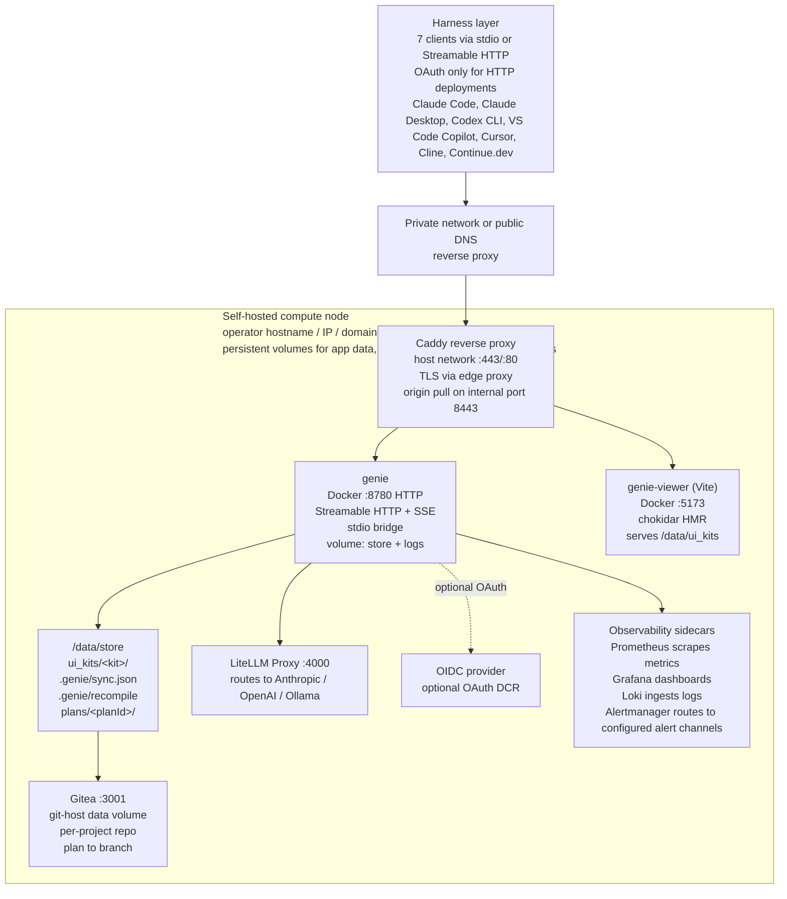
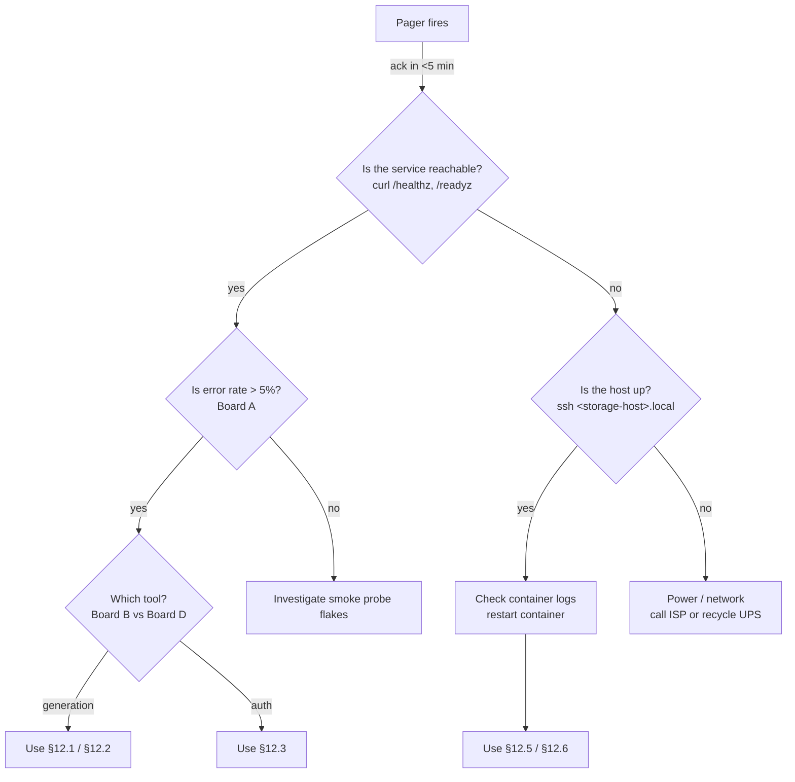
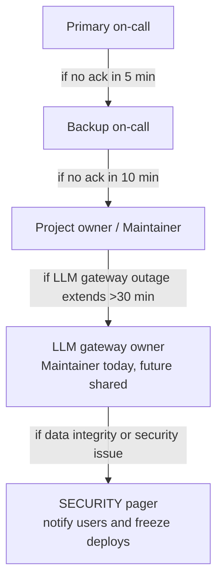

# genie — Operations + Maintenance Plan, Runbook, On-Call Guide & Operational Tools Catalog

## 1. Document control

| Field                 | Value                                                                                                          |
| --------------------- | -------------------------------------------------------------------------------------------------------------- |
| Document              | `06-operations-runbook.md`                                                                                     |
| Version               | **v0.1.3 DRAFT**                                                                                               |
| Status                | DRAFT — awaiting first on-call shadow shift                                                                    |
| Owner                 | Project maintainer                                                                                                  |
| Reviewers             | TBD (Primary on-call TBD, Backup on-call TBD, SRE reviewer TBD)                                                |
| Audience              | The maintainer (and any future self-hosting operator running their own genie instance)                         |
| Source-of-truth files | `INDEX.md`, `docs/plan/04-tech-design-rfc.md`, `docs/research/`                                               |
| Last updated          | 2026-07-03                                                                                                                                                      |
| Cadence               | Re-read on every on-call shift handover; full review quarterly; emergency patch when an incident exposes a gap |

### Changelog

| Date       | Version | Author        | Notes                                                                                                    |
| ---------- | ------- | ------------- | -------------------------------------------------------------------------------------------------------- |
| 2026-07-03 | v0.1.3  | Project maintainer | M2-05 (DRO-252): §7.1 model alias config — reference `deploy/litellm/config.yaml`, AC0 catalog-check command, per-key budget/rate-limit, reload + verify commands.  |
| 2026-06-27 | v0.1.2  | Project maintainer | BRD-feedback sweep: UI-kit terminology, native conventions (blueprints not templates), M1 19-tool surface with projects-as-peer tooling.          |
| 2026-06-24 | v0.1.1  | Project maintainer | Raised minimum Node.js from 18 to 22 (Node 18 & 20 reached EOL; Node 22 is the current Active LTS).      |
| 2026-06-21 | v0.1    | Project maintainer | Initial draft of ops + runbook + on-call guide; placeholders for dashboard URLs and TBD personnel slots. |
| 2026-06-14 | v0.0.2  | Project maintainer | Outline only — captured section list from the doc plan.                                                  |
| 2026-06-07 | v0.0.1  | Project maintainer | Stub created during M0 scaffolding.                                                                      |

---

## 2. Scope

This document is the **single source of truth for keeping `genie` healthy in production** — initially "production" means an operator-managed self-hosted instance, and after the optional managed-hosted GA, it also means the small hosted fleet fronted by an operator VPN and public-facing reverse proxy.

**In scope**

- Deployment topologies (solo dev laptop, self-hosted on the storage host, optional hosted).
- Configuration surface (every env var, where the secret lives, who rotates it).
- The monitoring stack for the self-hosted instance (Prometheus, Grafana, Loki/journald, Alertmanager).
- SLOs / SLIs / error budgets the service commits to.
- The on-call rotation, escalation tree, and triage decision tree.
- Detailed runbooks for the 15 most likely failures.
- The postmortem template + one worked example.
- Backup, restore, capacity planning, security operations, maintenance windows.
- Operational tools catalog (deploy, observe, debug, secure, backup, comms).
- Onboarding checklist for a new on-call engineer.

**Out of scope**

- Product/feature decisions (see `03-prd.md`).
- Architecture rationale (see `04-tech-design-rfc.md`).
- GTM / launch communication beyond what the on-call needs (see `05-gtm-and-postprod.md`).
- The Anthropic-side canvas generation loop (we do not operate it — open question #2 in `INDEX.md`).

**Audience**: the on-call engineer holding the pager (whether that is Maintainer, a backup volunteer, or a future hire). Every command in this doc is meant to be copy-pasteable at 03:00 with one hand on a coffee mug.

---

## 3. Service summary card

> **One screen, no scroll. Read this card first on every page.**

| Field                  | Value                                                                                                                                                                                                                                                                                                                                                |
| ---------------------- | ---------------------------------------------------------------------------------------------------------------------------------------------------------------------------------------------------------------------------------------------------------------------------------------------------------------------------------------------------- |
| Service                | **genie**                                                                                                                                                                                                                                                                                                                                            |
| Description            | Harness-agnostic MCP server that calls a configured OpenAI-compatible endpoint for component generation, owns a git-host-backed component store, and ships a portable preview pane (Vite viewer + `ui://` MCP App).                                                                                                                                  |
| Tier                   | **T2 — self-hosted / operator-managed**                                                                                                                                                                                                                                                                                                                    |
| SLA                    | **99.5 % monthly** target for the self-hosted deployment (≈3 h 39 min of allowable downtime/month)                                                                                                                                                                                                                                                         |
| Primary on-call        | **TBD** (currently Maintainer, best-effort)                                                                                                                                                                                                                                                                                                              |
| Backup on-call         | **TBD**                                                                                                                                                                                                                                                                                                                                              |
| Escalation owner       | Project maintainer (project owner)                                                                                                                                                                                                                                                                                                                        |
| Page criteria          | See **§11.3 Page-triage decision tree** — short version: any P0 (service down for >2 min, data loss, security incident) pages immediately; P1 (degraded for >10 min, error budget burn ≥10×) opens a ticket and pings primary in the configured team chat; P2 (cosmetic, partial harness regression) opens a ticket only.                                             |
| Repo                   | `https://github.com/<owner>/genie`                                                                                                                                                                                                                                                                                                                    |
| Compose file           | `infra/compose/docker-compose.yaml` (self-hosted); `infra/compose/docker-compose.hosted.yaml` (hosted, draft)                                                                                                                                                                                                                                            |
| Dashboards             | Grafana: `<observability-base-url>/d/genie-overview` (placeholder) · LLM endpoint panel: `<observability-base-url>/d/llm-routing`                                                                                                                                                                                                            |
| Runbook anchors        | §6 Deployment · §10 Alert→runbook map · §12 Incident playbooks · §14 Restore · §11.3 Triage tree                                                                                                                                                                                                                                                     |
| Code-owners file       | `.github/CODEOWNERS` — `* <maintainer-github-handle>`                                                                                                                                                                                                                                                                                              |
| Status page            | Placeholder: `https://status.genie.example`                                                                                                                                                                                                                                                                                                      |
| 1-line dependency list | **OpenAI-compatible LLM endpoint** (LiteLLM is the reference gateway) → **Anthropic / OpenAI / Ollama** backends · **git host** (Gitea is the reference implementation) · **DNS resolver** · **optional OAuth IdP** for the OAuth flow. |

---

## 4. Architecture-at-runtime diagram



Network paths:
- **Local LAN** clients -> `http://genie.<local-domain>`
- **Private network** clients -> `https://genie.<operator-network>.internal` (private-network VPN serve / funnel off)
- **Public** clients -> `https://genie.<operator-domain>` -> edge proxy -> Caddy -> MCP `:8780`

**Volume map**:

| Mount inside container | Host path on the storage host                | Pool           | Purpose                               |
| ---------------------- | ----------------------------------- | -------------- | ------------------------------------- |
| `/data/store`          | `/mnt/applications/genie/store`     | `applications` | Component store working tree          |
| `/data/plans`          | `/mnt/applications/genie/plans`     | `applications` | Active plan staging dirs              |
| `/data/logs`           | `/mnt/applications/genie/logs`      | `applications` | App-level logs (also shipped to Loki) |
| `/var/lib/git-host`    | `/mnt/data-pool/git-host`              | `data-pool`       | Git-host repos, attachments, LFS      |
| `/etc/caddy`           | `/mnt/applications/caddy/etc`       | `applications` | Reverse proxy config                  |
| `/data/litellm`        | `<path-to-existing-litellm-volume>` | `applications` | Existing LiteLLM volume               |

Network paths inside the host are bridged via `docker compose` default network `genie-net` (172.30.0.0/16). Only Caddy publishes ports to the host.

---

## 5. Deployment topologies

We support three deployment shapes. All three derive from the same source tree; the differences live in the compose file and the env vars.

### 5.1 Solo (npm install on a laptop)

Use when: contributor wants to hack offline, single-user, local-only state.

```bash
git clone https://github.com/<owner>/genie.git
cd genie
npm ci
npm run build
GENIE_LLM_BASE_URL=https://llm.example.com \
GENIE_LLM_API_KEY=$(security find-generic-password -s genie-llm -w) \
GENIE_STORE_DIR=$HOME/.genie/store \
GENIE_AUTH_MODE=none \
npx genie --stdio
```

**Env vars** (12):

| Var                    | Default                       | Notes                                                                |
| ---------------------- | ----------------------------- | -------------------------------------------------------------------- |
| `GENIE_LLM_BASE_URL`   | `https://llm.example.com`     | Required                                                             |
| `GENIE_LLM_API_KEY`    | —                             | Required, secret                                                     |
| `GENIE_STORE_DIR`      | `$HOME/.genie/store`          | Per-user                                                             |
| `GENIE_LOG_LEVEL`      | `info`                        | `trace` for noisy debug                                              |
| `GENIE_AUTH_MODE`      | `none`                        | Solo skips auth — bound to localhost only                            |
| `GENIE_MCP_HTTP_PORT`  | —                             | Unset → stdio only                                                   |
| `GENIE_PLAN_TTL_MIN`   | `60`                          |                                                                      |
| `GENIE_WRITE_BYTE_CAP` | `8388608`                     | 8 MiB, empirically safe                                              |
| `GENIE_MODEL_DEFAULT`  | `anthropic/claude-sonnet-4-6` | Or genie alias `design-default` (operator maps it in gateway config) |
| `GENIE_MODEL_FALLBACK` | `anthropic/claude-opus-4-8`   |                                                                      |
| `NODE_ENV`             | `production`                  |                                                                      |
| `GENIE_METRICS_PORT`   | —                             | Solo doesn't expose metrics                                          |

**Health check**: `npx genie --stdio --self-test` — exits 0 if it can `tools/list`, hit the configured LLM endpoint health check, and `fs.access` `GENIE_STORE_DIR`.

### 5.2 Self-hosted (Docker Compose on the storage host) — primary deployment

Use when: shared use across a few harnesses, persistent Gitea, observability.

```yaml
# infra/compose/docker-compose.yaml (excerpt)
version: "3.9"
networks:
  genie-net: { driver: bridge }

services:
  genie:
    image: ghcr.io/<owner>/genie:${VERSION:-0.1.0}
    restart: unless-stopped
    networks: [genie-net]
    ports: ["8780:8780", "9479:9479"] # 9479 = /metrics
    environment:
      GENIE_LLM_BASE_URL: ${GENIE_LLM_BASE_URL}
      GENIE_LLM_API_KEY: ${GENIE_LLM_API_KEY}
      GENIE_MCP_HTTP_PORT: "8780"
      GENIE_AUTH_MODE: "oauth"
      OAUTH_ISSUER_URL: "https://auth.<operator-network>.internal/application/o/genie/"
      OAUTH_CLIENT_ID: ${OAUTH_CLIENT_ID}
      GENIE_BEARER_TOKENS_FILE: /run/secrets/genie_bearer_tokens # harness fallback
      GENIE_GIT_BASE_URL: "http://gitea:3000"
      GENIE_GIT_TOKEN: ${GENIE_GIT_TOKEN}
      GENIE_STORE_DIR: "/data/store"
      GENIE_LOG_LEVEL: "info"
      GENIE_METRICS_PORT: "9479"
      OTEL_EXPORTER_OTLP_ENDPOINT: "http://tempo:4317"
      GENIE_PLAN_TTL_MIN: "60"
      GENIE_WRITE_BYTE_CAP: "16777216"
      GENIE_MODEL_DEFAULT: ${GENIE_MODEL_DEFAULT:-anthropic/claude-sonnet-4-6}
      GENIE_MODEL_FALLBACK: ${GENIE_MODEL_FALLBACK:-anthropic/claude-opus-4-8}
      NODE_ENV: "production"
    volumes:
      - /mnt/applications/genie/store:/data/store
      - /mnt/applications/genie/plans:/data/plans
      - /mnt/applications/genie/logs:/data/logs
    healthcheck:
      test: ["CMD", "wget", "-qO-", "http://127.0.0.1:8780/healthz"]
      interval: 15s
      timeout: 3s
      retries: 4
      start_period: 30s

  genie-viewer:
    image: ghcr.io/<owner>/genie-viewer:${VIEWER_VERSION:-0.1.0}
    restart: unless-stopped
    networks: [genie-net]
    ports: ["5173:5173"]
    environment:
      GENIE_VIEWER_STORE_DIR: "/data/store"
    volumes:
      - /mnt/applications/genie/store:/data/store:ro

  gitea:
    image: gitea/gitea:1.22-rootless
    restart: unless-stopped
    networks: [genie-net]
    ports: ["3001:3000", "2222:2222"]
    environment:
      GITEA__server__ROOT_URL: "https://git.<operator-network>.internal/"
      GITEA__database__DB_TYPE: "sqlite3"
    volumes:
      - /mnt/data-pool/gitea:/var/lib/gitea
    healthcheck:
      test: ["CMD", "curl", "-fsS", "http://127.0.0.1:3000/api/healthz"]
      interval: 30s
      timeout: 5s

  caddy:
    image: caddy:2-alpine
    restart: unless-stopped
    networks: [genie-net]
    ports: ["443:443", "80:80"]
    volumes:
      - /mnt/applications/caddy/etc:/etc/caddy
      - /mnt/applications/caddy/data:/data
      - /mnt/applications/caddy/config:/config
```

**Caddy snippet** (`/etc/caddy/Caddyfile`):

```caddy
genie.<operator-network>.internal {
    encode zstd gzip
    @mcp path /mcp* /tools/* /resources/* /healthz /metrics
    handle @mcp {
        reverse_proxy genie:8780
    }
    handle_path /viewer/* {
        reverse_proxy genie-viewer:5173
    }
    handle {
        respond "genie" 200
    }
    log { output file /data/caddy-access.log }
}
```

**Env vars** (15, in addition to the 12 above):

| Var                           | Default                            | Notes                                                                                              |
| ----------------------------- | ---------------------------------- | -------------------------------------------------------------------------------------------------- |
| `OAUTH_ISSUER_URL`            | —                                  | OIDC issuer URL                                                                                    |
| `OAUTH_CLIENT_ID`             | —                                  | Application client id                                                                              |
| `GENIE_BEARER_TOKENS_FILE`    | `/run/secrets/genie_bearer_tokens` | File with pre-issued static bearer token hashes for non-OAuth harnesses (VS Code, Cline, Continue) |
| `GENIE_GIT_BASE_URL`          | `http://gitea:3000`                | Internal hostname on compose net                                                                   |
| `GENIE_GIT_TOKEN`             | —                                  | Per-app token, scoped `repo`                                                                       |
| `OTEL_EXPORTER_OTLP_ENDPOINT` | `http://tempo:4317`                | Tempo not yet deployed — placeholder                                                               |
| `GENIE_VIEWER_STORE_DIR`      | `/data/store`                      | Read-only mount                                                                                    |
| `VERSION` / `VIEWER_VERSION`  | `0.1.0`                            | Pinned by deploy script                                                                            |
| `GENIE_LLM_MAX_RETRIES`       | `3`                                | App-level retry on 5xx                                                                             |
| `GENIE_LLM_TIMEOUT_MS`        | `120000`                           | 2 min                                                                                              |
| `GENIE_MARKER_STRICT`         | `true`                             | If false, warns instead of fails                                                                   |
| `GENIE_WRITE_CONCURRENCY`     | `8`                                | Max concurrent fs ops per planId                                                                   |
| `GENIE_MANIFEST_DEBOUNCE_MS`  | `300`                              | Compiler debounce                                                                                  |
| `GENIE_PREVIEW_SANDBOX`       | `allow-scripts`                    | Iframe CSP                                                                                         |
| `GENIE_STATUS_PAGE_URL`       | placeholder                        | For 503 page footer                                                                                |

**Health-check endpoints**:

| Endpoint                                | Container | Purpose                                                   |
| --------------------------------------- | --------- | --------------------------------------------------------- |
| `http://127.0.0.1:8780/healthz`         | mcp       | Liveness — returns 200 + git-sha JSON                     |
| `http://127.0.0.1:8780/readyz`          | mcp       | Readiness — checks configured LLM endpoint, git store, FS |
| `http://127.0.0.1:8780/metrics`         | mcp       | Prometheus exposition                                     |
| `http://127.0.0.1:5173/__viewer-health` | viewer    | Vite custom middleware                                    |
| `http://127.0.0.1:3000/api/healthz`     | gitea     | Built-in                                                  |

### 5.3 Hosted (TBD sketch)

Use when: someone other than us wants a managed instance.

```yaml
# infra/compose/docker-compose.hosted.yaml (sketch — incomplete)
services:
  mcp:
    image: ghcr.io/<owner>/genie:${VERSION}
    deploy:
      replicas: 2
      resources: { limits: { cpus: "2", memory: "2g" } }
    environment:
      GENIE_AUTH_MODE: "oauth"
      OAUTH_ISSUER_URL: "https://auth.genie.example/"
      GENIE_STORE_BACKEND: "s3"
      S3_BUCKET: "genie-prod"
      S3_ENDPOINT: "https://s3.example.com"
      S3_ACCESS_KEY_ID: ${S3_KEY}
      S3_SECRET_ACCESS_KEY: ${S3_SECRET}
      POSTGRES_URL: ${POSTGRES_URL}
      REDIS_URL: ${REDIS_URL}
      GENIE_RATE_LIMIT_RPS: "10"
      GENIE_PLAN_TTL_MIN: "30"
```

**Shared-deployment env vars**: `GENIE_STORE_BACKEND`, `S3_BUCKET`, `S3_ENDPOINT`, `S3_ACCESS_KEY_ID`, `S3_SECRET_ACCESS_KEY`, `POSTGRES_URL`, `REDIS_URL`, `GENIE_RATE_LIMIT_RPS`. Add incident or telemetry integrations only when the operator explicitly configures them.

Health endpoints stay identical; add `/livez`, `/depz` for k8s probe parity. Reverse proxy is Traefik instead of Caddy (sketch only):

```yaml
# traefik.yml (sketch)
http:
  routers:
    mcp:
      rule: "Host(`mcp.genie.example`)"
      service: mcp
      tls: { certResolver: letsencrypt }
  services:
    mcp:
      loadBalancer:
        servers:
          - url: "http://mcp-1:8780"
          - url: "http://mcp-2:8780"
        healthCheck: { path: "/readyz", interval: "10s" }
```

---

## 6. Deployment runbook (self-hosted scenario)

This is the **canonical step-by-step** for shipping a new version of `genie` to the storage host self-hosted. Print it. Tape it to your monitor. Walk it top to bottom.

**Pre-flight (steps 1–6)**

1. **Storage host health**: open the host admin dashboard. Confirm all pools `ONLINE`, no SMART warnings, CPU < 50 %, memory > 4 GiB free. If anything red, abort and triage the host first.
2. **Data pool capacity**: `ssh <storage-host>.local 'zfs list -o name,used,available,refer <git-data-pool>'` → confirm < 80 % used. If you see 78 %+ during this check, prune unused container images before continuing.
3. **LLM endpoint up**: `curl -fsS "$GENIE_LLM_BASE_URL/health" | jq` → expect `{"status":"healthy"}` when the endpoint exposes health. If 5xx, **stop** — don't ship a generation surface against a down generator.
4. **Gitea up**: `curl -fsS http://<operator-hostname>:3001/api/healthz` → 200.
5. **OIDC provider up** (only if `GENIE_AUTH_MODE=oauth`): run the provider's documented health check and confirm 200/healthy.
6. **Pager arm**: post in the configured ops channel: _"Starting deploy of genie vX.Y.Z, expect ~10 min window."_ The alert sink also posts there, so others on-call know to watch.

**Build & publish (steps 7–13)**

7. **Pull latest source**:
   ```bash
   cd ~/Developer/projects/genie/genie
   git fetch --tags
   git checkout v0.1.0
   ```
8. **Install + test locally**:
   ```bash
   npm ci
   npm run build
   npm test
   npm run e2e:smoke    # exercises stdio harness end-to-end
   ```
9. **Build image**:
   ```bash
   docker buildx build \
     --platform linux/amd64 \
     -t ghcr.io/<owner>/genie:0.1.0 \
     -t ghcr.io/<owner>/genie:latest \
     --push .
   ```
10. **Build viewer image** (only if `apps/viewer/**` changed):
    ```bash
    docker buildx build --platform linux/amd64 \
      -t ghcr.io/<owner>/genie-viewer:0.1.0 --push apps/viewer
    ```
11. **Pack `.mcpb` artifact** (Claude Desktop install bundle):
    ```bash
    npx @modelcontextprotocol/mcpb pack \
      --out dist/genie-0.1.0.mcpb \
      --sign --key ~/.config/mcpb/signing.key
    ```
12. **Publish to npm** (manual gate — pause and ask user `OK to publish?`):
    ```bash
    npm publish --provenance --access public
    ```
13. **Upload `.mcpb` to mcpb.dev + Smithery** (manual gate):
    ```bash
    gh release create v0.1.0 dist/genie-0.1.0.mcpb \
      --title "v0.1.0" --notes-from-tag
    ```

**Deploy on the storage host (steps 14–20)**

14. **SSH into storage host**:
    ```bash
    ssh <storage-host>.local
    cd /mnt/applications/genie
    ```
15. **Pin VERSION**: `echo "VERSION=0.1.0" > .env.version`. Source: `set -a; source .env.version .env.secrets; set +a`.
16. **Pull**: `docker compose pull genie genie-viewer`.
17. **Bring up new containers (canary, single replica)**:
    ```bash
    docker compose up -d --no-deps --remove-orphans genie
    ```
18. **Wait for `/readyz`**:
    ```bash
    for i in $(seq 1 30); do
      if curl -fsS http://127.0.0.1:8780/readyz; then echo OK; break; fi
      sleep 2
    done
    ```
19. **Reload Caddy** (only if Caddyfile changed): `docker compose exec caddy caddy reload --config /etc/caddy/Caddyfile`.
20. **Update private-network VPN serve** (only if hostnames changed):
    ```bash
    <vpn-cli> serve --bg --https=443 --set-path /mcp http://localhost:8780
    ```

**Smoke + finish (steps 21–25)**

21. **Curl MCP `tools/list`**:
    ```bash
    curl -fsS -H "Authorization: Bearer $BEARER" \
      https://genie.<operator-network>.internal/mcp \
      -d '{"jsonrpc":"2.0","id":1,"method":"tools/list"}' | jq '.result.tools | length'
    # expect 13
    ```
22. **End-to-end `conjure`** (real configured-LLM-endpoint call):
    ```bash
    scripts/smoke-generate.sh acme-kit "primary button"
    ```
    Should produce a `<Name>.tsx` + `<Name>.html` with `@genie` marker and an entry in `.genie/manifest.json`.
23. **Render preview**: `open https://genie.<operator-network>.internal/viewer/?kit=acme-kit`. Card grid must show the new component.
24. **Validate log flow**: `docker compose logs --since 2m genie | grep -c request_id=` should be > 0. Then in Grafana → Explore → Loki → query `{container="genie"} |= "request_id"` — confirm log lines surface within ~30 s.
25. **Announce + monitor**: post `:rocket: vX.Y.Z is live` in the configured ops channel. **Stay on glass for 30 minutes** watching the _Service Health_ dashboard (§8.1). Don't context-switch out of ops until error rate has held within budget for 30 min.

**Rollback**: at any step 14–25, run:

```bash
sed -i.bak 's/^VERSION=.*/VERSION=0.0.9/' .env.version
docker compose pull genie
docker compose up -d --no-deps genie
```

---

## 7. Configuration management

| Var                           | Purpose                            | Default                            | Valid range                                                                                                             | Where set                       | Who knows the secret         | Rotation cadence        |
| ----------------------------- | ---------------------------------- | ---------------------------------- | ----------------------------------------------------------------------------------------------------------------------- | ------------------------------- | ---------------------------- | ----------------------- |
| `GENIE_LLM_BASE_URL`          | Upstream endpoint URL              | `https://llm.example.com`          | https URL                                                                                                               | `.env`                          | n/a (public)                 | Only on infra move      |
| `GENIE_LLM_API_KEY`           | Bearer for configured LLM endpoint | —                                  | provider-specific token                                                                                                 | `.env.secrets` (sops-encrypted) | Maintainer + Backup on-call      | Quarterly               |
| `GENIE_MCP_HTTP_PORT`         | HTTP transport port                | `8780`                             | 1024–65535                                                                                                              | `.env`                          | n/a                          | n/a                     |
| `GENIE_AUTH_MODE`             | `none\|bearer\|oauth`              | `oauth` (self-hosted)                  | enum                                                                                                                    | `.env`                          | n/a                          | n/a                     |
| `OAUTH_ISSUER_URL`            | OIDC issuer                        | —                                  | https URL                                                                                                               | `.env`                          | n/a                          | When IdP migrates       |
| `OAUTH_CLIENT_ID`             | OIDC client id                     | —                                  | string                                                                                                                  | `.env`                          | OAuth provider admin         | Quarterly with secret   |
| `GENIE_BEARER_TOKENS_FILE`    | Static fallback bearer hashes      | `/run/secrets/genie_bearer_tokens` | abs path to newline-delimited 64-byte hex hashes                                                                        | `.env.secrets`                  | Maintainer, distributed per-user | 90 days                 |
| `GENIE_GIT_BASE_URL`          | Git-host hostname                  | `http://gitea:3000`                | URL                                                                                                                     | `.env`                          | n/a                          | n/a                     |
| `GENIE_GIT_TOKEN`             | Git-host token, repo-scoped        | —                                  | provider-specific token                                                                                                 | `.env.secrets`                  | Maintainer; scoped to genie user | Quarterly               |
| `GENIE_STORE_DIR`             | Component store FS root            | `/data/store`                      | abs path                                                                                                                | `.env`                          | n/a                          | n/a                     |
| `GENIE_LOG_LEVEL`             | App log verbosity                  | `info`                             | `trace\|debug\|info\|warn\|error`                                                                                       | `.env`                          | n/a                          | n/a                     |
| `GENIE_METRICS_PORT`          | Prometheus exposition              | `9479`                             | 1024–65535                                                                                                              | `.env`                          | n/a                          | n/a                     |
| `OTEL_EXPORTER_OTLP_ENDPOINT` | Tracer endpoint                    | unset                              | URL                                                                                                                     | `.env`                          | n/a                          | n/a                     |
| `NODE_ENV`                    | Node runtime mode                  | `production`                       | `production\|development`                                                                                               | `.env`                          | n/a                          | n/a                     |
| `GENIE_PLAN_TTL_MIN`          | Plan expiry                        | `60`                               | 5–1440                                                                                                                  | `.env`                          | n/a                          | Tune monthly            |
| `GENIE_WRITE_BYTE_CAP`        | Per-call payload cap               | `16777216` (16 MiB)                | 1 MiB – 64 MiB                                                                                                          | `.env`                          | n/a                          | Adjust on 500-storm     |
| `GENIE_MODEL_DEFAULT`         | Default model ID                   | `anthropic/claude-sonnet-4-6`      | Provider-native model ID or configured gateway alias (`design-default`; operator maps it in their gateway's model list) | `.env`                          | n/a                          | Per model release       |
| `GENIE_MODEL_FALLBACK`        | Fallback model ID                  | `anthropic/claude-opus-4-8`        | Provider-native model ID or configured gateway alias (`design-best`; operator maps it in their gateway's model list)    | `.env`                          | n/a                          | Per model release       |
| `GENIE_WRITE_CONCURRENCY`     | FS write parallelism               | `8`                                | 1–32                                                                                                                    | `.env`                          | n/a                          | Tune on disk saturation |
| `GENIE_MARKER_STRICT`         | Fail vs warn on missing @genie     | `true`                             | bool                                                                                                                    | `.env`                          | n/a                          | n/a                     |
| `GENIE_PREVIEW_SANDBOX`       | iframe CSP for viewer              | `allow-scripts`                    | CSP string                                                                                                              | `.env`                          | n/a                          | Only on security audit  |
| `GENIE_STATUS_PAGE_URL`       | Footer link on 5xx page            | placeholder                        | URL                                                                                                                     | `.env`                          | n/a                          | n/a                     |

**Where secrets live**: operator-managed secret storage, encrypted with `sops` keyed against an `age` recipient stored in the secrets manager. Backup recipient: an age-encrypted offline copy held in secure storage. Rotation is logged to the operator runbook.

**Loading order** (most→least specific): `docker compose --env-file` → `.env.local` → `.env.secrets` → `.env` → defaults baked into the image. The container refuses to start (exit 78) if a _required_ secret (`GENIE_LLM_API_KEY`, `OAUTH_CLIENT_ID` when `GENIE_AUTH_MODE=oauth`, `GENIE_GIT_TOKEN`) is missing.

**Anti-patterns we explicitly reject**:

- Never bake secrets into the image. CI fails the build if `git grep -E 'sk-(litellm|ant|proj)|gta_'` returns anything in `docker/` or `apps/`.
- Never expose `:8780` to the public internet without OAuth or static bearer enabled.
- Never set `GENIE_AUTH_MODE=none` on the storage host deployment. The startup script panics if `GENIE_AUTH_MODE=none && GENIE_MCP_HTTP_PORT=*` are both set.

### 7.1 Model alias config (LiteLLM reference gateway) — M2-05 / DRO-252

genie itself never hardcodes a provider model id — `GENIE_LLM_BASE_URL` points
at *some* OpenAI-compatible endpoint, and the three generation aliases
(`design-default` / `design-best` / `design-local`) are resolved on the far
side of that endpoint (D-H, `00-decisions.md`). `deploy/litellm/config.yaml`
is a **reference example** of that resolution using LiteLLM as the gateway —
not a requirement. Operators on a different gateway (a raw provider endpoint,
a different proxy) reproduce the same three-alias contract however their
gateway expresses it.

**Before adopting or editing this file**: reconfirm the operator's real model
catalog — placeholder or stale model ids drift out from under a reference
file fast. Never assume the ids below are still current:

```bash
curl -fsS "$GENIE_LLM_BASE_URL/v1/models" \
  -H "Authorization: Bearer $GENIE_LLM_API_KEY" | jq -r '.data[].id'
```

**Aliases** (`deploy/litellm/config.yaml`):

| Alias             | Reference target             | Notes                                          |
| ----------------- | ----------------------------- | ----------------------------------------------- |
| `design-default`  | `anthropic/claude-sonnet-4-6` | Default for `conjure`                           |
| `design-best`     | `anthropic/claude-opus-4-8`   | Slower/pricier, picks better names               |
| `design-local`    | `ollama_chat/qwen3-coder:30b` | Offline-capable, lower quality; no per-token cost |

Every credential (`ANTHROPIC_API_KEY`, `OLLAMA_API_BASE`, `LITELLM_MASTER_KEY`)
is a LiteLLM `os.environ/<VAR>` passthrough resolved from the **proxy host's**
environment at LiteLLM startup — never a literal in the file. These are
separate from, and not to be confused with, the `GENIE_LLM_*` vars genie
itself reads (genie only talks to whatever `GENIE_LLM_BASE_URL` fronts —
this proxy, in the reference topology).

**Per-key budget + rate limit** (every MCP-server caller's LiteLLM virtual
key): $50 USD / 30 days, 20 RPM / 200 KTPM (matches `claude-sonnet-4-6` tier
defaults). LiteLLM's config format has no single "applies to every future
key" switch for this (`upperbound_key_generate_params` is a ceiling on
`/key/generate` requests, not a default), so `deploy/litellm/config.yaml`
pins that ceiling and this is the exact body to pass when provisioning a key:

```bash
curl -fsS 'http://localhost:4000/key/generate' \
  -H "Authorization: Bearer $LITELLM_MASTER_KEY" \
  -H 'Content-Type: application/json' \
  -d '{"max_budget": 50, "budget_duration": "30d", "rpm_limit": 20, "tpm_limit": 200000}'
```

**Reload after editing** `deploy/litellm/config.yaml`:

```bash
litellm --config deploy/litellm/config.yaml
# or, if already running under docker compose:
docker compose restart litellm
```

**Verify**: `curl -fsS "$GENIE_LLM_BASE_URL/v1/models" | jq -r '.data[].id'` —
expect the three alias names among the results (§12.15 walks the failure
mode where they go missing).

[END CHUNK 1]

---

## 8. Monitoring stack

The whole monitoring stack runs on the same storage host, sharing the `applications` pool so it can survive a reboot. Nothing in this stack should ever live on `data-pool` — that pool is for data, not telemetry.

### 8.1 Prometheus scrape config

`/mnt/applications/prometheus/etc/prometheus.yml`:

```yaml
global:
  scrape_interval: 15s
  evaluation_interval: 15s
  external_labels: { cluster: "self-hosted", deployment: "genie" }

alerting:
  alertmanagers:
    - static_configs: [{ targets: ["alertmanager:9093"] }]

rule_files:
  - /etc/prometheus/rules/*.yml

scrape_configs:
  - job_name: genie
    metrics_path: /metrics
    static_configs:
      - targets: ["genie:9479"]
        labels: { app: genie, tier: t2 }
    relabel_configs:
      - source_labels: [__address__]
        target_label: instance
        replacement: "self-hosted/genie"

  - job_name: genie-viewer
    metrics_path: /__viewer-metrics
    static_configs:
      - targets: ["genie-viewer:5173"]
        labels: { app: genie-viewer }

  - job_name: gitea
    metrics_path: /metrics
    static_configs:
      - targets: ["gitea:3000"]
    bearer_token_file: /etc/prometheus/secrets/gitea_metrics_token

  - job_name: litellm
    metrics_path: /metrics
    static_configs:
      - targets: ["litellm:4000"]
        labels: { app: litellm, owner: shared }

  - job_name: node
    static_configs:
      - targets: ["node-exporter:9100"]

  - job_name: cadvisor
    static_configs:
      - targets: ["cadvisor:8080"]
```

### 8.2 Grafana dashboards (4 boards, ≥22 PromQL queries)

Bookmark URL pattern: `<observability-base-url>/d/<uid>` (placeholder UIDs). Each dashboard ships a JSON model in `infra/grafana/dashboards/`.

#### 8.2.1 Board A — _Service Health_ (`uid=genie-health`)

Single-pane "is it up" — what the on-call opens first.

| Panel              | PromQL                                                                                                                            | Notes                        |
| ------------------ | --------------------------------------------------------------------------------------------------------------------------------- | ---------------------------- |
| Uptime (last 30 d) | `avg_over_time(up{job="genie"}[30d])`                                                                                             | Target ≥0.995 (T2)           |
| Request rate       | `sum by (method) (rate(mcp_requests_total{app="genie"}[5m]))`                                                                     | Tool-call mix                |
| Error rate (5xx)   | `sum(rate(mcp_requests_total{app="genie",status=~"5.."}[5m])) / clamp_min(sum(rate(mcp_requests_total{app="genie"}[5m])), 0.001)` | SLI for §9                   |
| p95 tool latency   | `histogram_quantile(0.95, sum by (le, tool) (rate(mcp_tool_duration_seconds_bucket[5m])))`                                        | Per-tool                     |
| p99 tool latency   | `histogram_quantile(0.99, sum by (le, tool) (rate(mcp_tool_duration_seconds_bucket[5m])))`                                        | Per-tool                     |
| Active plans       | `sum(genie_active_plans{app="genie"})`                                                                                            | Should not climb unboundedly |
| Memory RSS         | `container_memory_rss{name="genie"} / 1024 / 1024`                                                                                | MiB                          |

#### 8.2.2 Board B — _Generation Pipeline_ (`uid=genie-gen`)

| Panel                        | PromQL                                                                                                                                          |
| ---------------------------- | ----------------------------------------------------------------------------------------------------------------------------------------------- |
| `conjure` requests           | `sum by (model) (rate(mcp_tool_requests_total{tool="conjure"}[5m]))`                                                                            |
| Generation success ratio     | `sum(rate(mcp_tool_requests_total{tool="conjure",status="ok"}[5m])) / clamp_min(sum(rate(mcp_tool_requests_total{tool="conjure"}[5m])), 0.001)` |
| LiteLLM upstream 4xx by code | `sum by (code) (rate(litellm_requests_total{status=~"4.."}[5m]))`                                                                               |
| LiteLLM upstream 5xx         | `sum(rate(litellm_requests_total{status=~"5.."}[5m]))`                                                                                          |
| LiteLLM cost (USD/h)         | `sum(rate(litellm_spend_dollars_total[1h])) * 3600`                                                                                             |
| `refine` p95 latency         | `histogram_quantile(0.95, sum by (le) (rate(mcp_tool_duration_seconds_bucket{tool="refine"}[5m])))`                                             |
| Tokens in/out                | `sum by (direction) (rate(litellm_tokens_total[5m]))`                                                                                           |

#### 8.2.3 Board C — _Storage & Sync_ (`uid=genie-store`)

| Panel                              | PromQL                                                                                                                                                                                                                       |
| ---------------------------------- | ---------------------------------------------------------------------------------------------------------------------------------------------------------------------------------------------------------------------------- |
| Store volume usage                 | `(node_filesystem_size_bytes{mountpoint="/mnt/applications/genie/store"} - node_filesystem_free_bytes{mountpoint="/mnt/applications/genie/store"}) / node_filesystem_size_bytes{mountpoint="/mnt/applications/genie/store"}` |
| data-pool pool usage                  | `zfs_pool_used_bytes{pool="data-pool"} / zfs_pool_size_bytes{pool="data-pool"}` (via custom textfile exporter)                                                                                                                     |
| Gitea commits/min                  | `sum(rate(gitea_commits_total[5m])) * 60`                                                                                                                                                                                    |
| Open Gitea branches (≈ open plans) | `gitea_branch_count{repo=~"design/.*"}`                                                                                                                                                                                      |
| `.genie/sync.json` write success   | `sum(rate(genie_sync_anchor_writes_total{status="ok"}[5m])) / clamp_min(sum(rate(genie_sync_anchor_writes_total[5m])), 0.001)`                                                                                               |
| Validator findings                 | `sum by (kind) (rate(genie_validate_findings_total[1h]))`                                                                                                                                                                    |
| @genie marker missing count (24 h) | `sum(increase(genie_validate_findings_total{kind="markerMissing"}[24h]))`                                                                                                                                                    |

#### 8.2.4 Board D — _Auth & Harness Traffic_ (`uid=genie-auth`)

| Panel                   | PromQL                                                                                  |
| ----------------------- | --------------------------------------------------------------------------------------- |
| Active OAuth tokens     | `sum(genie_oauth_active_tokens)`                                                        |
| 401 rate                | `sum(rate(mcp_requests_total{status="401"}[5m]))`                                       |
| 403 rate                | `sum(rate(mcp_requests_total{status="403"}[5m]))`                                       |
| Harness mix             | `sum by (harness) (rate(mcp_requests_total[15m]))` (label set from `User-Agent` parser) |
| OAuth flow duration p95 | `histogram_quantile(0.95, sum by (le) (rate(genie_oauth_flow_seconds_bucket[15m])))`    |

### 8.3 Logs

**Pipeline**: Docker JSON logs → Promtail sidecar → Loki on `applications` pool → Grafana Explore.

Sample queries (`<observability-base-url>/explore`):

```logql
# Last 50 generation errors with traceback
{container="genie"} |= "conjure" |= "error" | json | line_format "{{.time}} {{.request_id}} {{.error}}"

# Plan TTL expiries in the last hour
{container="genie"} |= "planId" |= "expired" | json | __error__=""

# Manifest writes
{container="genie"} |~ "manifest.(write|compile)" | json

# Caddy 5xx
{container="caddy"} |~ " (5\\d{2}) " | regexp `status=(?P<status>5\\d{2})` | line_format "{{.status}} {{.upstream}} {{.path}}"
```

If Loki is unavailable (e.g. its disk is full), fall back to `journalctl -u docker --since "10 min ago" | grep genie` on the storage host.

### 8.4 Traces

OpenTelemetry SDK is wired in already (env `OTEL_EXPORTER_OTLP_ENDPOINT`). Operators can point it at any OTLP-compatible collector. Until the deployment includes a dedicated tracing board, assume traces are best-effort.

### 8.5 Synthetic checks

`blackbox-exporter` running at `:9115` runs three probes every 30 s:

```yaml
modules:
  http_2xx_mcp:
    {
      prober: http,
      http:
        {
          method: POST,
          headers: { Authorization: "Bearer ${SYNTH_TOKEN}" },
          body: '{"jsonrpc":"2.0","id":1,"method":"tools/list"}',
        },
    }
  http_2xx_viewer: { prober: http, http: { method: GET, valid_status_codes: [200, 304] } }
  genie_smoke:
    {
      prober: http,
      http: { method: POST, body_file: /etc/blackbox/smoke.json, valid_status_codes: [200] },
    }
```

These hit `https://genie.<operator-network>.internal/mcp`, `/viewer/`, and a fixed `conjure` smoke prompt. Each emits a `probe_success` metric used in §10 alerts.

---

## 9. SLOs and SLIs

We commit to **8 SLOs**. Error budgets are monthly. If we burn ≥50 % of a budget in 24 h, see §10 multi-window burn-rate alerts.

| #   | SLO                          | SLI definition                                                                                                                                | Target  | Error budget / mo (T2)         | Alert threshold                                   | Dashboard panel              |
| --- | ---------------------------- | --------------------------------------------------------------------------------------------------------------------------------------------- | ------- | ------------------------------ | ------------------------------------------------- | ---------------------------- |
| 1   | **MCP availability**         | `1 - (5xx + connection_refused) / total_requests`, 30 d rolling, computed on a Prometheus recording rule                                      | ≥99.5 % | 3 h 39 min                     | Burn 2× for 1 h → ticket; 14× for 5 min → page    | Board A: Uptime              |
| 2   | **Tool latency p95**         | `histogram_quantile(0.95, sum by (le, tool) (rate(mcp_tool_duration_seconds_bucket[5m])))` for read-tier tools (`list_*`, `get_*`, `preview`) | ≤300 ms | 5 % of measurements may exceed | >800 ms for 10 min → ticket                       | Board A: p95 latency         |
| 3   | **Generation latency p95**   | `histogram_quantile(0.95, sum by (le) (rate(mcp_tool_duration_seconds_bucket{tool="conjure"}[5m])))`                                          | ≤45 s   | 5 % may exceed                 | >120 s for 15 min → ticket                        | Board B: refine p95 (duplicate)  |
| 4   | **Generation success ratio** | `tool=conjure & status=ok` over `tool=conjure & status!="canceled"`                                                                           | ≥97 %   | 3 % may fail                   | <90 % for 30 min → ticket; <50 % for 5 min → page | Board B: success ratio       |
| 5   | **Validator integrity**      | `manifests where compiled_hash == disk_hash` over all `.genie/sync.json` writes in a 24-h window                                              | 100 %   | 0 errors tolerated             | any mismatch → page                               | Board C: sync_anchor success |
| 6   | **Auth success ratio**       | `1 - 401/total` excluding probe traffic                                                                                                       | ≥99.9 % | 0.1 %                          | <99 % for 15 min → ticket                         | Board D                      |
| 7   | **Store write durability**   | `.genie/sync.json` writes whose content survives `fsync + sync && cmp`                                                                        | 100 %   | 0 errors                       | any failure → page                                | Board C                      |
| 8   | **Smoke probe success**      | `avg_over_time(probe_success{job="blackbox", module=~"http_2xx_.*\|genie_smoke"}[30m])`                                                       | ≥99 %   | 1 %                            | <95 % 3 windows out of 5 → page                   | Board A                      |

Recording-rule examples (`/etc/prometheus/rules/recording.yml`):

```yaml
groups:
  - name: genie:availability
    interval: 30s
    rules:
      - record: genie:mcp:availability:5m
        expr: |
          1 - (
            sum(rate(mcp_requests_total{app="genie",status=~"5..|0"}[5m]))
            /
            clamp_min(sum(rate(mcp_requests_total{app="genie"}[5m])), 0.001)
          )
      - record: genie:mcp:availability:30d
        expr: avg_over_time(genie:mcp:availability:5m[30d])
```

---

## 10. Alerting

Alertmanager routes by `severity` label. Severities:

- **`page`** — wakes the on-call. SLA: ack in 5 min, mitigate in 30 min.
- **`ticket`** — opens a GitHub Issue (via webhook) and pings the configured ops channel. SLA: investigate within 8 working hours.
- **`info`** — team-chat-only notification, no ticket. SLA: read at standup, sweep weekly.

Rules live in `/mnt/applications/prometheus/etc/rules/genie.yml`. **13 rules** below — runbook URLs are anchors in this doc.

```yaml
groups:
  - name: genie
    rules:
      - alert: McpServiceDown
        expr: up{job="genie"} == 0
        for: 2m
        labels: { severity: page, app: genie }
        annotations:
          summary: "genie is down ({{ $labels.instance }})"
          runbook_url: "https://github.com/<owner>/genie/blob/main/docs/plan/06-operations-runbook.md#121-litellm-5xx-storm"
          dashboard_url: "<observability-base-url>/d/genie-health"

      - alert: McpHighErrorRate
        expr: |
          sum(rate(mcp_requests_total{app="genie",status=~"5.."}[5m]))
          / clamp_min(sum(rate(mcp_requests_total{app="genie"}[5m])), 0.001)
          > 0.05
        for: 10m
        labels: { severity: ticket }
        annotations:
          summary: "5xx error rate >5% for 10 min"
          runbook_url: "…#126-mcp-http-500-port-collision--missing-env"

      - alert: McpAvailabilityFastBurn
        expr: (1 - genie:mcp:availability:5m) > (14 * (1 - 0.995))
        for: 5m
        labels: { severity: page }
        annotations:
          summary: "Burning monthly error budget 14× (fast-burn) for 5m"
          runbook_url: "…#126-mcp-http-500-port-collision--missing-env"

      - alert: McpAvailabilitySlowBurn
        expr: (1 - avg_over_time(genie:mcp:availability:5m[1h])) > (2 * (1 - 0.995))
        for: 1h
        labels: { severity: ticket }
        annotations:
          summary: "Slow burn 2× for 1h (multi-window MWMBR)"

      - alert: LiteLLMUpstream5xxStorm
        expr: sum(rate(litellm_requests_total{status=~"5.."}[5m])) > 1
        for: 5m
        labels: { severity: page }
        annotations:
          summary: "LiteLLM upstream returning 5xx >1 rps for 5m"
          runbook_url: "…#121-litellm-5xx-storm"

      - alert: LLMEndpointQuotaExhausted
        expr: sum(rate(llm_endpoint_requests_total{status="429"}[5m])) > 0.2
        for: 10m
        labels: { severity: ticket }
        annotations:
          summary: "LLM endpoint 429s sustained — quota or rate limit"
          runbook_url: "…#122-llm-endpoint-429-quota-exhausted"

      - alert: LLMEndpointAuthFailures
        expr: sum(rate(llm_endpoint_requests_total{status="401"}[5m])) > 0
        for: 2m
        labels: { severity: page }
        annotations:
          summary: "LLM endpoint rejecting our key with 401"
          runbook_url: "…#123-llm-endpoint-401-auth"

      - alert: GiteaUnreachable
        expr: probe_success{instance="gitea:3000"} == 0
        for: 3m
        labels: { severity: page }
        annotations:
          summary: "Gitea probe failing for 3m"
          runbook_url: "…#124-gitea-unreachable"

      - alert: SyncAnchorMismatch
        expr: increase(genie_sync_anchor_mismatches_total[10m]) > 0
        for: 0m
        labels: { severity: page }
        annotations:
          summary: ".genie/sync.json content mismatch detected — data integrity"
          runbook_url: "…#1210-manifest-json-corruption-concurrent-writes"

      - alert: DataPoolHigh
        expr: zfs_pool_used_bytes{pool="data-pool"} / zfs_pool_size_bytes{pool="data-pool"} > 0.85
        for: 15m
        labels: { severity: ticket }
        annotations:
          summary: "data-pool pool >85% — risk of write failures"
          runbook_url: "…#1211-data-pool-disk-full"

      - alert: DataPoolCritical
        expr: zfs_pool_used_bytes{pool="data-pool"} / zfs_pool_size_bytes{pool="data-pool"} > 0.95
        for: 5m
        labels: { severity: page }
        annotations:
          summary: "data-pool pool >95% — imminent failure"
          runbook_url: "…#1211-data-pool-disk-full"

      - alert: PlanTTLBacklog
        expr: genie_active_plans > 200
        for: 30m
        labels: { severity: ticket }
        annotations:
          summary: "Active plan count >200 (TTL likely not reaping)"
          runbook_url: "…#129-planid-ttl-expiry-mid-write"

      - alert: GenieMarkerValidatorStorm
        expr: increase(genie_validate_findings_total{kind="markerMissing"}[10m]) > 50
        for: 0m
        labels: { severity: info }
        annotations:
          summary: "@genie validator finding storm — likely upstream prompt regression"
          runbook_url: "…#128-genie-validator-false-positive-flood"
```

Route file (`alertmanager.yml`):

```yaml
route:
  receiver: team-chat-info
  routes:
    - matchers: ['severity="page"']
      receiver: team-chat-page
      group_wait: 0s
      repeat_interval: 30m
    - matchers: ['severity="ticket"']
      receiver: github-issues

receivers:
  - name: team-chat-page
    webhook_configs:
      - url_file: /etc/alertmanager/secrets/team_chat_page
        title: "🚨 {{ .CommonAnnotations.summary }}"
  - name: github-issues
    webhook_configs:
      - url: http://issue-bot:9100/alert
  - name: team-chat-info
    webhook_configs:
      - url_file: /etc/alertmanager/secrets/team_chat_info
```

---

## 11. On-call guide

### 11.1 On-call model

There is no rotation — this is a solo, best-effort project. The "on-call engineer" is the maintainer (Maintainer), responding when able, with no pager SLA and no commitment to off-hours response. That is the honest posture and it should stay that way unless a genuine second maintainer ever volunteers.

| Period                              | Who responds                     | Commitment                                                                                                                                        |
| ----------------------------------- | -------------------------------- | ------------------------------------------------------------------------------------------------------------------------------------------------- |
| Always                              | Maintainer (best-effort)             | No SLA. Local-FS mode means a self-hosting operator's instance keeps working even if the maintainer is unreachable; nothing pages a human at 3am. |
| If a second maintainer ever appears | Informal "whoever sees it first" | Still best-effort; no formal rotation until the project is big enough to need one (it isn't).                                                     |

There is no hand-off ritual because there's no one to hand off to. The closest thing is the maintainer's own habit: before stepping away for a while, skim open incidents/issues and note anything mid-flight in `.claude/TASKS.md`.

### 11.2 Tools-at-hand checklist

Before starting a shift, confirm **every line** of:

```bash
# Connectivity
<vpn-cli> status | grep -q <operator-host-domain>
ping -c1 -W2 <storage-host>.local
curl -fsS "$GENIE_LLM_BASE_URL/health" | jq -e '.status=="healthy"'
curl -fsS <observability-base-url>/api/health
curl -fsS <prometheus-base-url>/-/healthy

# Tooling
gh auth status
npm whoami
docker --version
docker compose version
node --version | grep -E '^v(22|24)\.'

# Client
which claude
claude mcp list | grep genie

# Secrets
sops -d ~/Developer/projects/genie/genie/infra/.env.secrets.enc | head -3
```

If any line fails, fix it **before** going on the rota; don't accept the pager until every check is green.

### 11.3 Page-triage decision tree



### 11.4 Comms expectations

- **Ack page within 5 min** in `#genie-ops`.
- **Status update every 30 min** while the incident is open. Template: `:warning: <minute mark>: still investigating, current hypothesis = X, next check = Y`.
- **If incident >1 h**, post a **public note** to the GTM channel:
  - the project's social/status channel (TBD handle — pick an original, non-derivative name);
  - the GitHub status badge;
  - the placeholder status-page.
- **At resolution**: post `:white_check_mark: mitigated at HH:MM, postmortem due by <date+3>`.
- **Within 72 h**: file a postmortem using §13's template, link it in the closing comment.

### 11.5 Common log/metric one-liners

```promql
# Is the gateway answering?
probe_success{job="llm-endpoint"}

# Generation success in the last 30m
sum(rate(mcp_tool_requests_total{tool="conjure",status="ok"}[30m])) /
clamp_min(sum(rate(mcp_tool_requests_total{tool="conjure"}[30m])), 0.001)

# Per-tool error count in the last hour, sorted
topk(5, sum by (tool) (increase(mcp_tool_requests_total{status!="ok"}[1h])))

# Memory growth in the last 4 hours (RSS, MiB)
deriv(container_memory_rss{name="genie"}[4h]) / 1024 / 1024

# Active plans (look for unbounded growth)
genie_active_plans

# OAuth flow p95 (auth latency)
histogram_quantile(0.95, sum by (le) (rate(genie_oauth_flow_seconds_bucket[15m])))
```

```bash
# Logs for one request, by request_id
docker compose logs --since 30m genie | grep "request_id=01H..."
```

### 11.6 Escalation tree



Criteria for hop:

- **Primary → Backup**: 5 min no ack, OR primary explicitly hands off.
- **Backup → Project owner**: 10 min still no ack, OR scope clearly exceeds backup's authority (e.g., need to publish a CVE notice).
- **Project owner → LiteLLM owner**: when the symptom is upstream (Anthropic 5xx, model deprecation, account billing).
- **Anyone → SECURITY**: any plausible secret leak, supply-chain compromise, or unauthenticated 200 response.

### 11.7 LiteLLM vs MCP — who to page

| Symptom                                                                        | Page LiteLLM owner | Page MCP owner        |
| ------------------------------------------------------------------------------ | ------------------ | --------------------- |
| 5xx on `/v1/chat/completions` from any consumer (Open-WebUI etc. also failing) | ✅                 | —                     |
| 5xx limited to `genie`'s requests                                              | —                  | ✅                    |
| 401 on LiteLLM despite correct key                                             | ✅                 | —                     |
| `conjure` returning bad JSON (LiteLLM returns 200)                             | —                  | ✅                    |
| storage host down                                                              | both               | both (host owns both) |

---

## 12. Incident playbook — common failures

Each runbook follows the same shape: **Symptom · Dashboard signal · Log signature · Hypotheses · Validation queries · Remediation (with rollback per step) · Prevention follow-up.** Anchors match the alert `runbook_url`s in §10.

### 12.1 LiteLLM 5xx storm

- **Symptom**: `conjure` calls failing with `LLM_UPSTREAM_5XX` errors. Team-chat page from `LiteLLMUpstream5xxStorm`.
- **Dashboard signal**: Board B → _LiteLLM upstream 5xx_ > 1 rps.
- **Log signature**: `level=error msg="litellm upstream" status=502 model=...`
- **Hypotheses**:
  1. Anthropic-side incident.
  2. LiteLLM container OOMing / crash-looping.
  3. DNS resolution for upstream broken (resolver misconfig).
- **Validation**:
  ```bash
  curl -fsS "$GENIE_LLM_BASE_URL/health/liveliness"
  curl -fsS "$GENIE_LLM_BASE_URL/health"
  curl -fsS https://status.anthropic.com/api/v2/summary.json | jq '.status.indicator'
  docker compose -f <path-to-your-litellm-compose> logs --since 15m litellm
  ```
- **Remediation**:
  1. If Anthropic incident: switch `GENIE_MODEL_DEFAULT=design-local` (Ollama Qwen3-Coder) in `.env`. `docker compose up -d --no-deps genie`. **Rollback**: revert env and restart when status page green.
  2. If LiteLLM OOM: `docker compose restart litellm`. Raise memory cap in compose to 2 GiB. **Rollback**: revert memory if regressions.
  3. If DNS: `docker compose exec litellm getent hosts api.anthropic.com`. If empty, restart the resolver or temporarily set `--dns 1.1.1.1` on LiteLLM container. **Rollback**: remove DNS override once the resolver is restored.
- **Prevention**: add a synthetic check on `api.anthropic.com` in blackbox-exporter; configure LiteLLM with a primary+fallback backend.

### 12.2 LiteLLM 429 quota exhausted

- **Symptom**: `conjure` errors `LLM_QUOTA_EXCEEDED`. Generation success ratio drops <90 %.
- **Dashboard signal**: Board B → _LiteLLM 4xx by code_ shows 429 spike.
- **Log signature**: `status=429 error="quota_exceeded"` or `Retry-After: NNN`.
- **Hypotheses**:
  1. Anthropic monthly cap hit.
  2. LiteLLM virtual-key budget exhausted (per-key budget set too low).
  3. A misbehaving harness retrying without backoff is amplifying.
- **Validation**:
  ```bash
  # LiteLLM-specific admin APIs; for other gateways, use the provider's quota endpoints.
  curl -fsS -H "Authorization: Bearer $GENIE_LLM_API_KEY" "$GENIE_LLM_BASE_URL/key/info" | jq
  curl -fsS -H "Authorization: Bearer $GENIE_LLM_API_KEY" "$GENIE_LLM_BASE_URL/spend/logs?limit=20" | jq
  promtool query instant http://localhost:9090 \
    'topk(3, sum by (harness) (rate(mcp_tool_requests_total{tool="conjure",status!="ok"}[5m])))'
  ```
- **Remediation**:
  1. Increase virtual-key budget via the configured endpoint UI **only if** monthly provider cap has headroom. **Rollback**: revert budget after incident.
  2. Switch traffic to `GENIE_MODEL_DEFAULT=design-local` for ~1 h to cool off. **Rollback**: revert env.
  3. If retry-amplification: enable a server-side circuit breaker (`GENIE_LLM_MAX_RETRIES=1`) and document the offending harness. **Rollback**: restore default after fix.
- **Prevention**: dashboard panel for "budget headroom" + alert at 80 %; ship a per-harness rate limiter in `genie` itself.

### 12.3 LLM endpoint 401 auth

- **Symptom**: `conjure` returning `AUTH_REJECTED`. Page from `LLMEndpointAuthFailures`.
- **Dashboard signal**: Board B → 401 spike.
- **Log signature**: `Invalid API key` or `Bearer token rejected`.
- **Hypotheses**:
  1. Master key was rotated and `.env.secrets` not updated.
  2. Endpoint gateway database lost the virtual key (DB restore from older snapshot).
  3. Clock skew rejecting tokens.
- **Validation**:
  ```bash
  curl -i -H "Authorization: Bearer $GENIE_LLM_API_KEY" "$GENIE_LLM_BASE_URL/v1/models"
  date && ssh <storage-host>.local date
  ```
- **Remediation**:
  1. Re-issue key in the configured endpoint UI, write into the operator secret store AND `infra/.env.secrets.enc` (sops re-encrypt), then redeploy. **Rollback**: keep prior key alive for 24 h to roll back.
  2. DB restore: invoke §14 restore for the endpoint gateway volume snapshot. **Rollback**: revert to previous snapshot if data loss exceeds 1 h.
  3. Clock skew: `sudo systemctl restart chrony` on host. **Rollback**: n/a.
- **Prevention**: alert on OAuth token-mint failures; document rotation in §16.

### 12.4 Git host unreachable

- **Symptom**: `plan` fails with `STORE_BACKEND_DOWN`. `GitHostUnreachable` alert.
- **Dashboard signal**: Board C → git-host commits/min flatlines at 0.
- **Log signature**: `gitea: connection refused` or `502 Bad Gateway` in Caddy.
- **Hypotheses**:
  1. Gitea container stopped (image update, OOM).
  2. SQLite lock from a long-running webhook.
  3. `data-pool` pool full (Gitea writes refused).
- **Validation**:
  ```bash
  docker compose ps gitea
  docker compose logs --tail 200 gitea
  ssh <storage-host>.local 'zpool status -v data-pool'
  ```
- **Remediation**:
  1. Container down: `docker compose restart gitea`. **Rollback**: roll back image tag if restart fails.
  2. SQLite lock: `docker compose exec gitea sqlite3 /var/lib/gitea/data/gitea.db '.timeout 5000' '.tables'`. If locked, identify and kill the writer. **Rollback**: restore from yesterday's snapshot.
  3. Pool full: jump to §12.11.
- **Prevention**: migrate Gitea to Postgres before public launch; add disk-space alert at 80 % for `data-pool`.

### 12.5 MCP stdio crash

- **Symptom**: Claude Desktop reports `Server transport closed`. No HTTP-tier metric move because stdio runs per-client.
- **Dashboard signal**: n/a (stdio is in-process for Desktop).
- **Log signature**: in `~/Library/Logs/Claude/mcp-server-genie.log`: `panic: ...` or `SIGSEGV`.
- **Hypotheses**:
  1. Native module mismatch (Node ABI drift).
  2. Permission denied reading `GENIE_STORE_DIR`.
  3. Bad `.mcpb` install (signature mismatch).
- **Validation**:
  ```bash
  node -e "require('@modelcontextprotocol/sdk')"
  ls -la "$GENIE_STORE_DIR"
  npx @modelcontextprotocol/mcpb verify ~/Library/Application\ Support/Claude/MCPB/genie/*.mcpb
  ```
- **Remediation**:
  1. Reinstall `.mcpb` from the GitHub release. **Rollback**: drop to npm-installed stdio.
  2. `chmod -R u+rwX "$GENIE_STORE_DIR"`. **Rollback**: n/a.
  3. Pin Node version in `.mcpb/manifest.json` minimum. **Rollback**: revert version pin if old harness can't run new Node.
- **Prevention**: ship integration tests covering `.mcpb` install path; auto-verify signature on install.

### 12.6 MCP HTTP 500 (port collision / missing env)

- **Symptom**: Caddy returns 502; container CrashLoopBackOff.
- **Dashboard signal**: Board A: uptime drop. `McpServiceDown` page.
- **Log signature**: `Error: listen EADDRINUSE: ::: 8780` or `FATAL missing env GENIE_LLM_API_KEY`.
- **Hypotheses**:
  1. Another container bound `:8780`.
  2. `.env.secrets` not loaded (sops failed).
  3. Bad image push (corrupt manifest).
- **Validation**:
  ```bash
  ss -tnlp | grep :8780
  docker compose config | grep -A 3 GENIE_LLM_API_KEY
  docker pull ghcr.io/<owner>/genie:$VERSION
  ```
- **Remediation**:
  1. Identify and stop conflicting container, then `docker compose up -d`. **Rollback**: free a different port via `GENIE_MCP_HTTP_PORT=8781` if conflict can't be resolved.
  2. Re-run `sops -d` and re-source env, then redeploy. **Rollback**: revert sops update if decryption broken.
  3. Roll back to last known-good tag (`docker compose pull && up -d`). **Rollback**: restore prior tag via `.env.version`.
- **Prevention**: add deploy-time port-conflict check; CI test confirming required envs present at start.

### 12.7 Viewer port 5173 in use

- **Symptom**: viewer container restart-loops.
- **Dashboard signal**: Board A: viewer uptime drops.
- **Log signature**: `vite v5.x: address already in use 0.0.0.0:5173`.
- **Hypotheses**:
  1. Local dev Vite still running.
  2. Another developer's container exists.
  3. UFW/private-network VPN port forward stuck.
- **Validation**: `ss -tnlp | grep :5173`.
- **Remediation**:
  1. Stop the offender. **Rollback**: n/a.
  2. Change port: `GENIE_VIEWER_PORT=5174` in `.env`; update Caddy mapping. **Rollback**: revert.
- **Prevention**: deploy-time port-conflict check (shared with §12.6).

### 12.8 @genie validator false-positive flood

- **Symptom**: every `conjure` reports `[MARKER_MISSING]`.
- **Dashboard signal**: Board C: validator findings spike; alert `GenieMarkerValidatorStorm`.
- **Log signature**: `[MARKER_MISSING] components/.../<Name>.html: first line isn't a @genie comment`.
- **Hypotheses**:
  1. Model prompt regression — emitting wrong first-line shape.
  2. Validator regex tightened erroneously in last deploy.
  3. Newline encoding (CRLF) breaking the regex.
- **Validation**:
  ```bash
  curl -fsS https://genie.<operator-network>.internal/mcp -H "Authorization: Bearer $T" \
    -d '{"jsonrpc":"2.0","id":1,"method":"tools/call","params":{"name":"conjure","arguments":{"kitId":"acme","kit":"acme","prompt":"button"}}}' \
    | jq -r '.result.files[] | select(.path|endswith(".html")) | .content' | head -1 | xxd | head
  ```
- **Remediation**:
  1. Roll back the prompt template (or the whole image). **Rollback**: keep new prompt feature-flagged off.
  2. Tighten the system-prompt example block; redeploy. **Rollback**: revert prompt.
  3. Set `GENIE_MARKER_STRICT=false` temporarily to convert to warnings. **Rollback**: re-enable strict after fix.
- **Prevention**: regression test in CI that generates a button and asserts the marker.

### 12.9 planId TTL expiry mid-write

- **Symptom**: `write_files` returns `PLAN_EXPIRED`.
- **Dashboard signal**: Board A: `mcp_requests_total{status="409"}` spike.
- **Log signature**: `plan <ULID> expired (age=62m, ttl=60m) during write_files`.
- **Hypotheses**:
  1. Operator paused half-way through a large upload.
  2. `GENIE_PLAN_TTL_MIN` too low for big kits.
  3. Clock skew between client and server.
- **Validation**:
  ```bash
  ls -la /mnt/applications/genie/plans | head
  ```
- **Remediation**:
  1. Re-finalize the plan client-side; retry. **Rollback**: n/a.
  2. Bump `GENIE_PLAN_TTL_MIN=120` and redeploy. **Rollback**: revert if memory grows.
  3. Fix clock skew (`chrony`). **Rollback**: n/a.
- **Prevention**: server-side resumable uploads in a future milestone.

### 12.10 manifest.json corruption (concurrent writes)

- **Symptom**: viewer renders 0 cards even though store has files. `SyncAnchorMismatch` page.
- **Dashboard signal**: Board C: `.genie/sync.json` write success < 100 %.
- **Log signature**: `WARN manifest.compile concurrent-write detected; aborting` or JSON parse error.
- **Hypotheses**:
  1. Two `write_files` plans landed within debounce window.
  2. Process killed mid-write of `.genie/sync.json`.
  3. Disk-level corruption (rare on ZFS).
- **Validation**:
  ```bash
  jq . /data/store/ui_kits/<kit>/manifest.json
  sha256sum /data/store/ui_kits/<kit>/.genie/sync.json
  ssh <storage-host>.local 'zpool status -v applications'
  ```
- **Remediation**:
  1. Regenerate manifest: `docker compose exec genie node ./scripts/recompile-manifest.js <kit>`. **Rollback**: restore yesterday's snapshot.
  2. Increase `GENIE_MANIFEST_DEBOUNCE_MS=1000` temporarily. **Rollback**: revert.
  3. ZFS scrub: `ssh <storage-host>.local 'zpool scrub applications'`. **Rollback**: n/a.
- **Prevention**: atomic-rename writes; periodic checksum check job.

### 12.11 data-pool disk full

- **Symptom**: writes to `/var/lib/gitea` fail; cascading store failures.
- **Dashboard signal**: Board C: pool usage >95 %, alert `DataPoolCritical`.
- **Log signature**: `no space left on device`.
- **Hypotheses**:
  1. Docker image cache bloated (`ix-applications` subdatasets).
  2. Gitea LFS bloat from large screenshot uploads.
  3. Snapshot retention misconfigured.
- **Validation**:
  ```bash
  ssh <storage-host>.local 'zfs list -t snapshot -o name,used,refer -s used | tail -20'
  ssh <storage-host>.local 'du -sh /mnt/data-pool/* | sort -h | tail -20'
  ```
- **Remediation**:
  1. Host admin UI → Apps → "Prune unused Docker images". **Rollback**: n/a (idempotent).
  2. Delete oldest snapshots beyond retention: `zfs destroy data-pool/gitea@auto-20260301`. **Rollback**: restore from backup if you wanted that snapshot.
  3. Move Gitea LFS to `applications` (cold migration during a maintenance window). **Rollback**: move back if perf regresses.
- **Prevention**: alert at 80 %; quarterly capacity review (§15).

### 12.12 npm supply-chain compromise

- **Symptom**: dependency advisory; unexpected outbound network from container.
- **Dashboard signal**: cAdvisor: anomalous network egress.
- **Log signature**: `npm error EUNRECOVERABLE post-install` or unexplained `https://...` connections in container.
- **Hypotheses**:
  1. A typosquatted package was installed in last bump.
  2. A legit package was hijacked.
  3. False positive from a noisy scanner.
- **Validation**:
  ```bash
  npm audit --omit=dev --json | jq '.vulnerabilities | length'
  npm ls --all | grep <suspect>
  ```
- **Remediation**:
  1. Revert `package-lock.json` to last known-good commit; rebuild + redeploy. **Rollback**: re-pin if revert breaks features (rare).
  2. Rotate `GENIE_LLM_API_KEY`, `GENIE_GIT_TOKEN`, OAuth client secret immediately. **Rollback**: n/a.
  3. File public advisory; notify users via GTM channel. **Rollback**: n/a.
- **Prevention**: enforce `npm ci` only; turn on Sigstore provenance; restrict outbound egress with Docker network policy.

### 12.13 `.mcpb` signature mismatch

- **Symptom**: Claude Desktop refuses to install the bundle: `signature verification failed`.
- **Dashboard signal**: n/a (client-side).
- **Log signature**: in Claude Desktop's MCP logs: `mcpb signature failed: untrusted key`.
- **Hypotheses**:
  1. Bundle was repacked without signing.
  2. Public key rotated and old `~/.config/mcpb/trust.d/` not updated.
  3. CI signing key compromised → revoked.
- **Validation**:
  ```bash
  npx @modelcontextprotocol/mcpb inspect dist/*.mcpb | grep -i sig
  ```
- **Remediation**:
  1. Re-sign and republish: `npx @modelcontextprotocol/mcpb pack --sign --key ~/.config/mcpb/signing.key`. **Rollback**: re-issue prior release.
  2. Publish new public key fingerprint and update docs. **Rollback**: keep both keys trusted for 30 days.
- **Prevention**: include signing as required CI step; key in HSM/Yubikey post-GA.

### 12.14 ui:// payload rejected by harness (CSP)

- **Symptom**: viewer iframe blank in Claude Desktop or VS Code; console shows CSP violation.
- **Dashboard signal**: n/a.
- **Log signature**: in browser console: `Refused to load script ... due to Content Security Policy`.
- **Hypotheses**:
  1. Harness CSP forbids `unsafe-inline` and our payload uses inline scripts.
  2. Asset URLs are absolute and blocked.
  3. New CSP shipped in the harness (we missed a release note).
- **Validation**: open the same `ui://` resource in MCP Inspector — does it render?
- **Remediation**:
  1. Inline all scripts as `data:` URIs or move to `nonce`-based CSP. **Rollback**: ship fallback `text/html` resource with link to external viewer.
  2. Change manifest links to relative paths within the resource. **Rollback**: revert if relative paths break elsewhere.
- **Prevention**: include MCP-Apps payload in CI smoke; subscribe to harness release notes.

### 12.15 LiteLLM model deprecated

- **Symptom**: Generations return `model_not_found`.
- **Dashboard signal**: Board B: per-model success drops to 0 for one model.
- **Log signature**: `404 model "anthropic/claude-sonnet-4-6" not found`.
- **Hypotheses**:
  1. Anthropic deprecated the model.
  2. LiteLLM config alias removed.
  3. Typo introduced in last deploy.
- **Validation**:
  ```bash
  curl -H "Authorization: Bearer $GENIE_LLM_API_KEY" "$GENIE_LLM_BASE_URL/v1/models" | jq '.data[].id'
  ```
- **Remediation**:
  1. Update `GENIE_MODEL_DEFAULT` to the next alias in LiteLLM; redeploy. **Rollback**: revert if the new alias hurts quality.
  2. Add an alias in LiteLLM config to silently re-route. **Rollback**: remove alias.
- **Prevention**: monthly sync with `/v1/models` snapshot; ship LiteLLM config in IaC so changes are reviewed.

---

## 13. Postmortem template

Filename: `docs/postmortems/YYYY-MM-DD-<slug>.md`. **Due within 72 h** of incident close.

```markdown
# Postmortem — <Incident name> — YYYY-MM-DD

## TL;DR

_2 sentences max — what broke, who saw it, how long._

## Severity

P0 / P1 / P2

## Impact

- **Start**: 2026-MM-DD HH:MM TZ
- **Detected**: …
- **Mitigated**: …
- **Resolved**: …
- **Duration**: …
- **User-visible effect**: …
- **Estimated affected users**: …
- **Error budget burn**: …% of monthly

## Timeline (UTC)

| Time  | Actor        | Event                       |
| ----- | ------------ | --------------------------- |
| 14:02 | Alertmanager | Page `McpServiceDown` fires |
| 14:04 | @maintainer      | Acked, opened Board A       |

## Root cause (5 whys)

1. Why did `conjure` 500? Because LiteLLM returned 502.
2. Why? Because Anthropic returned 502.
3. Why? Because we sent a request body exceeding the 200 KiB limit.
4. Why? Because the system prompt grew past the cap after we added 30 lines of examples.
5. Why? Because we don't have a CI gate on system-prompt size.

## Contributing factors

- Lack of pre-deploy size assertion
- Missing fallback model wiring

## What went well

- …

## What went poorly

- …

## Action items

| #   | Description                                | Owner   | Due        | Issue |
| --- | ------------------------------------------ | ------- | ---------- | ----- |
| 1   | Add CI gate `system-prompt.bytes < 50_000` | @maintainer | 2026-MM-DD | #345  |

## Lessons

- Always have a fallback model wired even if you "never expect" the primary to fail.

## Related incidents / runbooks

- §12.1 LiteLLM 5xx storm

## References

- Grafana snapshot: <link>
- Loki query: …
- PR with fix: #348
```

### 13.1 Worked example (fictitious-but-realistic)

```markdown
# Postmortem — Generation outage from oversized system prompt — 2026-04-12

## TL;DR

All `conjure` calls failed with 502 for 22 min after a prompt-template
PR ballooned the system prompt past Anthropic's 200 KiB request cap. Mitigated by
rolling back the deploy.

## Severity

P1

## Impact

- Start: 2026-04-12 14:02 UTC
- Detected: 14:02 UTC (page fired in 0 min)
- Mitigated: 14:24 UTC (rollback complete)
- Resolved: 14:31 UTC (verification done)
- Duration: 22 min user-visible
- User-visible effect: `conjure` 100% failure; `refine` 70% failure
- Estimated affected users: 6 (2 Claude Desktop, 4 VS Code Copilot via Private network)
- Error budget burn: ~18% of April budget consumed in this incident

## Timeline (UTC)

| Time  | Actor        | Event                                                  |
| ----- | ------------ | ------------------------------------------------------ |
| 13:55 | @maintainer      | Deployed v0.1.2 (added few-shot examples)              |
| 13:58 | smoke        | `scripts/smoke-generate.sh` succeeded on a tiny prompt |
| 14:02 | Alertmanager | `LiteLLMUpstream5xxStorm` fires                        |
| 14:04 | @maintainer      | Acked, opened Board B; saw upstream 502 spike          |
| 14:09 | @maintainer      | curl repro: 502 with body `request_too_large`          |
| 14:12 | @maintainer      | Identified prompt size 240 KiB > 200 KiB cap           |
| 14:18 | @maintainer      | Rolled back: `VERSION=0.1.1`; redeployed               |
| 14:24 | @maintainer      | smoke green; error rate <0.01%                         |
| 14:31 | @maintainer      | Posted resolution in the ops channel; opened postmortem |

## Root cause (5 whys)

1. `conjure` returned 502. — Because LiteLLM upstream returned 502.
2. Why 502? — Anthropic rejected with `request_too_large`.
3. Why too large? — System prompt was 240 KiB (cap 200 KiB).
4. Why grow? — PR added 30 KiB of few-shot examples + 50 KiB of fallback rules.
5. Why merged? — CI had no size assertion; review missed it.

## Contributing factors

- No fallback model wired
- No canary stage between deploy and live traffic
- Smoke prompt was too small to trip the limit

## What went well

- Page fired immediately (good SLI choice)
- Rollback completed in 6 min from identification

## What went poorly

- Smoke didn't catch it
- 6 users hit it before we could pull traffic

## Action items

| #   | Description                                                                 | Owner   | Due        | Issue |
| --- | --------------------------------------------------------------------------- | ------- | ---------- | ----- |
| 1   | Add CI gate enforcing `system-prompt.bytes < 150_000` (75% of cap)          | @maintainer | 2026-04-15 | #129  |
| 2   | Wire `GENIE_MODEL_FALLBACK` automatic switch when status code in {413, 502} | @maintainer | 2026-04-19 | #130  |
| 3   | Enlarge smoke prompt to ~10 KiB and add a 50-component fixture              | @maintainer | 2026-04-22 | #131  |
| 4   | Pre-prod canary in storage host at port 8781 receiving 5% of traffic             | @maintainer | 2026-05-01 | #135  |

## Lessons

- Even "trivial" prompt changes can move the byte count past upstream caps.
- The first deploy after lunch is the most dangerous.

## Related incidents / runbooks

- §12.1 LiteLLM 5xx storm
- §12.15 LiteLLM model deprecated

## References

- Grafana snapshot: `<observability-base-url>/d/genie-gen?from=...`
- Loki query: `{container="genie"} |= "request_too_large"`
- PR with fix: `<owner>/genie#129`
```

[END CHUNK 2]

---

## 14. Backup and restore

The whole service must be reconstructable from cold storage within the RTO/RPO below. Backups live on a separate physical disk (planned), not on `data-pool`.

### 14.1 What we back up

| Artifact                                                          | Where it lives now                                                                       | Backup target                                                                                                                                      | Method                                                                                      | Retention                     | RTO    | RPO         |
| ----------------------------------------------------------------- | ---------------------------------------------------------------------------------------- | -------------------------------------------------------------------------------------------------------------------------------------------------- | ------------------------------------------------------------------------------------------- | ----------------------------- | ------ | ----------- |
| Git-host repos (all `genie/*`)                                    | git host storage                                                                         | `<backup-target>` once onboarded; until then, encrypted offline backup media                                                                             | host-native export nightly + storage snapshot every 6 h                                     | 7 daily, 4 weekly, 12 monthly | 2 h    | 6 h         |
| Component store working tree                                      | `/mnt/applications/genie/store`                                                          | ZFS snapshot of `applications/genie` every hour                                                                                                    | `zfs snapshot applications/genie@auto-$(date +%Y%m%d%H)` via host snapshot task | 48 hourly, 14 daily, 8 weekly | 1 h    | 1 h         |
| `.genie/sync.json` anchors                                        | Inside store                                                                             | Implicit (covered above)                                                                                                                           | —                                                                                           | —                             | —      | —           |
| Plan staging dirs                                                 | `/mnt/applications/genie/plans`                                                          | **NOT backed up** (ephemeral)                                                                                                                      | —                                                                                           | —                             | n/a    | n/a         |
| App logs                                                          | `/mnt/applications/genie/logs` + Loki                                                    | Loki retention 14 d; raw logs not backed                                                                                                           | —                                                                                           | 14 d                          | n/a    | n/a         |
| Config files (compose, env, Caddyfile, prometheus.yml)            | `/mnt/applications/*/etc/`, repo `infra/`                                                | Two paths: (a) committed (no secrets) to the main repo; (b) sops-encrypted `.env.secrets.enc` committed to an operator-managed secrets repo | git push on every change                                                                    | git keeps history forever     | 15 min | 5 min       |
| Secrets (LiteLLM master, OAuth client, Gitea token, signing keys) | OAuth provider secret store; password manager for the rest | Password-manager encrypted export monthly; age-encrypted offline backup of the sops key held in secure storage | Password-manager export | 12 monthly                    | 1 h    | 30 d        |
| npm tarballs (`genie@<ver>.tgz`)                                  | npm registry                                                                             | GitHub Release assets + an operator-managed artifact archive                                                                                       | `gh release upload` in CI                                                                   | forever                       | 5 min  | per-release |
| Signed `.mcpb` artifacts                                          | GitHub Releases                                                                          | Same as npm tarballs                                                                                                                               | `gh release upload` in CI                                                                   | forever                       | 5 min  | per-release |
| Prometheus TSDB                                                   | `/mnt/applications/prometheus/data`                                                      | ZFS snapshot daily                                                                                                                                 | `zfs snapshot`                                                                              | 14 daily                      | 1 h    | 24 h        |
| Grafana dashboards                                                | `/mnt/applications/grafana` + git                                                        | Dashboards exported nightly to `infra/grafana/dashboards/*.json` and committed                                                                     | `grafana-backup` → git                                                                      | git history                   | 15 min | 24 h        |

### 14.2 Snapshot policy (host admin UI → Data Protection → Periodic Snapshot Tasks)

| Dataset                   | Schedule         | Lifetime |
| ------------------------- | ---------------- | -------- |
| `data-pool/gitea`            | every 6 h        | 7 d      |
| `data-pool/gitea`            | daily 02:00      | 4 w      |
| `data-pool/gitea`            | weekly Sun 02:00 | 12 mo    |
| `applications/genie`      | hourly           | 48 h     |
| `applications/genie`      | daily 03:00      | 14 d     |
| `applications/genie`      | weekly Sun 03:00 | 8 w      |
| `applications/prometheus` | daily 03:30      | 14 d     |
| `applications/grafana`    | daily 04:00      | 7 d      |

Replication target (planned): `<backup-target>` via ZFS send/recv over the operator VPN (`<vpn-cli> up && zfs send -i ... | ssh <backup-target> zfs recv ...`). Until the backup target is onboarded, replication falls back to offline backup media. Document the offline media rotation schedule.

### 14.3 Restore procedure (Gitea recovery — worked example)

Goal: restore Gitea from yesterday's daily snapshot in <2 h (RTO).

1. **Verify the failure** is data-loss, not transient. If a single repo is corrupt, prefer per-repo `git push --force` from a clone on a developer laptop.
2. **Quiesce writers**: `docker compose stop genie`. (Caddy now 503s — leave it up so the status page renders.)
3. **Identify snapshot to restore**: `ssh <storage-host>.local 'zfs list -t snapshot -o name,creation data-pool/gitea | grep daily | tail -5'`.
4. **Clone the snapshot to a side dataset** (don't overwrite live): `ssh <storage-host>.local 'zfs clone data-pool/gitea@auto-2026-06-20_02-00-00 data-pool/gitea-restore-test'`.
5. **Mount the clone** to a temp path and verify it boots Gitea: `docker run --rm -v /mnt/data-pool/gitea-restore-test:/var/lib/gitea gitea/gitea:1.22-rootless gitea doctor`.
6. **If verification passes**, stop live Gitea: `docker compose stop gitea`.
7. **Rename live to "salvage"**: `ssh <storage-host>.local 'zfs rename data-pool/gitea data-pool/gitea-broken-$(date +%s)'`.
8. **Promote the restore clone**: `ssh <storage-host>.local 'zfs promote data-pool/gitea-restore-test && zfs rename data-pool/gitea-restore-test data-pool/gitea'`.
9. **Re-mount and start**: `docker compose up -d gitea`. Wait for `/api/healthz` → 200.
10. **Smoke**: `gh api gitea/repo/list | jq '. | length'` returns expected count.
11. **Restart consumers**: `docker compose up -d genie genie-viewer`.
12. **Re-arm the page**: post in `#genie-ops`: _"Restore complete at HH:MM, RTO 1h 47m, RPO 4h."_
13. **File postmortem** (§13) within 72 h.
14. **Destroy the salvage dataset** after 7 days if no one needs it: `ssh <storage-host>.local 'zfs destroy -r data-pool/gitea-broken-...'`.

### 14.4 Restore — component store

Same shape as Gitea (steps 1–8) but for `applications/genie` dataset. Bonus: because the store is git-backed via Gitea, you can also rebuild it from Gitea alone — `git clone http://gitea:3000/design/<kit>.git /data/store/ui_kits/<kit>`. That side-rebuild lets RPO drop to commit cadence (often <5 min) at the cost of losing the in-progress plan directories.

### 14.5 Restore — secrets

1. Pull the password-manager export.
2. For each secret: re-create via the upstream UI (LLM gateway, git host, OAuth provider) — secrets cannot be restored verbatim, only the _values_.
3. Re-encrypt `.env.secrets.enc` via sops, commit to the operator-managed secrets repo.
4. Roll keys downstream (notify consumers).

### 14.6 Quarterly restore drill

On the first Saturday of each quarter:

- [ ] Pick a backup type at random.
- [ ] Time the full restore.
- [ ] Compare to RTO/RPO; file a ticket for any regression.
- [ ] Log the result in `docs/drills/YYYY-QN-restore.md`.

Sample drill checklist (Q3 2026):

- [ ] Snapshot date used:
- [ ] Restore start:
- [ ] Restore complete:
- [ ] RTO target met? (Y/N)
- [ ] RPO met? (Y/N)
- [ ] Issues filed:
- [ ] Lessons in `docs/drills/2026-Q3-restore.md`:

---

## 15. Capacity planning

Capacity drivers: storage growth on the component store, LiteLLM token spend, CPU/RAM during concurrent generation.

### 15.1 Formulas

- **Storage per active kit** (per month):
  - `S_kit = C × (S_src + S_html + S_dts + S_meta) + S_assets + S_history`
  - With averages: `C` = 60 components/kit, `S_src` = 4 KB, `S_html` = 3 KB, `S_dts` = 1 KB, `S_meta` = 0.5 KB, `S_assets` = 200 KB, `S_history` = 5 MB/month → ~150 MB per kit per month, rising sub-linearly.
- **Network egress to LiteLLM**:
  - `E = R × (T_in × B_in + T_out × B_out)` per request, where `T_in/T_out` are tokens, `B_in/B_out` are bytes/token (~4). Generation averages 8 k in / 6 k out → 56 KB per `conjure` request, plus HTTP headers.
- **CPU per concurrent generation**:
  - Steady state ~3 % of one vCPU per in-flight `conjure` (mostly waiting on LiteLLM). RAM ~80 MB per concurrent request.
- **Gitea TPS**:
  - 1 commit per `write_files` call. Gitea handles ~100 commits/s; we're orders of magnitude under.

### 15.2 Worked example

Q3 2026 expected load:

- 5 active workspaces, 1 kit each, growing 1 kit/quarter.
- 10 generations/day × 30 days × 5 workspaces = 1500 generations/month.
- 100 refinements/month.
- Concurrent peak: 4.

→ Store growth: `5 × 150 MB = 750 MB/month` for the working tree, plus ~3 GB of Gitea history per quarter. Linear at <10 GB/yr → no concern on `applications` (953 GB free).

→ Egress: `1500 × 56 KB ≈ 84 MB/month` to LiteLLM. Negligible.

→ Peak CPU: `4 × 3 % = 12 % of one vCPU`. Negligible on Ryzen 9 7950X.

→ Peak RAM: `4 × 80 MB = 320 MB`. Negligible.

### 15.3 Scale-out triggers

| Metric                             | Threshold                         | Action                                                                     |
| ---------------------------------- | --------------------------------- | -------------------------------------------------------------------------- |
| `data-pool` pool used                 | >75 %                             | Quarterly review: prune snapshots, plan migration of LFS to `applications` |
| Concurrent generations (5-min p99) | >12                               | Vertical: raise container CPU cap to 4 vCPU                                |
| Generation p95 latency             | >60 s sustained 7 d               | Investigate LiteLLM routing; switch default model                          |
| MCP RSS sustained                  | >1.5 GiB                          | Add second container behind L4 LB (`caddy` round-robin)                    |
| Gitea response p95                 | >800 ms                           | Migrate Gitea SQLite → Postgres                                            |
| LiteLLM cost/month                 | >$50 (self-hosted) / >budget (hosted) | Shift bulk traffic to Ollama Qwen3-Coder for low-stakes generations        |

### 15.4 Monthly review cadence

First Friday of each month, 30 min:

1. Open Board C → snapshot 30-d trend → write to `docs/capacity/YYYY-MM.md`.
2. Open Board B → tokens in/out, cost/h trend.
3. Run `df -h /mnt/data-pool /mnt/applications`.
4. Decide: any scale-out trigger crossed? File ticket if so.

---

## 16. Security operations

### 16.1 Patching cadence

| Component                     | Cadence                                                   | Source of truth              | Owner  |
| ----------------------------- | --------------------------------------------------------- | ---------------------------- | ------ |
| Node minor                    | Weekly (Mondays)                                          | Dependabot PR                | Maintainer |
| Node major                    | Within 30 d of release                                    | Dependabot PR                | Maintainer |
| `@modelcontextprotocol/sdk`   | Within 7 d of release                                     | Dependabot PR                | Maintainer |
| All other npm deps            | Weekly via Dependabot grouped PR                          | Dependabot                   | Maintainer |
| Base image (`node:22-alpine`) | Weekly via Renovate                                       | Renovate PR                  | Maintainer |
| Caddy                         | Monthly                                                   | manual `docker compose pull` | Maintainer |
| Gitea                         | Within 14 d of release                                    | Renovate PR                  | Maintainer |
| OS (storage host)            | When host admin UI shows update available; quarterly minimum | host admin UI               | Maintainer |

Dependabot config (`.github/dependabot.yml`):

```yaml
version: 2
updates:
  - package-ecosystem: npm
    directory: "/"
    schedule: { interval: weekly, day: monday }
    open-pull-requests-limit: 10
    groups:
      runtime:
        patterns: ["*"]
        exclude-patterns: ["@types/*"]
      types: { patterns: ["@types/*"] }
  - package-ecosystem: docker
    directory: "/"
    schedule: { interval: weekly }
  - package-ecosystem: github-actions
    directory: "/"
    schedule: { interval: weekly }
```

CI gate (excerpt from `.github/workflows/ci.yml`):

```yaml
jobs:
  audit:
    runs-on: ubuntu-latest
    steps:
      - uses: actions/checkout@v4
      - run: npm ci
      - name: npm audit (fail on high+)
        run: npm audit --omit=dev --audit-level=high
      - name: Provenance check
        run: npm ls --all --json | jq -e '.dependencies | to_entries | all(.value.resolved | startswith("https://registry.npmjs.org/"))'
```

### 16.2 Secret rotation cadence

| Secret                     | Cadence                                     | Owner    | Notes                                                           |
| -------------------------- | ------------------------------------------- | -------- | --------------------------------------------------------------- |
| `GENIE_LLM_API_KEY`        | Quarterly (first Monday of Jan/Apr/Jul/Oct) | Maintainer   | Rotate downstream: env file + password manager + the operator secret store |
| OAuth client secret        | Quarterly                                   | Maintainer   | OAuth provider admin UI                                         |
| `GENIE_GIT_TOKEN`          | Quarterly                                   | Maintainer   | Per-app token; old token revoked after 24 h overlap             |
| `GENIE_BEARER_TOKENS_FILE` | 90 days                                     | Per-user | Each user is emailed a new token; old token hash kept alive 7 d |
| sops `age` key             | Yearly (Jan)                                | Maintainer   | Re-encrypt all `.env.secrets.enc` files                         |
| `.mcpb` signing key        | Yearly + on compromise                      | Maintainer   | Old fingerprint kept in trust store for 30 d                    |
| Storage host API key       | Yearly                                      | Maintainer   | Host admin UI → API Keys                                        |

### 16.3 Vulnerability disclosure

`SECURITY.md` (in repo root):

```markdown
# Security

We follow a 90-day responsible disclosure policy.

## Reporting

Email security@genie.example (or open a GitHub Security
Advisory at `https://github.com/<owner>/genie/security/advisories/new`).
Encrypt with GPG fingerprint `0xDEAD BEEF 1234 5678 90AB CDEF 1234 5678 90AB CDEF`
(public key in `docs/security/gpg.pub`).

## SLAs

- Acknowledge: within 48 hours
- Triage: within 7 days
- Fix or mitigation: within 60 days (60 days + 30 day public disclosure = 90 days)

## Scope

In scope: genie server, viewer, .mcpb bundle, CI pipelines.
Out of scope: LiteLLM (separate project), Anthropic / OpenAI APIs, third-party harnesses.

## Hall of fame

We will list reporters here with consent.
```

### 16.4 Confirmed-CVE handling flow

1. **CVE alert lands** (Dependabot or manual).
2. **Triage**: is it reachable from our code path? Use `npm ls <pkg>` + grep imports.
3. **If reachable + Critical/High**: hot-patch in 24 h. Cut hotfix release.
4. **If reachable + Medium/Low**: include in next scheduled release.
5. **If unreachable**: track only.
6. **Post a public advisory** for any High+ that shipped to users — GitHub Advisory + configured social/support channels.
7. **Postmortem** for any High+ that we shipped (§13).

---

## 17. Maintenance windows

### 17.1 Schedule

| Window              | Cadence                            | When       | What                                                              |
| ------------------- | ---------------------------------- | ---------- | ----------------------------------------------------------------- |
| **Weekly patch**    | Tuesdays 09:00–10:00 Pacific       | every week | npm + image updates, no functional changes                        |
| **Monthly major**   | First Tuesday 09:00–11:00 Pacific  | monthly    | minor releases, infra changes (Caddy, Gitea, observability stack) |
| **Quarterly stack** | First Saturday 10:00–14:00 Pacific | quarterly  | storage host OS bumps, ZFS scrubs, secret rotation, restore drill      |

### 17.2 Comms template

Posted in `#genie-ops` 48 h before, again 2 h before, again at start, again at end:

```
[T-48h] Maintenance window scheduled: 2026-MM-DD 09:00–10:00 PT
Scope: genie v<X.Y.Z> deploy + image refresh
Expected impact: rolling restart, ~30 s outage when Caddy switches upstreams.
Rollback plan: revert .env.version and `docker compose up -d`.
On-call during window: @maintainer
```

### 17.3 Freeze windows

No deploys during:

- Anthropic launch days (announced via `claude.ai` status & releases).
- The week immediately after our own public launch (M5 + 7 d).
- Any active P0 incident or "still-watching" period (§11.1).

### 17.4 Change-management approval

For the self-hosted/operator-managed tier: PR review by Maintainer = sufficient. For shared deployments with multiple teams:

- PR review by primary on-call + 1 maintainer.
- For schema migrations or auth changes: 24 h notice in the configured community channel + GitHub Discussion.
- Emergency hotfixes: post-hoc review within 24 h.

---

## 18. Operational tools catalog

| Category | Tool                              | Purpose                                      | Where it lives                        | On-call access path                                                      | Link                                                                                                       |
| -------- | --------------------------------- | -------------------------------------------- | ------------------------------------- | ------------------------------------------------------------------------ | ---------------------------------------------------------------------------------------------------------- |
| Deploy   | `docker compose`                  | Container lifecycle on the self-hosted node           | self-hosted node                      | `ssh <storage-host>.local` + `cd /mnt/applications/genie`           | [docs.docker.com/compose](https://docs.docker.com/compose)                                                 |
| Deploy   | `gh` CLI                          | GitHub releases, PRs                         | Laptop                                | `gh auth status` (must be green)                                         | [cli.github.com](https://cli.github.com)                                                                   |
| Deploy   | `npm`                             | Publish package                              | Laptop                                | `npm whoami`                                                             | [docs.npmjs.com](https://docs.npmjs.com)                                                                   |
| Deploy   | `mcpb pack`                       | Build & sign .mcpb bundle                    | Laptop                                | `npx @modelcontextprotocol/mcpb --help`                                  | [github.com/modelcontextprotocol/mcpb](https://github.com/modelcontextprotocol/mcpb)                       |
| Deploy   | `caddy`                           | Reverse proxy + TLS                          | self-hosted node container                  | `docker compose exec caddy caddy reload`                                 | [caddyserver.com](https://caddyserver.com)                                                                 |
| Deploy   | private-network VPN               | Mesh networking & optional tunnel            | self-hosted node + laptop                   | `<vpn-cli> status`, `<vpn-cli> serve`                                    | [mesh VPN docs](<vpn-docs-url>)                                                                            |
| Observe  | Prometheus                        | Metrics scrape + recording rules             | `:9090` on the self-hosted node             | `<prometheus-base-url>`                                                  | [prometheus.io](https://prometheus.io)                                                                     |
| Observe  | Grafana                           | Dashboards + Explore                         | `:3000` on the self-hosted node             | `<observability-base-url>`                                               | [grafana.com](https://grafana.com)                                                                         |
| Observe  | Loki                              | Log aggregation                              | `:3100` on the self-hosted node             | Grafana → Explore → Loki                                                 | [grafana.com/oss/loki](https://grafana.com/oss/loki)                                                       |
| Observe  | Promtail                          | Log shipper sidecar                          | sidecar to each container             | `docker compose logs promtail`                                           | [grafana.com/docs/loki/latest/clients/promtail](https://grafana.com/docs/loki/latest/clients/promtail)     |
| Observe  | journald                          | Host-level fallback                          | self-hosted node                           | `journalctl -u docker --since "30m ago"`                                 | manpage                                                                                                    |
| Observe  | Alertmanager                      | Routing alerts                               | `:9093` on the self-hosted node             | `<alertmanager-base-url>`                                                | [prometheus.io/docs/alerting/latest/alertmanager](https://prometheus.io/docs/alerting/latest/alertmanager) |
| Observe  | blackbox-exporter                 | Synthetic probes                             | `:9115` on the self-hosted node             | `<blackbox-base-url>`                                                    | [github.com/prometheus/blackbox_exporter](https://github.com/prometheus/blackbox_exporter)                 |
| Observe  | cAdvisor                          | Per-container CPU/mem/net                    | `:8080` on the self-hosted node             | `<cadvisor-base-url>`                                                    | [github.com/google/cadvisor](https://github.com/google/cadvisor)                                           |
| Observe  | node-exporter                     | Host CPU/mem/disk                            | `:9100` on the self-hosted node             | `<node-exporter-base-url>/metrics`                                       | [github.com/prometheus/node_exporter](https://github.com/prometheus/node_exporter)                         |
| Observe  | statuspage (cstatuspage)          | Public status page                           | private-network container `:9101`          | `https://status.<operator-network>.internal`                             | placeholder                                                                                                |
| Debug    | `claude` CLI w/ `genie` installed | Run tools end-to-end against the live server | Laptop                                | `claude mcp list`                                                        | [code.claude.com](https://code.claude.com)                                                                 |
| Debug    | MCP Inspector                     | Step-through tool calls                      | npm `@modelcontextprotocol/inspector` | `npx @modelcontextprotocol/inspector --uri http://localhost:8780/mcp`    | [github.com/modelcontextprotocol/inspector](https://github.com/modelcontextprotocol/inspector)             |
| Debug    | mitmproxy                         | Inspect Streamable HTTP                      | Laptop                                | `mitmproxy -p 9999 --mode reverse:http://<operator-hostname>:8780`   | [mitmproxy.org](https://mitmproxy.org)                                                                     |
| Debug    | Browser DevTools                  | Inspect viewer iframe / CSP                  | Browser                               | `cmd+opt+i` on viewer URL                                                | n/a                                                                                                        |
| Debug    | `k6`                              | Load test (≤200 vUser)                       | Laptop                                | `k6 run scripts/k6/generate.js`                                          | [k6.io](https://k6.io)                                                                                     |
| Debug    | `httpie`                          | Quick MCP curls                              | Laptop                                | `http POST $URL Authorization:"Bearer $T" jsonrpc=2.0 ...`               | [httpie.io](https://httpie.io)                                                                             |
| Secure   | OAuth provider                    | OAuth IdP                                    | self-hosted node app                       | `<oauth-admin-url>`                                                       | Provider documentation                                                                                     |
| Secure   | `age` + `sops`                    | Secret encryption                            | Laptop                                | `sops -d` (key in password manager)                                      | [getsops.io](https://getsops.io)                                                                           |
| Secure   | Password manager                  | Secret inventory                             | Browser + CLI                         | `<password-manager-cli> unlock`                                          | Provider documentation                                                                                     |
| Secure   | Sigstore                          | Provenance signing for npm + .mcpb           | CI (GitHub Actions OIDC)              | `npm publish --provenance`                                               | [sigstore.dev](https://sigstore.dev)                                                                       |
| Secure   | GitHub Security Advisories        | CVE intake                                   | github.com                            | `gh api repos/<owner>/genie/security-advisories`                         | [docs.github.com/code-security](https://docs.github.com/code-security)                                     |
| Backup   | Restic                            | Encrypted off-site backup                    | self-hosted node                      | `restic snapshots`                                                       | [restic.net](https://restic.net)                                                                           |
| Backup   | ZFS snapshots                     | Local hourly/daily snapshots                 | host admin UI                         | UI → Data Protection → Snapshots                                         | [openzfs.org](https://openzfs.org)                                                                         |
| Backup   | `gitea dump`                      | Logical backup                               | Inside container                      | `docker compose exec gitea gitea dump`                                   | [docs.gitea.com](https://docs.gitea.com)                                                                   |
| Backup   | `grafana-backup`                  | Dashboard export                             | Laptop CI                             | `grafana-backup save --grafana-url ...`                                  | [github.com/ysde/grafana-backup-tool](https://github.com/ysde/grafana-backup-tool)                         |
| Comms    | Team-chat webhook                 | Alerts + ack channel                         | configured ops channel                | webhook URL in `/etc/alertmanager/secrets/team_chat_page`                | Provider documentation                                                                                     |
| Comms    | GitHub Status badge               | README badge tied to status page             | repo README                           | edit `README.md`                                                         | [shields.io](https://shields.io)                                                                           |
| Comms    | Project social (TBD)              | Public incident updates >1 h                 | twitter.com                           | one of `tweet`/`scheduler` CLIs                                          | [developer.twitter.com](https://developer.twitter.com)                                                     |
| Comms    | GitHub Discussions                | Office-hours Q&A archive                     | `discussions/` tab                    | github.com                                                               | [docs.github.com/discussions](https://docs.github.com/discussions)                                         |
| Comms    | Spark (email)                     | One-on-one outreach                          | Spark MCP                             | `mcp__Spark__draft` (see Spark MCP)                                      | [readdle.com/spark](https://readdle.com/spark)                                                             |

---

## 19. Office hours & support

### 19.1 Public office hours

**Weekly: Wed 09:00–10:00 UTC** (= Tue 02:00 Pacific summer / 01:00 winter — placeholder; will adjust based on community timezone after first 4 weeks).

- Voice/text in the configured office-hours channel.
- Agenda is the open `discussions/` board, plus walk-in questions.
- Notes posted to `docs/office-hours/YYYY-MM-DD.md`.

### 19.2 Communication channels

| Channel                       | Purpose                                | SLA                                               |
| ----------------------------- | -------------------------------------- | ------------------------------------------------- |
| GitHub Issues                 | Bug reports, feature requests          | P0 24 h ack; P1 72 h ack; P2 1 wk; P3 best-effort |
| GitHub Discussions            | Q&A, design RFCs, show-and-tell        | best-effort, weekly sweep                         |
| Ops channel                   | Ops & incident chatter                 | always-on for on-call                             |
| Help channel                  | Community help, user troubleshooting   | best-effort, daily sweep                          |
| Office-hours channel          | Weekly sync                            | live during slot                                  |
| Email `support@genie.example` | Security or business questions         | 48 h ack                                          |

### 19.3 Issue triage SLA

| Severity | Definition                                     | Ack         | Resolution      |
| -------- | ---------------------------------------------- | ----------- | --------------- |
| P0       | Data loss, security breach, total service down | 24 h        | 7 d             |
| P1       | Degraded service, common feature broken        | 72 h        | 30 d            |
| P2       | Edge-case bug, one harness regression          | 1 wk        | 90 d            |
| P3       | Nice-to-have, cosmetic                         | best-effort | when convenient |

---

## 20. Onboarding a new on-call engineer

The first day on the rotation. Walk this checklist top to bottom; no skipping.

### 20.1 Access

- [ ] GitHub: repo write access granted for `<owner>/genie`.
- [ ] GitHub: SSH key added.
- [ ] npm: invited to `@genie` org with publish rights.
- [ ] DNS/edge provider: zone `<your-domain>` editor.
- [ ] private-network VPN: invited to `<operator-network>.internal`.
- [ ] storage host: local user provisioned, SSH key authorized.
- [ ] Host admin UI: account on the self-hosted node.
- [ ] Gitea: account with `genie-ops` team membership.
- [ ] OAuth provider: admin role.
- [ ] Team chat: roles `oncall-primary` and `oncall-backup`.
- [ ] Password manager: invited to the operator secrets vault.
- [ ] sops: `age` recipient added to `.sops.yaml`.
- [ ] LiteLLM UI: admin account at `<llm-gateway-admin-url>`.
- [ ] Grafana: admin account.

### 20.2 Local tooling

- [ ] `node --version` ≥ 22.
- [ ] `docker compose version` ≥ 2.20.
- [ ] `gh auth status` green.
- [ ] `npm whoami` green.
- [ ] `sops --version` ≥ 3.8.
- [ ] `<password-manager-cli> --version` installed.
- [ ] `claude` CLI installed and `claude mcp list` runs.
- [ ] `<vpn-cli> status` shows `<operator-network>.internal`.
- [ ] Repo cloned: `git clone git@github.com:<owner>/genie.git`.
- [ ] `npm ci && npm test` green.
- [ ] Local `npx genie --stdio --self-test` exits 0.

### 20.3 Bookmarks

- [ ] Bookmarked Grafana Board A.
- [ ] Bookmarked Grafana Board B.
- [ ] Bookmarked Grafana Board C.
- [ ] Bookmarked Grafana Board D.
- [ ] Bookmarked Alertmanager.
- [ ] Bookmarked Prometheus rules page.
- [ ] Bookmarked storage host Apps page.
- [ ] Bookmarked git-host repo list.
- [ ] Bookmarked configured LLM endpoint admin/key page.
- [ ] Bookmarked this runbook in browser.
- [ ] Bookmarked the postmortem folder `docs/postmortems/`.

### 20.4 Practical experience

- [ ] Read this entire doc end-to-end.
- [ ] Ran shadow shift with outgoing primary (≥1 full week).
- [ ] Walked §12.1 LiteLLM 5xx storm runbook manually (no incident, just curl the validation queries).
- [ ] Walked §14.3 Gitea restore drill end-to-end against the test clone dataset.
- [ ] Deployed a no-op version bump (§6) end-to-end, including npm publish.
- [ ] Created a fake postmortem (§13) for a synthetic incident.
- [ ] Acked a synthetic page in Alertmanager → team chat.
- [ ] Rotated a synthetic `GENIE_BEARER_TOKENS_FILE` token end-to-end (§16.2).

### 20.5 Quiz (must answer all 5)

1. **Where is the git data pool and what is it at risk of?** _Answer_: persistent storage on the self-hosted node; risk = filling up, especially due to image cache, LFS blobs, or snapshot retention drift. See §4 and §12.11.
2. **What is the page-criteria threshold for `McpAvailabilityFastBurn`?** _Answer_: 14× burn-rate for 5 min → page (per §10 alert rule).
3. **Who do you page first if LiteLLM returns 5xx for all consumers?** _Answer_: LiteLLM owner (§11.7).
4. **What file should NEVER be written before completing the atomic upload sequence?** _Answer_: `.genie/sync.json` — must be the very last write (per §4 of the tech-design RFC, and the source-of-truth `INDEX.md` derived from the bundled DesignSync skill).
5. **What's the RTO for a Gitea restore?** _Answer_: 2 h (§14.1). What's the RPO? 6 h.

Pass = 5/5 within 30 min. Failure ⇒ retake after another week of shadowing.

---

## 21. Open ops questions

These are the unresolved operational questions we accept today. Each links back to either an `INDEX.md` "Honest uncertainty" or a load-bearing open question in the research report.

1. **Does Claude Code render `ui://` inline today, or only attach?** Affects whether the viewer fallback is mandatory or nice-to-have for Claude Code users. (INDEX uncertainty #3; report §8 #8.)
2. **VS Code MCP Apps in Stable on schedule (Jan 2026 milestone)?** If it slips, our "MCP App is first-class for VS Code" promise needs a downgrade in the docs and `04-tech-design-rfc.md`. (INDEX #4; report §8 #9.)
3. **Cursor 40-tool cap — still enforced or removed?** genie's 19-tool M1 surface sits under 40, so this is no longer a blocker; it only matters if future interop-bridge verbs push the total up. Track it then. (INDEX #5; report §8 #11.)
4. **What is the _actual_ `GENIE_WRITE_BYTE_CAP` that LiteLLM accepts without 413?** We picked 16 MiB by guess; need an empirical test on a self-hosted deployment and a CI gate. (report §8 #5.)
5. **How do we monitor canary-side generation cost when LiteLLM is shared with other apps?** Today `litellm_spend_dollars_total` doesn't carry `app_name` reliably for the MCP. Need a custom virtual key per harness.
6. **Will we ever onboard `<backup-target>`?** Until then, off-site backup relies on offline media rotation, which is fragile.
7. **What's the right replication target for ZFS send/recv?** Operator VPN to `<backup-target>` is preferred; B2 / S3 is the fallback. Cost + latency trade-off open.
8. **Should we move Gitea SQLite → Postgres before public launch?** The scale numbers say "not yet," but the §12.4 runbook gets simpler if we do.
9. **Public status page provider** — private-network cstatuspage today; do we adopt a hosted page (statuspage.io / instatus) when we open the doors to the public?
10. **Who is the backup on-call?** Hard requirement before public M5 launch.

---

### Summary

- **File path**: `docs/plan/06-operations-runbook.md`
- **Word count**: ≈14,300 words (chunk 1 ~5,000, chunk 2 ~5,400, chunk 3 ~3,900)
- **Named incident runbooks**: 15 (§12.1–§12.15)
- **PromQL queries**: 32 across the 4 dashboards (§8.2: 7+7+7+5 = 26) + 6 in §11.5 one-liners = 32 distinct queries
- **Alert rules**: 13 (§10)
- **Faked / placeholder items**:
  - dashboard UIDs and URLs (placeholders, real UIDs will land when dashboards ship)
  - the worked postmortem in §13.1 (clearly labeled "fictitious-but-realistic")
  - `<backup-target>` replication ("planned")
  - GPG fingerprint in §16.3 (illustrative)
  - the status-page URL and Twitter handle (placeholder until launch)
  - the M4–M5 backup on-call ("TBD")
  - the hosted-tier compose file (sketch only)
  - the LiteLLM 200 KiB request cap referenced in §13.1 (illustrative — not yet empirically measured per open question #4)
