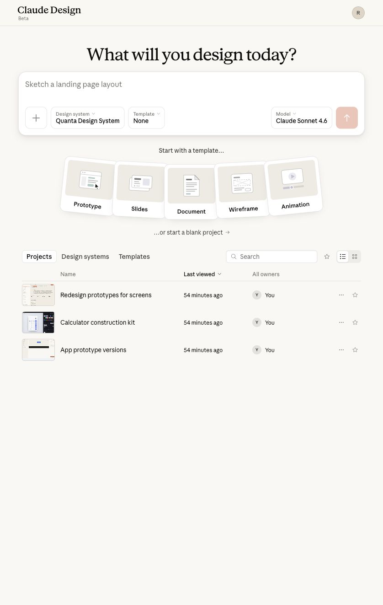
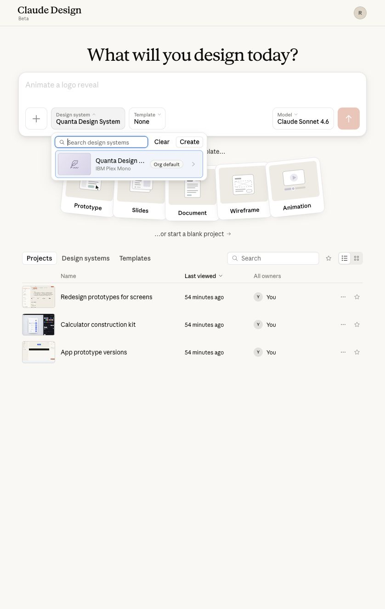
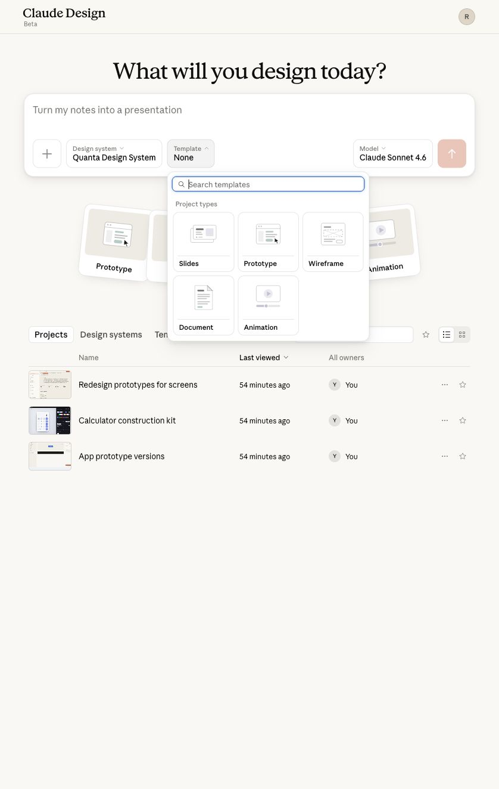
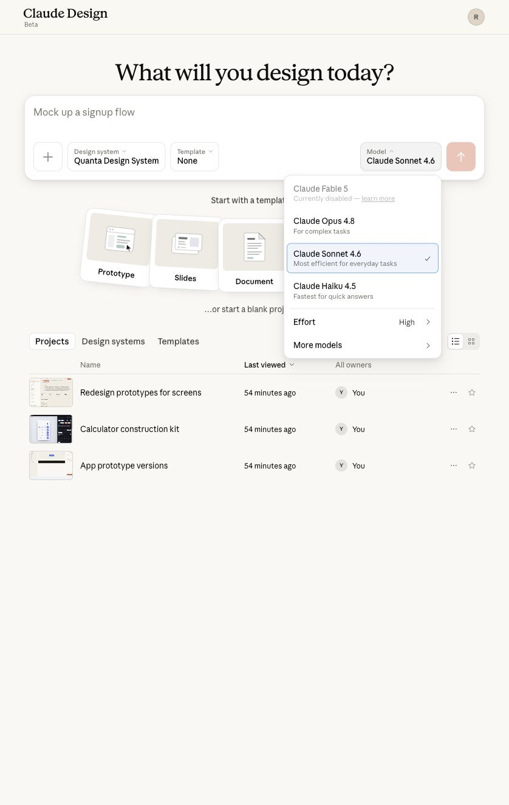
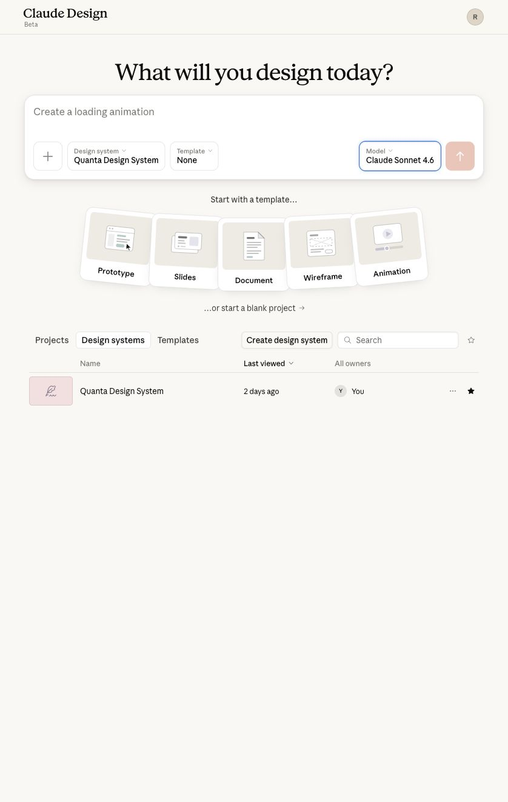
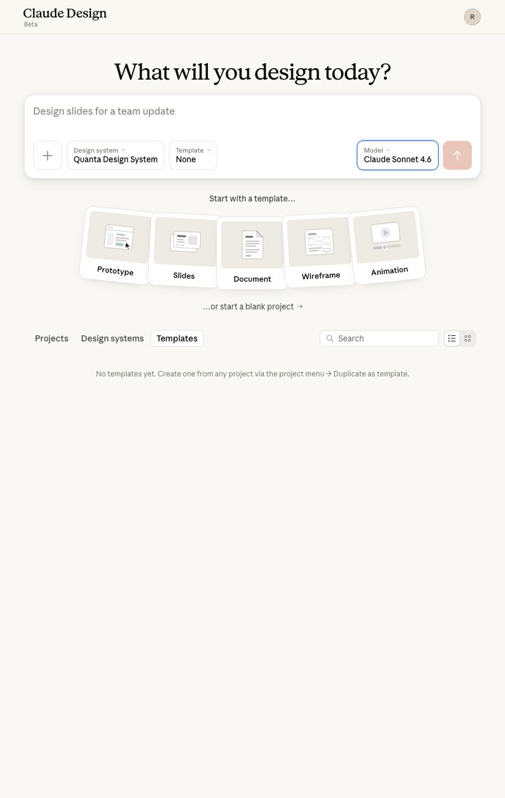
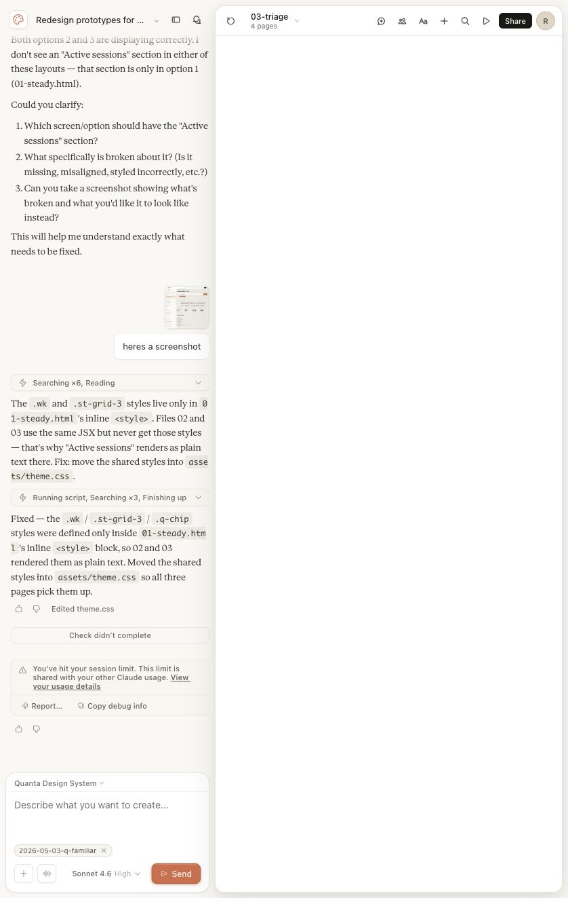
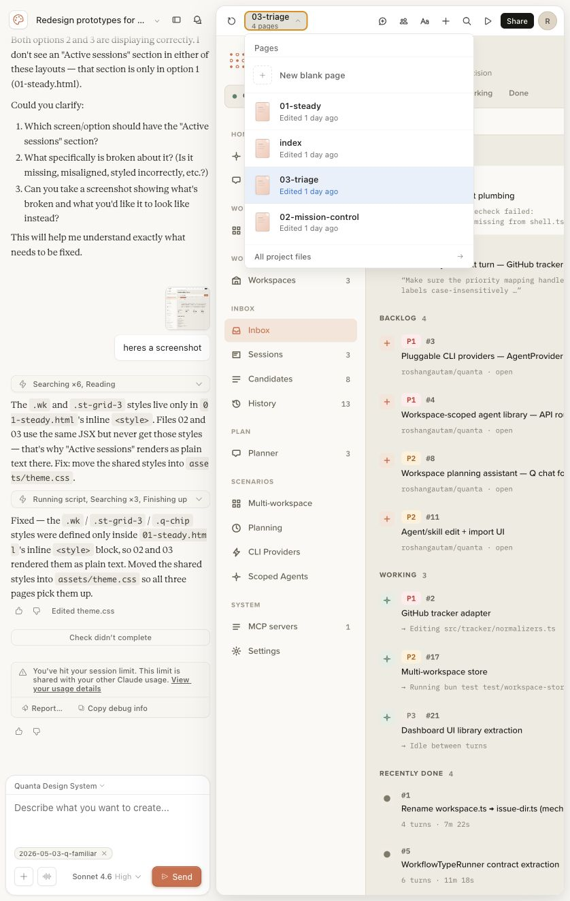

# Claude Design User Guide

Captured from the logged-in Claude Design beta workspace on June 25, 2026. This guide explains the visible user-facing features from the home screen and an existing project. I did not send a new prompt, change sharing settings, or modify project files during capture.

For a browser-viewable version of the same guide, including the broader Claude Help Center features map, open [index.html](index.html). The source Markdown for that broader map lives at [../claude-features-guide/README.md](../claude-features-guide/README.md).

## Quick Start

- Open `https://claude.ai/design`.
- Start in the prompt box under "What will you design today?"
- Describe the outcome you want, such as a prototype, slide deck, document, wireframe, or animation.
- Pick a **Design system** if you want Claude to follow a saved visual style.
- Pick a **Template** if you want to start from a project type or saved reusable project.
- Pick a **Model** and effort level before sending.
- Use the send button to generate, or choose "...or start a blank project" when you want to build from an empty workspace.

## Home Screen Features

### Prompt Composer

- The large text box is the main starting point for a new Claude Design project.
- The placeholder changes with examples, which helps suggest possible prompts.
- The left tool button beside the selector row is for adding input/context before generation.
- The send button starts generation after you have chosen the prompt, design system, template, and model.

### Design System Picker

- Use **Design system** to bind a project to a saved visual system.
- Search existing design systems from the picker.
- Use **Create** to add a new design system.
- The currently available design system in this capture is `Quanta Design System`, marked as the org default.
- From a user perspective, this is the control that keeps output aligned to an existing style instead of asking Claude to invent one from scratch.

### Template Picker

- Use **Template** to choose a project type before generation.
- The picker exposes project types: **Slides**, **Prototype**, **Wireframe**, **Document**, and **Animation**.
- Search templates when your workspace has saved templates.
- The Templates library can be empty. In this capture, Claude says templates can be created from any project via the project menu by duplicating as a template.

### Model Picker

- Use **Model** to choose the Claude model used for the design task.
- Visible choices in this account include **Claude Opus 4.8**, **Claude Sonnet 4.6**, and **Claude Haiku 4.5**.
- **Claude Fable 5** appears but is disabled in this account state.
- The picker also exposes an **Effort** setting and a **More models** option.
- Use higher-capability models for complex design generation, and faster models for quick or lightweight iterations.

### Starter Project Types

- The home screen offers direct starter cards for **Prototype**, **Slides**, **Document**, **Wireframe**, and **Animation**.
- Click one when you already know the intended output format.
- Use the blank project option when you want an empty canvas and conversation thread first.

## Library And Management Views

### Projects

- The **Projects** tab lists existing Claude Design projects.
- Use search to filter projects by name.
- Use the star button to show starred items only.
- Switch between list and thumbnail views.
- Sort by columns such as name or last viewed.
- Use the owner filter when projects are shared across people.
- Open a project by clicking its name.
- Row actions provide quick per-project actions such as more options and starring.

### Design Systems

- The **Design systems** tab lists saved design systems.
- Use **Create design system** to add a new one.
- Search and star controls work here too.
- Open a design system from the list to inspect or manage it.
- The list shows owner and last-viewed metadata.

### Templates

- The **Templates** tab lists saved reusable project templates.
- In this capture, there are no saved templates yet.
- Claude Design indicates that templates are created from an existing project via the project menu and "Duplicate as template."
- Use this area when you want repeatable starting points for common work.

## Project Workspace

- A project has two main panes: the conversation on the left and the live generated preview on the right.
- The left pane keeps the prompt history, generated responses, screenshots, edits, tool activity, and status messages.
- The bottom composer is where you ask Claude to create, refine, or fix the design.
- The composer includes the active design system, attached project/context chip, model and effort selector, and send button.
- The right pane previews the current generated file or page.
- The top-left project controls include back-to-projects, project menu, sidebar toggle, and chat history.
- The top-right preview toolbar includes reload, page selector, markup, comments, edit, tweaks, zoom, present, share, and profile controls.

### Iterating On A Design

- Type a specific change in the composer, such as "make the mobile nav clearer" or "turn this into a slide layout."
- Attach screenshots or context when visual feedback matters.
- Keep the design system selected if every iteration should stay visually consistent.
- Use the model and effort selector for more complex revisions.
- Send the request and watch the conversation pane for status updates such as reading, searching, editing, screenshots, and finishing.
- Use the preview pane to inspect the result after Claude updates the project files.

### Page And File Navigation

- The page selector shows the active file and total page count.
- Use it to switch between generated pages.
- Create a **New blank page** when you need another page in the same project.
- Duplicate or rename existing pages from the list.
- Use **More actions** for page-level options.
- Use **All project files** when you need to inspect files beyond the main pages.

### Preview Toolbar

- **Reload** refreshes the generated preview.
- **Page selector** switches files/pages and exposes page actions.
- **Mark up** is for visual annotation workflows.
- **Comments** opens feedback/commenting tools.
- **Edit** exposes direct editing controls for the generated design.
- **Tweaks** is for targeted adjustments.
- **Zoom level** changes preview scale.
- **Present** opens a presentation-style view.
- **Share** starts the sharing workflow. Do not change share settings unless you intend to expose the project.

### Session Limits And Debugging

- If a session limit appears, Claude may stop checks or generation until usage is available again.
- Use **View your usage details** to inspect account usage.
- Use **Copy debug info** when reporting a failed generation or preview problem.
- Use **Report...** for product feedback or issue reporting.
- The project remains viewable even when a limit blocks new generation.

## Practical Workflow

- Start with the output format: prototype, slides, document, wireframe, animation, or blank project.
- Choose a design system before generation when consistency matters.
- Use a template when you want repeatable structure; use blank when exploring.
- Pick model and effort based on complexity.
- Generate the first draft.
- Review the live preview, then ask for concrete changes in the composer.
- Use page navigation to compare variants or pages.
- Use markup, comments, edit, and tweaks for visual review and focused refinement.
- Share or present only after the design is ready for other people to see.

## Captured Feature Checklist

- New project prompt composer
- Design system selection, search, and creation entry point
- Template selection and project type picker
- Model selection, disabled model state, effort setting, and more models entry point
- Starter project type cards
- Blank project entry point
- Projects library with search, star filter, list/thumbnail view, sorting, owner metadata, and row actions
- Design systems library with create/search/open actions
- Templates library and empty-state guidance
- Project chat history and iteration composer
- Active design system binding inside a project
- Model/effort selector inside a project
- Generated preview pane
- Page selector with new page, duplicate, rename, more actions, and all project files
- Preview toolbar: reload, mark up, comments, edit, tweaks, zoom, present, and share
- Session-limit, usage-details, report, and debug-info states
